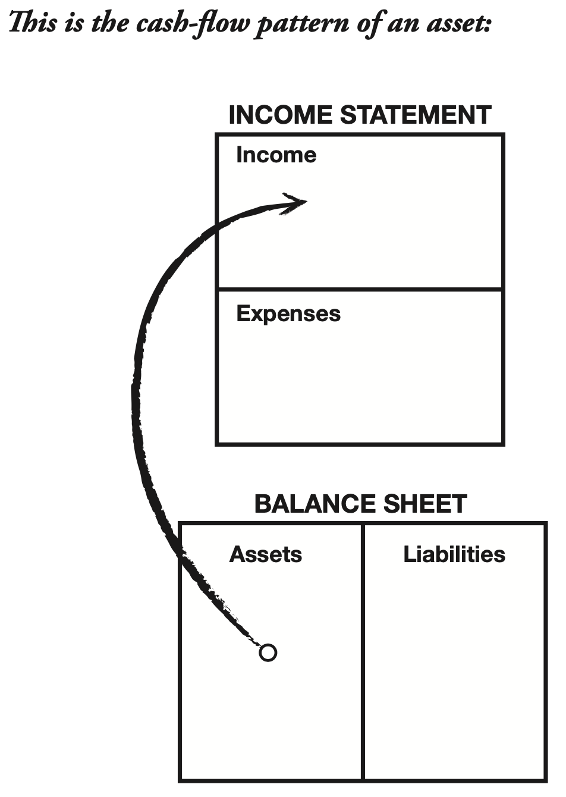
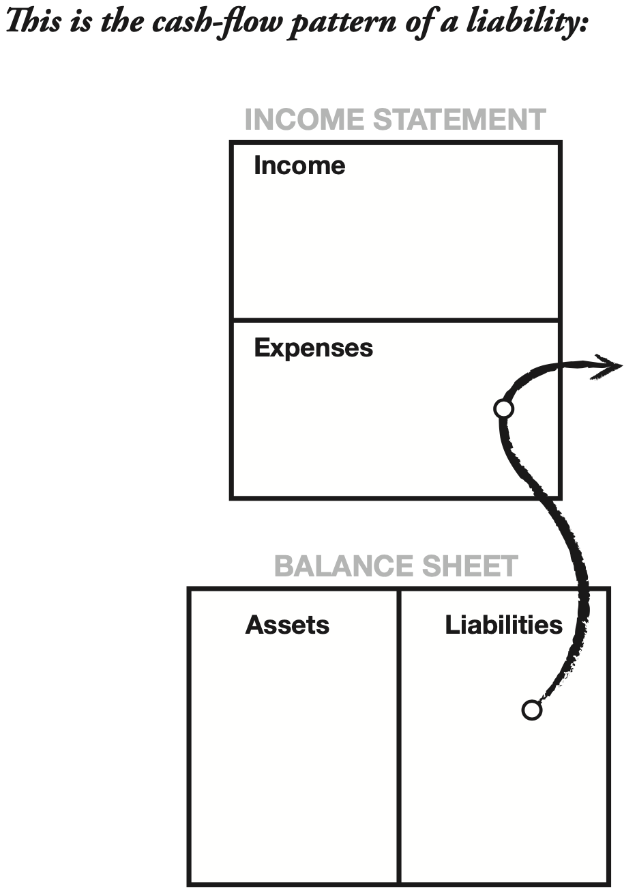
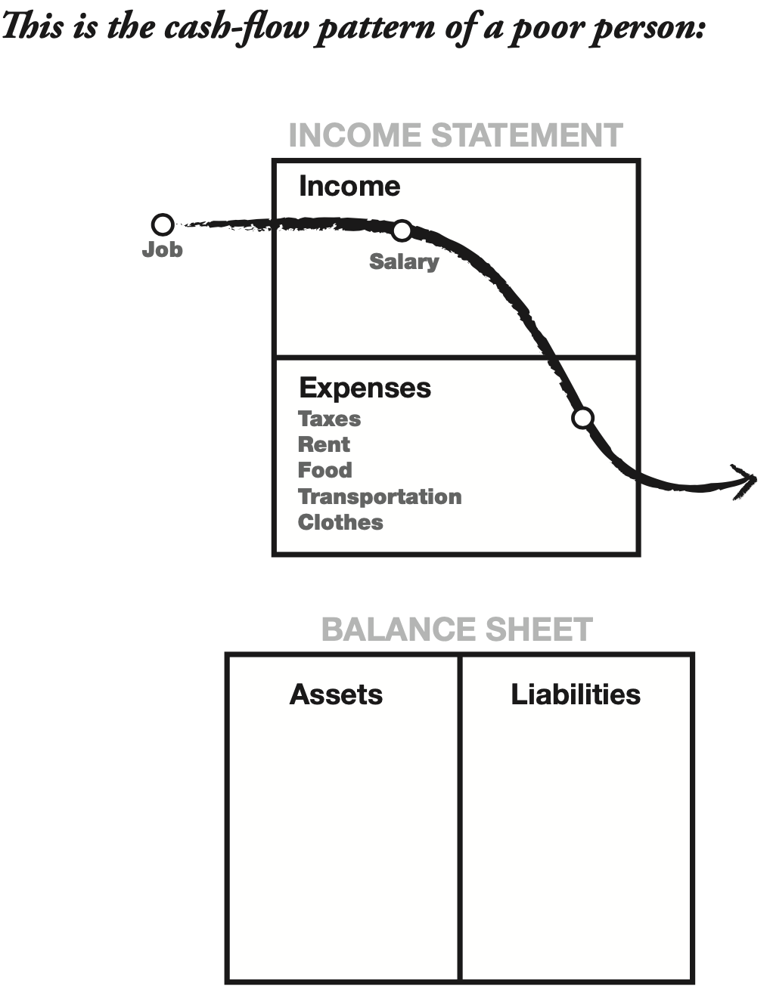
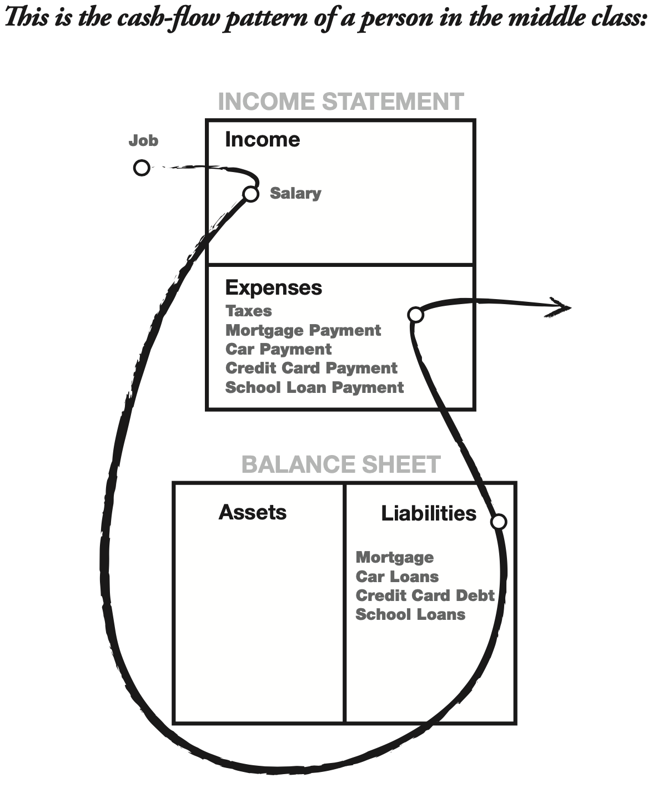
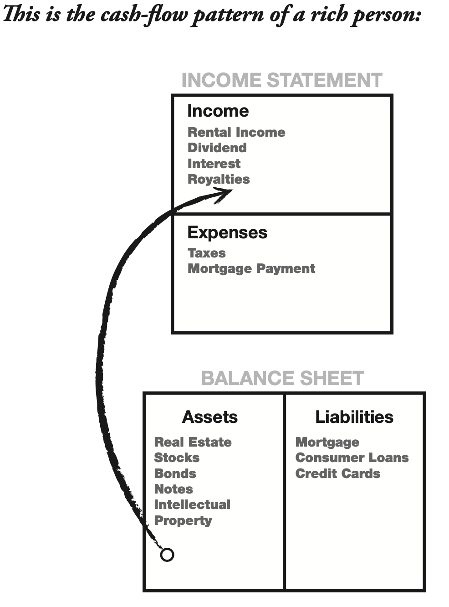
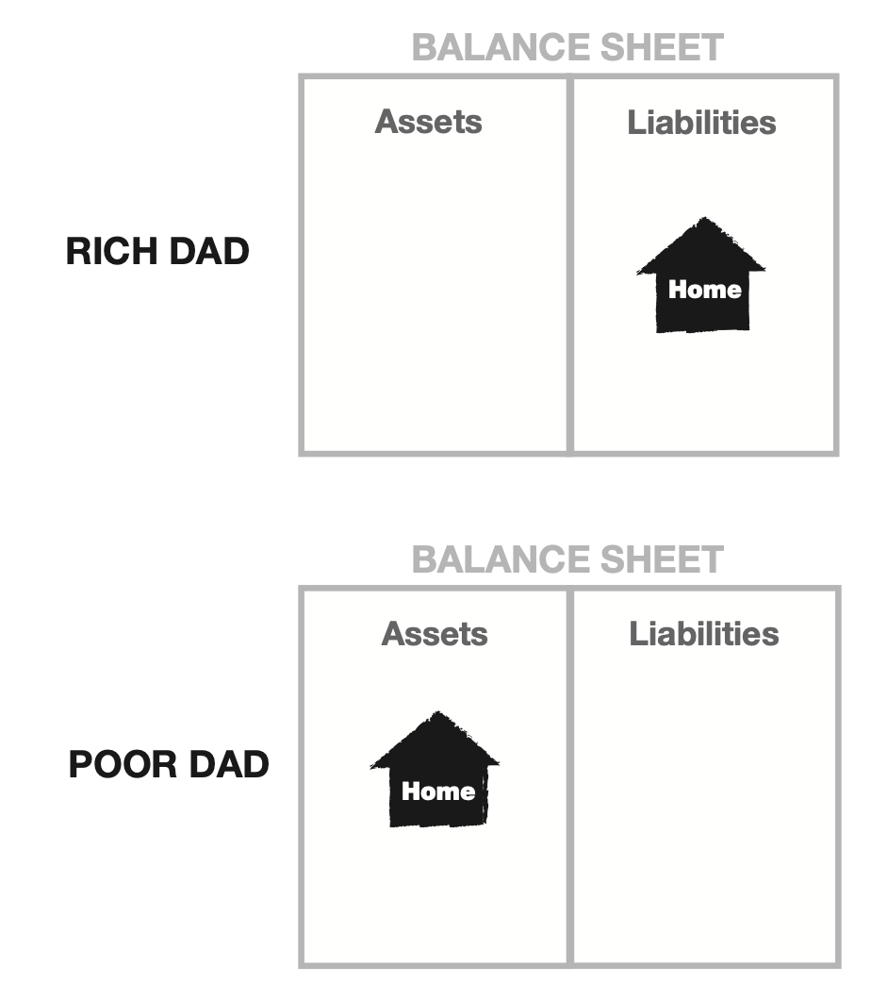
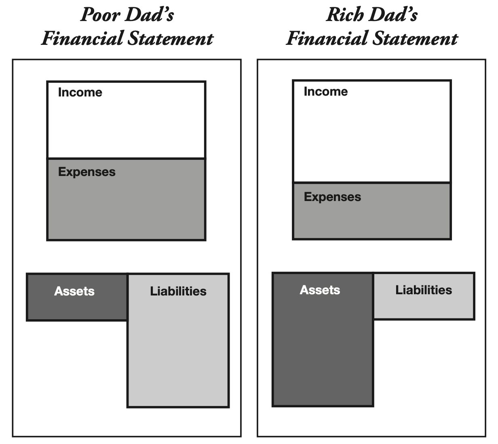
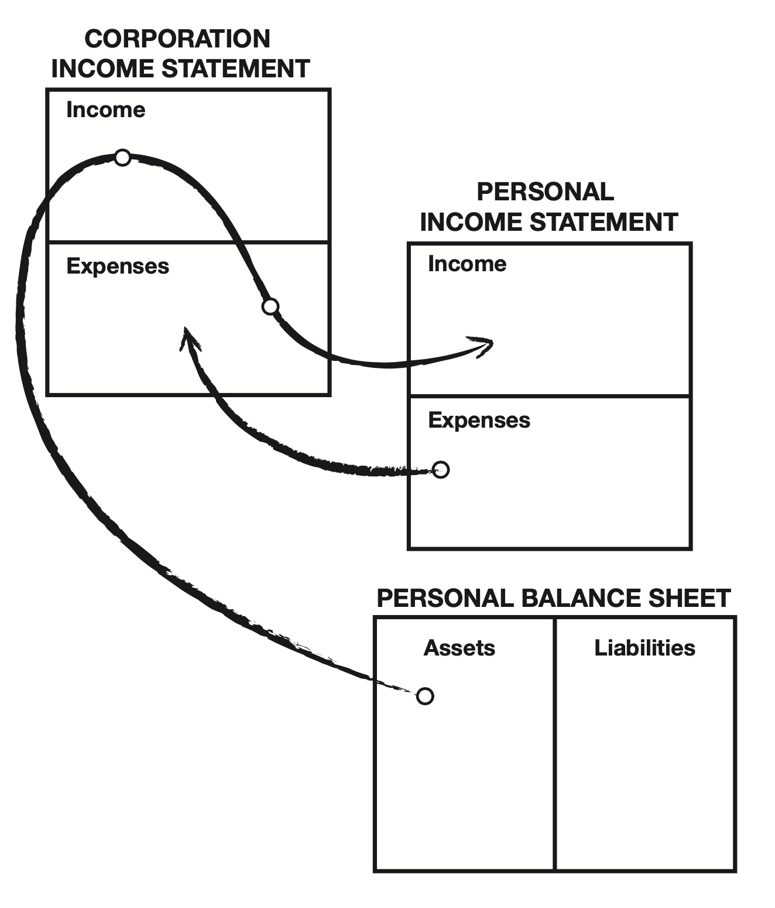
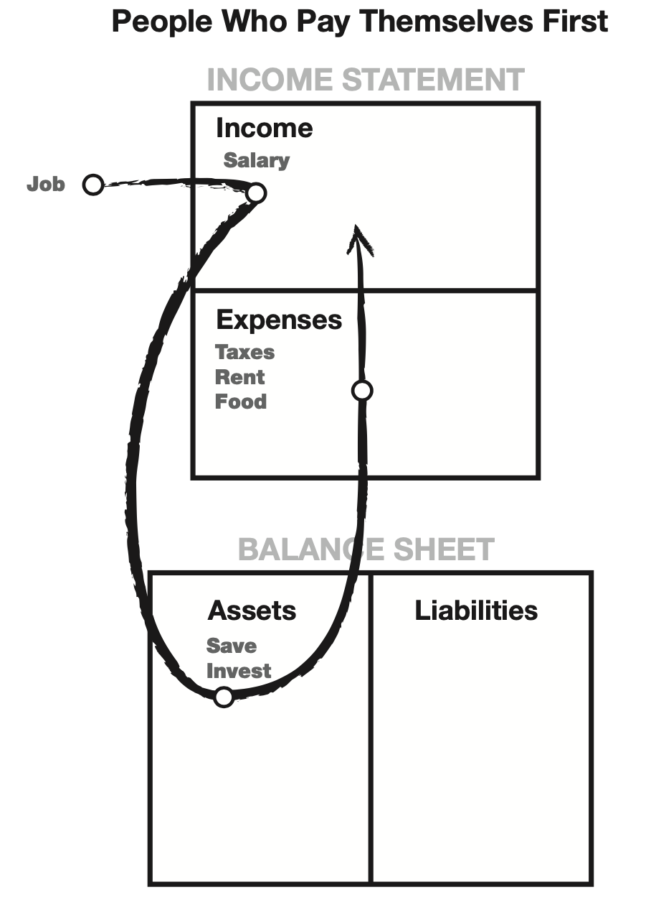

There is a difference between being poor and being broke. Broke is temporary. Poor is eternal.

Most of the time, life does not talk to you. It just sort of pushes you around. Each push is life saying, ‘Wake up. There’s something I want you to learn.

## Lesson 1: The Rich Don’t Work for Money
Most people have a price. And they have a price because of human emotions named fear and greed. First, the fear of being without money motivates us to work hard, and then once we get that paycheck, greed or desire starts us thinking about all the wonderful things money can buy. The pattern is then set.
People’s lives are forever controlled by two emotions: fear and greed. The pattern of get up, go to work, pay bills; get up, go to work, pay bills. People’s lives are forever controlled by two emotions: fear and greed. Offer them more money and they continue the cycle by increasing their spending. This is what I call the Rat Race. So many people say, “Oh, I’m not interested in money.” Yet they’ll work
at a job for eight hours a day. If you don’t first handle fear and desire, and you get rich, you’ll only be a highly paid slave.

## LESSON 2: Why teach financial literacy?
It’s not how much money you make. It’s how much money you keep. Rich people acquire assets. The poor and middle class acquire liabilities that they think are assets.

You must know the difference between an asset and a liability, and buy assets. An asset puts money in my pocket. A liability takes money out of my pocket.

Cash flow tells the story of how a person handles money. All too often, instead of trusting their inner wisdom, that genius inside, most people follow the crowd. They do things because everybody else does them. They conform, rather than question. Often, they mindlessly repeat what they have been told: “Diversify.” “Your home is an asset.” “Your home is your biggest investment.” “You get a tax break for going into greater debt.” “Get a safe job.” “Don’t make mistakes.” “Don’t take risks.” A person can be highly educated, professionally successful, and financially illiterate. “An intelligent person hires people who are more intelligent than he is. We started to understand why our rich dad told us that schools were designed to produce good employees, instead of employers.

The above diagram illustrates the difference in perception between my rich dad and my poor dad when it came to their homes. One dad thought his house was an asset, and the other dad thought it was a liability.

### Why the Rich Get Richer
A review of my rich dad’s financial statement shows why the rich get richer. The asset column generates more than enough income to cover expenses, with the balance reinvested into the asset column. The asset column continues to grow and, therefore, the income it produces grows with it. The result is that the rich get richer!

### Why the Middle Class Struggle
The middle class finds itself in a constant state of financial struggle. Their primary income is through their salary. As their wages increase, so do their taxes. Their expenses tend to increase in proportion to their salary increase: hence, the phrase “the Rat Race.” They treat their home as their primary asset, instead of investing in income-producing assets. Once you understand the difference, concentrate your efforts on buying income-generating assets. That’s the best way to get started on a path to becoming rich. Keep doing that, and your asset column will grow.

1. You work for the company. Employees make their business owner or the shareholders rich, not themselves. Your efforts and success will help provide for the owner’s success and retirement.
2. You work for the government. The government takes its share from your paycheck before you even see it. By working harder, you simply increase the amount of taxes taken by the government. Most people work from January to May just for the government.
3. You work for the bank. After taxes, your next largest expense is usually your mortgage and credit-card debt.

Wealth is a person’s ability to survive so many number of days forward—or, if I stopped working today, how long could I survive?

Let’s use an example. Let’s say I have cash flow from my asset column of $1,000 a month. And I have monthly expenses of $2,000. What is my wealth?
Let’s go back to Buckminster Fuller’s definition. Using his definition, how many days forward can I survive? Assuming a 30-day month, I have enough cash flow for half a month.
When I achieve $2,000 a month cash flow from my assets, then I will be wealthy.
So while I’m not yet rich, I am wealthy. I now have income generated from assets each month that fully cover my monthly expenses.

- The rich buy assets.
- The poor only have expenses.
- The middle class buy liabilities they think are assets.

## LESSON 3: Mind your own business
The rich focus on their asset columns while everyone else focuses on their income statements. Financial struggle is often the result of people working all their lives for someone else.

So what kind of assets am I suggesting that you or your children acquire
- Businesses that do not require my presence I own them, but they are managed or run by other people. If I have to work there, it’s not a business. It becomes my job.
- Stocks
- Bonds
- Income-generating real estate
- Notes (IOUs)
- Royalties from intellectual property such as music, scripts, and patents
- Anything else that has value, produces income or appreciates, and has a ready market

Start minding your own business. Keep your daytime job, but start buying real assets, not liabilities.  An important distinction is that rich people buy luxuries last, while the poor and middle class tend to buy luxuries first. A true luxury is a reward for investing in and developing a
real asset. For example, when my wife Kim and I had extra money coming from our apartment houses, she went out and bought her Mercedes. It didn’t take any extra work or risk on her part because the apartment house bought the car. She did, however, have to wait four years while the real estate investment portfolio grew and began generating enough extra cash flow to pay for the car. But the luxury, the Mercedes, was a true reward because she proved she knew how to grow her asset column. That car now means a lot more to her than simply another pretty car. It means she used her financial intelligence to afford it.

## LESSON 4: The history of taxes and the power of corporations
My rich dad just played the game smart, and he did it through corporations— the biggest secret of the rich. The middle class is so heavily taxed is because of the Robin Hood ideal. The reality is that the rich are not taxed. It’s the middle class, especially the educated upper-income middle class, who pays for the poor. He explained that the idea of taxes was made popular, and accepted by the majority, by telling the poor and the middle class that taxes were created only to punish the rich. This is how the masses voted for the law, and it became constitutionally legal. Although it was intended to punish the rich, in reality it wound up punishing the very people who voted for it, the poor and middle class. My rich dad did not see Robin Hood as a hero. He called Robin Hood a crook.

A corporation earns, spends everything it can, and is taxed on anything that is left. It’s one of the biggest legal tax loopholes that the rich use. 

An employee with a safe, secure job, without financial aptitude, has no escape. If you work for money, you give the power to you employer. If money works for you, you keep the power and control it. Each dollar in my asset column was a great employee, working hard to make more employees and buy the boss
a new Porsche.

I remind people that financial IQ is made up of knowledge from four broad areas of expertise:

1. Accounting
2. Investing
3. Understanding markets
4. The law

## LESSON 5: The rich invent money
Often in the real world, it’s not the smart who get ahead, but the bold. The single most powerful asset we all have is our mind. If it is trained well, it can create enormous wealth. The problem with “secure” investments is that they are often sanitized, that is, made so safe that the gains are less. It is not gambling if you know what you’re doing. It is gambling if you’re just throwing money into a deal and praying. Great opportunities are not seen with your eyes. They are seen with your mind.

## LESSON 6: Work to learn — don't work for money
It says best-selling author, not best-writing author. You want to know a little about a lot was rich dad’s suggestion. The most important specialized skills are sales and marketing. The ability to sell—to communicate to another human being, be it a customer, employee, boss, spouse, or child—is the base skill of personal success. Communication skills such as writing, speaking, and negotiating are crucial to a life of success. These are skills I work on constantly, attending courses or buying educational resources to expand my knowledge. For most people, the reason they don’t win financially is because the pain of losing money is far greater than the joy of being rich. Failure inspires winners, Failure defeats losers. If you hate losing, play it safe. If losing makes you weak, play it safe. Go with balanced investments. If you’re over 25 years old and are terrified of taking risks, don’t change. Play it safe, but start early. Start accumulating your nest egg early because it will take time. Rich dad believed that the words “I can’t afford it” shut down your brain. “How can I afford it?” opens up possibilities, excitement, and dreams. When I decided to exit the Rat Race, it was simply a question
of “How can I afford to never work again?” And my mind began to kick out answers and solutions. The hardest part was fighting my real parents’ dogma: “We can’t afford that.” “Stop thinking only about yourself.” “Why don’t you think about others?” and other similar sentiments designed to instill guilt to suppress my “greed.” “So you see, after paying myself, the pressure to pay my taxes and the other creditors is so great that it forces me to seek other forms of income. The pressure to pay becomes my motivation. I’ve worked extra jobs, started other companies, traded in the stock market, anything just to make sure those guys don’t start yelling at me. That pressure made me work harder, forced me to think, and all in all, made me smarter and more active when it comes to money. If I had paid myself last, I would have felt no pressure, but I’d be broke.” If I pay myself first, I get financially stronger, mentally and fiscally.

There is gold everywhere. Most people are not trained to see it. If you learn something new, you are then required to make mistakes in order to fully understand what you have learned. Wise investors buy an investment when it’s not popular. They know their profits are made when they buy, not when they sell. They wait patiently. As I said, they do not time the market. Just like a surfer, they get in position for the next big swell.

Small people remain small because they think small, act alone, or don’t act all.

## Final thoughts
A friend of mine was griping one day about how hard it was to save money for his four children’s college educations. He was putting $300 away in a college fund each month and had so far accumulated only about $12,000. He had about 12 more years to save for college since his oldest child was then six years old. At the time, the real estate market in Phoenix was terrible. People were giving houses away. I suggested to my friend that he buy a house with some of the money in his college fund. The idea intrigued him, and we began to discuss the possibility. His primary concern was that he did not have credit with the bank to buy another house since he was so over-extended. I assured him that there were other ways to finance a property rather than through the bank. We looked for a house for two weeks, a house that would fit all our criteria. There were plenty to choose from so shopping was fun. Finally, we found a three-bedroom, two-bath home in a prime neighborhood. The owner had been downsized and needed to sell that day because he and his family were moving to California where another job waited. The owner wanted $102,000, but we offered only $79,000. He took
it immediately and agreed to carry back the loan with a 10 percent down payment. All my friend had to come up with was $7,900. As soon as the owner moved, my friend put the house up for rent. After all expenses were paid, including the mortgage, he put about $125 in his pocket each month. His plan was to keep the house for 12 years and let the mortgage get paid down faster by applying the extra $125 to the principal each month. We figured that in 12 years, a large portion of the mortgage would be paid off and he could possibly be clearing $800 a month by the time his first child went to college. He could also sell the house if it had appreciated in value. Three years later, the real estate market greatly improved in Phoenix and he was offered $156,000 for the same house by the tenant who lived in it. Again, he asked me what I thought. I advised that he sell it, using a 1031 tax-deferred exchange. Suddenly, he had nearly $80,000 to operate with. I called another friend in Austin, Texas, who then moved this tax-deferred capital gain into a mini-storage facility. Within three months, he began receiving checks for a little less than a $1,000 a month which he then poured back into the college fund. A couple of years later, the mini-warehouse sold, and he received a check for nearly $330,000 as proceeds from the sale. He rolled those funds into a new project that would now generate over $3,000 a month in income, again, going into the college fund. He is now very confident that his goal will be met easily. It only took $7,900 to start and a little financial intelligence. His children will be able to afford the education they want, and he will then use the underlying asset, wrapped in his legal entity, to pay for his retirement. As a result of this successful investment strategy, he will be able to retire early.

### The Three Incomes
In the world of accounting, there are three different types of income: 
1. Ordinary earned
2. Portfolio
3. Passive

Passive income, in most cases, is income derived from real estate investments. Portfolio income is income derived from paper assets such as stocks and bonds. Portfolio income is the income that makes Bill Gates the richest man in the world, not earned income. In my second book, Rich Dad’s CASHFLOW Quadrant, I explain the four different types of people who make up the world of business. They are E (Employee), S (Self-employed), B (Business Owner), and I (Investor).

In Rich Dad’s Guide to Investing, book number three in the Rich Dad series, I go into more detail on the importance of converting earned income into passive and portfolio income. A real investor makes money in an up market and a down market. That is why they make so much money.