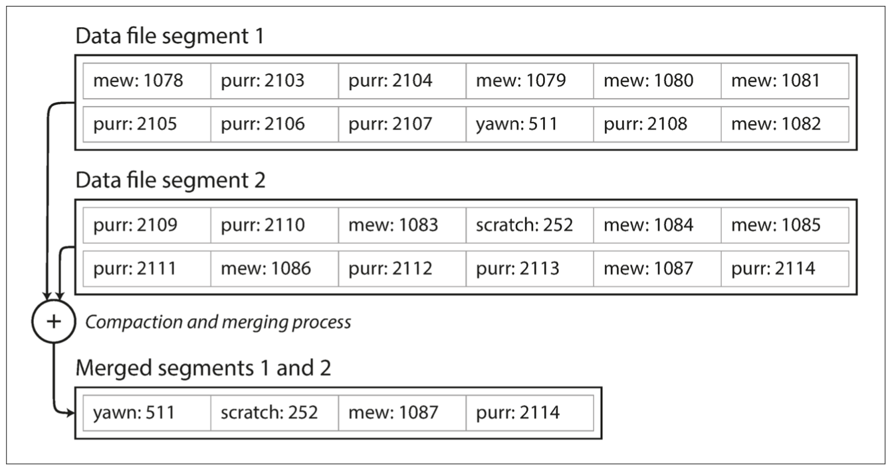
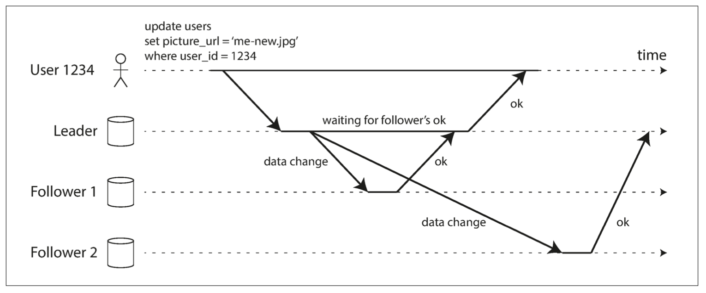

# Chapter 1: Reliable, Scalable, and Maintainable Applications
We focus on three concerns that are important in most software systems:
- Reliability: The system should continue to work correctly (performing the correct function at the desired level of performance) even in the face of adversity (hardware or software faults, and even human error).
- Scalability: As the system grows (in data volume, traffic volume, or complexity), there should be reasonable ways of dealing with that growth.
- Maintainability: Over time, many different people will work on the system (engineering and oper‐ ations, both maintaining current behavior and adapting the system to new use cases), and they should all be able to work on it productively.


## Reliability
For software, typical expectations include:
- The application performs the function that the user expected.
- It can tolerate the user making mistakes or using the software in unexpected ways.
- Its performance is good enough for the required use case, under the expected load and data volume.
- The system prevents any unauthorized access and abuse.

We can understand relia‐ bility as meaning, roughly, “continuing to work correctly, even when things go wrong.” 

Note that a fault is not the same as a failure. A fault is usually defined as one component of the system deviating from its spec, whereas a failure is when the system as a whole stops providing the required service to the user. It is impossible to reduce the probability of a fault to zero; therefore it is usually best to design fault-tolerance mechanisms that prevent faults from causing failures. 

## Scalability
First, we need to succinctly describe the current load on the system; only then can we discuss growth questions (what happens if our load doubles?). Load can be described with a few numbers which we call load parameters. The best choice of parameters depends on the architecture of your system: it may be requests per second to a web server, the ratio of reads to writes in a database, the number of simultaneously active users in a chat room, the hit rate on a cache, or something else.

It’s preferable to do more work at write time and less at read time.


The final twist of the Twitter anecdote: now that approach 2 is robustly implemented, Twitter is moving to a hybrid of both approaches. Most users’ tweets continue to be fanned out to home timelines at the time when they are posted, but a small number of users with a very large number of followers (i.e., celebrities) are excepted from this fan-out. Tweets from any celebrities that a user may follow are fetched separately and merged with that user’s home timeline when it is read, like in approach 1. This hybrid approach is able to deliver consistently good performance. We will revisit this exam‐ ple in Chapter 12 after we have covered some more technical ground.

Usually it is better to use percentiles to describe performance using response time. If you take your list of response times and sort it from fastest to slowest, then the median is the halfway point: for example, if your median response time is 200 ms, that means half your requests return in less than 200 ms, and half your requests take longer than that.

In order to figure out how bad your outliers are, you can look at higher percentiles: the 95th, 99th, and 99.9th percentiles are common (abbreviated p95, p99, and p999). They are the response time thresholds at which 95%, 99%, or 99.9% of requests are faster than that particular threshold. For example, if the 95th percentile response time is 1.5 seconds, that means 95 out of 100 requests take less than 1.5 seconds, and 5 out of 100 requests take 1.5 seconds or more. 

High percentiles of response times, also known as tail latencies, are important because they directly affect users’ experience of the service. For example, Amazon describes response time requirements for internal services in terms of the 99.9th per‐ centile, even though it only affects 1 in 1,000 requests. This is because the customers with the slowest requests are often those who have the most data on their accounts because they have made many purchases—that is, they’re the most valuable customers.

## Maintainability

However, we can and should design software in such a way that it will hopefully min‐ imize pain during maintenance, and thus avoid creating legacy software ourselves. To this end, we will pay particular attention to three design principles for software systems:
- Operability: Make it easy for operations teams to keep the system running smoothly.
- Simplicity: Make it easy for new engineers to understand the system, by removing as much complexity as possible from the system. (Note this is not the same as simplicity of the user interface.)
- Evolvability: Make it easy for engineers to make changes to the system in the future, adapting it for unanticipated use cases as requirements change. Also known as extensibil‐ ity, modifiability, or plasticity.

# Chapter 2: Data Models and Query Languages
If you want to fetch a profile in the relational example, you need to either perform multiple queries (query each table by user_id) or perform a messy multi- way join between the users table and its subordinate tables. In the JSON representa‐ tion, all the relevant information is in one place, and one query is sufficient.

many-to-one relationships (many peo‐ ple live in one particular region, many people work in one particular industry), which don’t fit nicely into the document model. In relational databases, it’s normal to refer to rows in other tables by ID, because joins are easy. In document databases, joins are not needed for one-to-many tree structures, and support for joins is often weak.iii
If the database itself does not support joins, you have to emulate a join in application code by making multiple queries to the database.

While many-to-many relationships and joins are routinely used in relational data‐ bases, document databases and NoSQL reopened the debate on how best to represent such relationships in a database.


## Which data model leads to simpler application code?
If the data in your application has a document-like structure (i.e., a tree of one-to- many relationships, where typically the entire tree is loaded at once), then it’s probably a good idea to use a document model. The document model has limitations: for example, you cannot refer directly to a nes‐ ted item within a document, but instead you need to say something like “the second item in the list of positions for user 251”. However, if your application does use many-to-many relationships, the document model becomes less appealing. It’s possible to reduce the need for joins by denormal‐ izing, but then the application code needs to do additional work to keep the denor‐ malized data consistent. Joins can be emulated in application code by making multiple requests to the database, but that also moves complexity into the application and is usually slower than a join performed by specialized code inside the database. In such cases, using a document model can lead to significantly more complex appli‐ cation code and worse performance.


Document databases are sometimes called schemaless, but that’s misleading, as the code that reads the data usually assumes some kind of structure—i.e., there is an implicit schema, but it is not enforced by the database. A more accurate term is schema-on-read (the structure of the data is implicit, and only interpreted when the data is read), in contrast with schema-on-write (the traditional approach of relational databases, where the schema is explicit and the database ensures all written data con‐ forms to it. Schema-on-read is similar to dynamic (runtime) type checking in programming lan‐ guages, whereas schema-on-write is similar to static (compile-time) type checking.

Schema changes have a bad reputation of being slow and requiring downtime. This reputation is not entirely deserved: most relational database systems execute the ALTER TABLE statement in a few milliseconds. MySQL is a notable exception—it copies the entire table on ALTER TABLE, which can mean minutes or even hours of downtime when altering a large table—although various tools exist to work around this limitation.

The schema-on-read approach is advantageous if the items in the collection don’t all have the same structure for some reason. For example, because:
- There are many different types of objects, and it is not practical to put each type of object in its own table.
- The structure of the data is determined by external systems over which you have no control and which may change at any time.

PostgreSQL since version 9.3, MySQL since version 5.7, and IBM DB2 since ver‐ sion 10.5 also have a similar level of support for JSON documents. Given the popularity of JSON for web APIs, it is likely that other relational databases will follow in their footsteps and add JSON support.

On the document database side, RethinkDB supports relational-like joins in its query language, and some MongoDB drivers automatically resolve database references (effectively performing a client-side join, although this is likely to be slower than a join performed in the database since it requires additional network round-trips and is less optimized).
It seems that relational and document databases are becoming more similar over time, and that is a good thing: the data models complement each other.v If a database is able to handle document-like data and also perform relational queries on it, appli‐ cations can use the combination of features that best fits their needs.


## Query Languages for Data
When the relational model was introduced, it included a new way of querying data: SQL is a declarative query language, whereas IMS and CODASYL queried the database using imperative code. 
For example, if you have a list of animal species, you might write something like this to return only the sharks in the list:

```JavaScript

//imperative way
function getSharks() { 
    var sharks = [];
    for (var i = 0; i < animals.length; i++) { 
        if (animals[i].family === "Sharks") {
            sharks.push(animals[i]);
        }
    }
    return sharks; 
}
```

```SQL
-- declarative
SELECT * FROM animals WHERE family = 'Sharks';
```
- Imperative language: tells the computer to perform certain operations in a certain order. You can imagine stepping through the code line by line, evaluating conditions, updating variables, and deciding whether to go around the loop one more time.

- Declarative language: like SQL or relational algebra, you just specify the pattern of the data you want—what conditions the results must meet, and how you want the data to be transformed (e.g., sorted, grouped, and aggregated)—but not how to achieve that goal. It is up to the database system’s query optimizer to decide which indexes and which join methods to use, and in which order to execute various parts of the query. 


A declarative query language is attractive because it is typically more concise and eas‐ ier to work with than an imperative API. But more importantly, it also hides imple‐ mentation details of the database engine, which makes it possible for the database system to introduce performance improvements without requiring any changes to queries. For example, in the imperative code shown at the beginning of this section, the list of animals appears in a particular order. If the database wants to reclaim unused disk space behind the scenes, it might need to move records around, changing the order in which the animals appear. Can the database do that safely, without breaking queries?
The SQL example doesn’t guarantee any particular ordering, and so it doesn’t mind if the order changes. But if the query is written as imperative code, the database can never be sure whether the code is relying on the ordering or not. The fact that SQL is more limited in functionality gives the database much more room for automatic opti‐ mizations.


Finally, declarative languages often lend themselves to parallel execution. Today, CPUs are getting faster by adding more cores, not by running at significantly higher clock speeds than before. Imperative code is very hard to parallelize across mul‐ tiple cores and multiple machines, because it specifies instructions that must be per‐ formed in a particular order. Declarative languages have a better chance of getting faster in parallel execution because they specify only the pattern of the results, not the algorithm that is used to determine the results. The database is free to use a parallel implementation of the query language, if appropriate.


## MapReduce Querying
MapReduce is a programming model for processing large amounts of data in bulk across many machines, popularized by Google. A limited form of MapReduce is supported by some NoSQL datastores, including MongoDB and CouchDB. MapReduce is neither a declarative query language nor a fully imperative query API, but somewhere in between. To give an example, imagine you are a marine biologist, and you add an observation record to your database every time you see animals in the ocean. Now you want to generate a report saying how many sharks you have sighted per month. In PostgreSQL you might express that query like this:

```SQL
SELECT date_trunc('month', observation_timestamp) AS observation_month, sum(num_animals) AS total_animals
FROM observations
WHERE family = 'Sharks' 
GROUP BY observation_month;
```
This query first filters the observations to only show species in the Sharks family, then groups the observations by the calendar month in which they occurred, and finally adds up the number of animals seen in all observations in that month.

The same can be expressed with MongoDB’s MapReduce feature as follows:

```JavaScript
db.observations.mapReduce( 
    function map() {
        var year = this.observationTimestamp.getFullYear(); 
        var month = this.observationTimestamp.getMonth() + 1; 
        emit(year + "-" + month, this.numAnimals);
    },

    function reduce(key, values) {
        return Array.sum(values); 
    },
    
    {
            query: { family: "Sharks" },
            out: "monthlySharkReport"
    } 
);
```

1. The filter to consider only shark species can be specified declaratively (this is a MongoDB-specific extension to MapReduce).
2. The JavaScript function map is called once for every document that matches query, with this set to the document object.
3. The map function emits a key (a string consisting of year and month, such as "2013-12" or "2014-1") and a value (the number of animals in that observation).
4. The key-value pairs emitted by map are grouped by key. For all key-value pairs with the same key (i.e., the same month and year), the reduce function is called once.
5. The reduce function adds up the number of animals from all observations in a particular month.
6. The final output is written to the collection monthlySharkReport.

For example, say the observations collection contains these two documents:
```


{
    observationTimestamp: Date.parse("Mon, 25 Dec 1995 12:34:56 GMT"),
    family:     "Sharks",
    species:    "Carcharodon carcharias",
    numAnimals: 3
}
{
    observationTimestamp: Date.parse("Tue, 12 Dec 1995 16:17:18 GMT"),
    family:     "Sharks",
    species:    "Carcharias taurus",
    numAnimals: 4
}
```
The map function would be called once for each document, resulting in emit("1995-12", 3) and emit("1995-12", 4). Subsequently, the reduce function would be called with reduce("1995-12", [3, 4]), returning 7.

The map and reduce functions are somewhat restricted in what they are allowed to do. They must be pure functions, which means they only use the data that is passed to them as input, they cannot perform additional database queries, and they must not have any side effects. These restrictions allow the database to run the functions any‐ where, in any order, and rerun them on failure. However, they are nevertheless pow‐ erful: they can parse strings, call library functions, perform calculations, and more.

A usability problem with MapReduce is that you have to write two carefully coordi‐ nated JavaScript functions, which is often harder than writing a single query. More‐ over, a declarative query language offers more opportunities for a query optimizer to improve the performance of a query. For these reasons, MongoDB 2.2 added support for a declarative query language called the aggregation pipeline. In this language, the same shark-counting query looks like this:

```JavaScript
db.observations.aggregate([
    { $match: { family: "Sharks" } },
    { $group: {
        _id: {
            year:  { $year:  "$observationTimestamp" },
            month: { $month: "$observationTimestamp" }
        },
    totalAnimals: { $sum: "$numAnimals" } }}
    ]);
```
The aggregation pipeline language is similar in expressiveness to a subset of SQL, but it uses a JSON-based syntax rather than SQL’s English-sentence-style syntax;


## Graph-Like Data Models
But what if many-to-many relationships are very common in your data? The rela‐ tional model can handle simple cases of many-to-many relationships, but as the con‐ nections within your data become more complex, it becomes more natural to start modeling your data as a graph. There are several different, but related, ways of structuring and querying data in graphs. In this section we will discuss the property graph model (implemented by Neo4j, Titan, and InfiniteGraph) and the triple-store model (implemented by Datomic, AllegroGraph, and others).

### Property Graphs
In the property graph model, each vertex consists of:
- A unique identifier
- A set of outgoing edges
- A set of incoming edges
- A collection of properties (key-value pairs)

Each edge consists of:
- A unique identifier
- The vertex at which the edge starts (the tail vertex)
- The vertex at which the edge ends (the head vertex)
- A label to describe the kind of relationship between the two vertices
- A collection of properties (key-value pairs)


### Triple-Stores and SPARQL
In a triple-store, all information is stored in the form of very simple three-part state‐ ments: (subject, predicate, object). For example, in the triple (Jim, likes, bananas), Jim is the subject, likes is the predicate (verb), and bananas is the object. Examples show the same data as in Example 2-3, written as triples in a format called Turtle, a subset of Notation3
```Javascript
@prefix : <urn:example:>.
_:lucy     a       :Person.
_:lucy     :name   "Lucy".
_:lucy     :bornIn _:idaho.
_:idaho    a       :Location.
_:idaho    :name   "Idaho".
_:idaho    :type   "state".
_:usa      :type   "country".
_:usa      :within _:namerica.
_:namerica :name   "North America".
_:namerica :type   "continent"
```

Example:
```Javascript
@prefix : <urn:example:>.
_:lucy      a      :Person;      :name      "Lucy";               :bornIn      _:idaho.
_:idaho     a      :Location;    :name      "Idaho";              :type        "state";        :within      _:usa.
_:usa       a      :Location;    :name      "United States";      :type        "country";      :within      _:namerica
```


SPARQL is a query language for triple-stores using the RDF data model [43]. (It is an acronym for SPARQL Protocol and RDF Query Language.

```SQL
PREFIX : <urn:example:>
SELECT ?personName WHERE {
  ?person :name ?personName.
  ?person :bornIn  / :within* / :name "United States".
  ?person :livesIn / :within* / :name "Europe".
}
```


## Summary
New nonrelational “NoSQL” datastores have diverged in two main directions:
1. Document databases target use cases where data comes in self-contained documents and relationships between one document and another are rare.
2. Graph databases go in the opposite direction, targeting use cases where anything is potentially related to everything.


# Chapter 3: Storage and Retrieval
Any kind of index usually slows down writes, because the index also needs to be updated every time data is written.
This is an important trade-off in storage systems: well-chosen indexes speed up read queries, but every index slows down writes.

## Hash Indexes
Let’s say our data storage consists only of appending to a file, as in the preceding example. Then the simplest possible indexing strategy is this: keep an in-memory hash map where every key is mapped to a byte offset in the data file—the location at which the value can be found, as illustrated in Figure. Whenever you append a new key-value pair to the file, you also update the hash map to reflect the offset of the data you just wrote (this works both for inserting new keys and for updating existing keys). When you want to look up a value, use the hash map to find the offset in the data file, seek to that location, and read the value.


As described so far, we only ever append to a file—so how do we avoid eventually running out of disk space? A good solution is to break the log into segments of a cer‐ tain size by closing a segment file when it reaches a certain size, and making subse‐ quent writes to a new segment file. We can then perform compaction on these segments, as illustrated in Figure. Compaction means throwing away duplicate keys in the log, and keeping only the most recent update for each key.


We can also merge several segments together at the same time as performing the compaction, as shown in Figure. Segments are never modified after they have been written, so the merged segment is written to a new file. The merging and compaction of frozen seg‐ ments can be done in a background thread, and while it is going on, we can still con‐ tinue to serve read and write requests as normal, using the old segment files. After the merging process is complete, we switch read requests to using the new merged seg‐ ment instead of the old segments—and then the old segment files can simply be deleted.



In order to find the value for a key, we first check the most recent segment’s hash map; if the key is not present we check the second-most-recent segment, and so on. The merging process keeps the number of segments small, so lookups don’t need to check many hash maps.

- File format: CSV is not the best format for a log. It’s faster and simpler to use a binary format that first encodes the length of a string in bytes, followed by the raw string (without need for escaping).
- Deleting records: If you want to delete a key and its associated value, you have to append a special deletion record to the data file (sometimes called a tombstone). When log segments are merged, the tombstone tells the merging process to discard any previous values for the deleted key.
- Concurrency control: As writes are appended to the log in a strictly sequential order, a common implementation choice is to have only one writer thread. Data file segments are append-only and otherwise immutable, so they can be read concurrently by multiple threads.

Why don’t you update the file in place, overwriting the old value with the new value? But an append-only design turns out to be good for several reasons:
- Appending and segment merging are sequential write operations, which are gen‐ erally much faster than random writes, especially on magnetic spinning-disk hard drives. To some extent sequential writes are also preferable on flash-based solid state drives (SSDs) [4].
- Concurrency and crash recovery are much simpler if segment files are append- only or immutable. For example, you don’t have to worry about the case where a crash happened while a value was being overwritten, leaving you with a file con‐ taining part of the old and part of the new value spliced together.
- Merging old segments avoids the problem of data files getting fragmented over time.

However, the hash table index also has limitations. The hash table must fit in memory, so if you have a very large number of keys, you’re out of luck. In principle, you could maintain a hash map on disk, but unfortunately it is difficult to make an on-disk hash map perform well. It requires a lot of random access I/O, it is expensive to grow when it becomes full, and hash collisions require fiddly logic.


## SSTables and LSM-Trees
We require that the sequence of key-value pairs is sorted by key. We call this format Sorted String Table, or SSTable for short. We also require that each key only appears once within each merged segment file (the compaction process already ensures that). SSTables have several big advantages over log segments with hash indexes:

1. Merging segments is simple and efficient, even if the files are bigger than the available memory. The approach is like the one used in the mergesort algorithm and is illustrated in Figure 3-4: you start reading the input files side by side, look at the first key in each file, copy the lowest key (according to the sort order) to the output file, and repeat. This produces a new merged segment file, also sorted by key. When multiple segments contain the same key, we can keep the value from the most recent segment and discard the values in older segments.


2. In order to find a particular key in the file, you no longer need to keep an index of all the keys in memory. For an example: say you’re looking for the key handiwork, but you don’t know the exact offset of that key in the segment file. However, you do know the offsets for the keys handbag and handsome, and because of the sorting you know that handiwork must appear between those two. This means you can jump to the offset for handbag and scan from there until you find handiwork (or not, if the key is not present in the file).


You still need an in-memory index to tell you the offsets for some of the keys, but it can be sparse: one key for every few kilobytes of segment file is sufficient, because a few kilobytes can be scanned very quickly.

### Constructing and maintaining SSTables
Maintaining a sorted structure on disk is possible (see “B-Trees” on page 79), but maintaining it in memory is much easier. There are plenty of well-known tree data structures that you can use, such as red-black trees or AVL trees. With these data structures, you can insert keys in any order and read them back in sorted order.

We can now make our storage engine work as follows:
- When a write comes in, add it to an in-memory balanced tree data structure (for
example, a red-black tree). This in-memory tree is sometimes called a memtable.
- When the memtable gets bigger than some threshold—typically a few megabytes —write it out to disk as an SSTable file. This can be done efficiently because the tree already maintains the key-value pairs sorted by key. The new SSTable file becomes the most recent segment of the database. While the SSTable is being written out to disk, writes can continue to a new memtable instance.
- In order to serve a read request, first try to find the key in the memtable, then in the most recent on-disk segment, then in the next-older segment, etc.
- From time to time, run a merging and compaction process in the background to combine segment files and to discard overwritten or deleted values.

This scheme works very well. It only suffers from one problem: if the database crashes, the most recent writes (which are in the memtable but not yet written out to disk) are lost. In order to avoid that problem, we can keep a separate log on disk to which every write is immediately appended.

Lucene, an indexing engine for full-text search used by Elasticsearch and Solr, uses a similar method for storing its term dictionary [12, 13]. A full-text index is much more complex than a key-value index but is based on a similar idea: given a word in a search query, find all the documents (web pages, product descriptions, etc.) that mention the word. This is implemented with a key-value structure where the key is a word (a term) and the value is the list of IDs of all the documents that contain the word (the postings list). In Lucene, this mapping from term to postings list is kept in SSTable-like sorted files, which are merged in the background as needed.

### Performance optimizations
 you have to check the memtable, then the segments all the way back to the oldest (possibly having to read from disk for each one) before you can be sure that the key does not exist. In order to optimize this kind of access, storage engines often use additional Bloom filters. (A Bloom filter is a memory-efficient data structure for approximating the contents of a set. It can tell you if a key does not appear in the database, and thus saves many unnecessary disk reads for nonexistent keys.)

 ## B-Trees
Like SSTables, B-trees keep key-value pairs sorted by key, which allows efficient key- value lookups and range queries. But that’s where the similarity ends: B-trees have a very different design philosophy.
The log-structured indexes we saw earlier break the database down into variable-size segments, typically several megabytes or more in size, and always write a segment sequentially. By contrast, B-trees break the database down into fixed-size blocks or pages, traditionally 4 KB in size (sometimes bigger), and read or write one page at a time.


One page is designated as the root of the B-tree; whenever you want to look up a key in the index, you start here. The page contains several keys and references to child pages. Each child is responsible for a continuous range of keys, and the keys between the references indicate where the boundaries between those ranges lie.
In the example in Figure above, we are looking for the key 251, so we know that we need to follow the page reference between the boundaries 200 and 300. That takes us to a similar-looking page that further breaks down the 200–300 range into subranges. Eventually we get down to a page containing individual keys (a leaf page), which either contains the value for each key inline or contains references to the pages where the values can be found.
The number of references to child pages in one page of the B-tree is called the branching factor. For example, in Figure above the branching factor is six. In practice, the branching factor depends on the amount of space required to store the page refer‐ ences and the range boundaries, but typically it is several hundred.
If you want to update the value for an existing key in a B-tree, you search for the leaf page containing that key, change the value in that page, and write the page back to disk (any references to that page remain valid). If you want to add a new key, you need to find the page whose range encompasses the new key and add it to that page. If there isn’t enough free space in the page to accommodate the new key, it is split into two half-full pages, and the parent page is updated to account for the new subdi‐ vision of key ranges—see Figure below.


This algorithm ensures that the tree remains balanced: a B-tree with n keys always has a depth of O(log n). Most databases can fit into a B-tree that is three or four levels deep, so you don’t need to follow many page references to find the page you are look‐ ing for. 

Moreover, some operations require several different pages to be overwritten. For example, if you split a page because an insertion caused it to be overfull, you need to write the two pages that were split, and also overwrite their parent page to update the references to the two child pages. This is a dangerous operation, because if the data‐ base crashes after only some of the pages have been written, you end up with a cor‐ rupted index (e.g., there may be an orphan page that is not a child of any parent).
In order to make the database resilient to crashes, it is common for B-tree implemen‐ tations to include an additional data structure on disk: a write-ahead log (WAL, also known as a redo log). This is an append-only file to which every B-tree modification must be written before it can be applied to the pages of the tree itself. When the data‐ base comes back up after a crash, this log is used to restore the B-tree back to a con‐ sistent state 

### B-tree optimizations
- Instead of overwriting pages and maintaining a WAL for crash recovery, some databases (like LMDB) use a copy-on-write scheme [21]. A modified page is written to a different location, and a new version of the parent pages in the tree is created, pointing at the new location. This approach is also useful for concurrency control.
- If a query needs to scan over a large part of the key range in sorted order, that page-by-page layout can be ineffi‐ cient, because a disk seek may be required for every page that is read. Many B- tree implementations therefore try to lay out the tree so that leaf pages appear in sequential order on disk. However, it’s difficult to maintain that order as the tree grows. By contrast, since LSM-trees rewrite large segments of the storage in one go during merging, it’s easier for them to keep sequential keys close to each other on disk.
- Additional pointers have been added to the tree. For example, each leaf page may have references to its sibling pages to the left and right, which allows scanning keys in order without jumping back to parent pages.

## Comparing B-Trees and LSM-Trees
Even though B-tree implementations are generally more mature than LSM-tree implementations, LSM-trees are also interesting due to their performance character‐ istics. As a rule of thumb, LSM-trees are typically faster for writes, whereas B-trees are thought to be faster for reads. Reads are typically slower on LSM-trees because they have to check several different data structures and SSTables at different stages of compaction.

## Advantages of LSM-trees
A B-tree index must write every piece of data at least twice: once to the write-ahead log, and once to the tree page itself (and perhaps again as pages are split). There is also overhead from having to write an entire page at a time, even if only a few bytes in that page changed. Some storage engines even overwrite the same page twice in order to avoid ending up with a partially updated page in the event of a power failure 

Log-structured indexes also rewrite data multiple times due to repeated compaction and merging of SSTables. This effect—one write to the database resulting in multiple writes to the disk over the course of the database’s lifetime—is known as write ampli‐ fication. It is of particular concern on SSDs, which can only overwrite blocks a limi‐ ted number of times before wearing out.

In write-heavy applications, the performance bottleneck might be the rate at which the database can write to disk. In this case, write amplification has a direct perfor‐ mance cost: the more that a storage engine writes to disk, the fewer writes per second it can handle within the available disk bandwidth.

LSM-trees can be compressed better, and thus often produce smaller files on disk than B-trees. B-tree storage engines leave some disk space unused due to fragmenta‐ tion: when a page is split or when a row cannot fit into an existing page, some space in a page remains unused. Since LSM-trees are not page-oriented and periodically rewrite SSTables to remove fragmentation, they have lower storage overheads, espe‐ cially when using leveled compaction.

## Downsides of LSM-trees
- Another issue with compaction arises at high write throughput: the disk’s finite write bandwidth needs to be shared between the initial write (logging and flushing a memtable to disk) and the compaction threads running in the background. When writing to an empty database, the full disk bandwidth can be used for the initial write, but the bigger the database gets, the more disk bandwidth is required for compaction.
- If write throughput is high and compaction is not configured carefully, it can happen that compaction cannot keep up with the rate of incoming writes. In this case, the number of unmerged segments on disk keeps growing until you run out of disk space, and reads also slow down because they need to check more segment files. Typ‐ ically, SSTable-based storage engines do not throttle the rate of incoming writes, even if compaction cannot keep up, so you need explicit monitoring to detect this situa‐ tion [29, 30].
- An advantage of B-trees is that each key exists in exactly one place in the index, whereas a log-structured storage engine may have multiple copies of the same key in different segments. This aspect makes B-trees attractive in databases that want to offer strong transactional semantics: in many relational databases, transaction isola‐ tion is implemented using locks on ranges of keys, and in a B-tree index, those locks can be directly attached to the tree.
- B-trees are very ingrained in the architecture of databases and provide consistently good performance for many workloads, so it’s unlikely that they will go away anytime soon. In new datastores, log-structured indexes are becoming increasingly popular. There is no quick and easy rule for determining which type of storage engine is better for your use case, so it is worth testing empirically.

## Other Indexing Structures
So far we have only discussed key-value indexes, which are like a primary key index in the relational model. A primary key uniquely identifies one row in a relational table, or one document in a document database, or one vertex in a graph database. Other records in the database can refer to that row/document/vertex by its primary key (or ID), and the index is used to resolve such references.

It is also very common to have secondary indexes. In relational databases, you can create several secondary indexes on the same table using the CREATE INDEX command, and they are often crucial for performing joins efficiently.
A secondary index can easily be constructed from a key-value index. The main differ‐ ence is that keys are not unique; i.e., there might be many rows (documents, vertices) with the same key. This can be solved in two ways: either by making each value in the index a list of matching row identifiers (like a postings list in a full-text index) or by making each key unique by appending a row identifier to it. Either way, both B-trees and log-structured indexes can be used as secondary indexes.

## Data Warehousing
An application typically looks up a small number of records by some key, using an index. Records are inserted or updated based on the user’s input. Because these applications are interactive, the access pattern became known as online transaction processing (OLTP).

The following queries are often written by business analysts, and feed into reports that help the management of a company make better decisions (business intelligence). In order to differentiate this pattern of using databases from transaction processing, it has been called online analytic processing (OLAP).
- What was the total revenue of each of our stores in January?
- How many more bananas than usual did we sell during our latest promotion?
- Which brand of baby food is most often purchased together with brand X diapers?

These OLTP systems are usually expected to be highly available and to process trans‐ actions with low latency, since they are often critical to the operation of the business. Database administrators therefore closely guard their OLTP databases. They are usu‐ ally reluctant to let business analysts run ad hoc analytic queries on an OLTP data‐ base, since those queries are often expensive, scanning large parts of the dataset, which can harm the performance of concurrently executing transactions.

A data warehouse, by contrast, is a separate database that analysts can query to their hearts’ content, without affecting OLTP operations. The data warehouse con‐ tains a read-only copy of the data in all the various OLTP systems in the company. Data is extracted from OLTP databases (using either a periodic data dump or a con‐ tinuous stream of updates), transformed into an analysis-friendly schema, cleaned up, and then loaded into the data warehouse. This process of getting data into the warehouse is known as Extract–Transform–Load (ETL) and is illustrated in the figure.


A big advantage of using a separate data warehouse, rather than querying OLTP sys‐ tems directly for analytics, is that the data warehouse can be optimized for analytic access patterns. It turns out that the indexing algorithms discussed in the first half of this chapter work well for OLTP, but are not very good at answering analytic queries.

## Summary
On a high level, we saw that storage engines fall into two broad categories: those opti‐ mized for transaction processing (OLTP), and those optimized for analytics (OLAP). There are big differences between the access patterns in those use cases:
- OLTP systems are typically user-facing, which means that they may see a huge volume of requests. In order to handle the load, applications usually only touch a small number of records in each query. The application requests records using some kind of key, and the storage engine uses an index to find the data for the requested key. Disk seek time is often the bottleneck here.
- Data warehouses and similar analytic systems are less well known, because they are primarily used by business analysts, not by end users. They handle a much lower volume of queries than OLTP systems, but each query is typically very demanding, requiring many millions of records to be scanned in a short time. Disk bandwidth (not seek time) is often the bottleneck here, and column- oriented storage is an increasingly popular solution for this kind of workload.

# Chapter 4: Encoding and Evolution
When you want to write data to a file or send it over the network, you have to encode it as some kind of self-contained sequence of bytes (for example, a JSON document).

JSON, XML, and CSV are textual formats, and thus somewhat human-readable (although the syntax is a popular topic of debate). Besides the superficial syntactic issues, they also have some subtle problems:
- In XML and CSV, you cannot distinguish between a number and a string that happens to consist of digits (except by referring to an external schema). JSON distinguishes strings and numbers, but it doesn’t distinguish integers and floating-point numbers, and it doesn’t specify a precision.
This is a problem when dealing with large numbers; for example, integers greater than 253 cannot be exactly represented in an IEEE 754 double-precision floating- point number, so such numbers become inaccurate when parsed in a language that uses floating-point numbers (such as JavaScript). An example of numbers larger than 253 occurs on Twitter, which uses a 64-bit number to identify each tweet. The JSON returned by Twitter’s API includes tweet IDs twice, once as a JSON number and once as a decimal string, to work around the fact that the numbers are not correctly parsed by JavaScript applications [10].
- JSON and XML have good support for Unicode character strings (i.e., human- readable text), but they don’t support binary strings (sequences of bytes without a character encoding). Binary strings are a useful feature, so people get around this limitation by encoding the binary data as text using Base64. The schema is then used to indicate that the value should be interpreted as Base64-encoded. This works, but it’s somewhat hacky and increases the data size by 33%.


# Chapter 5: Replication
There are two common ways data is distributed across multiple nodes:
- Replication: Keeping a copy of the same data on several different nodes, potentially in differ‐ ent locations. Replication provides redundancy: if some nodes are unavailable, the data can still be served from the remaining nodes. Replication can also help improve performance. We discuss replication in Chapter 5.
- Partitioning: Splitting a big database into smaller subsets called partitions so that different par‐ titions can be assigned to different nodes (also known as sharding). We discuss partitioning in Chapter 6.

We will discuss three popular algorithms for replicating changes between nodes: single-leader, multi-leader, and leaderless replication. Almost all dis‐ tributed databases use one of these three approaches. They all have various pros and cons, which we will examine in detail.

## Leaders and Followers
The most common solution for this is called leader-based replication (also known as active/passive or master–slave replica‐ tion) and is illustrated in the Figure. It works as follows:
1. One of the replicas is designated the leader (also known as master or primary). When clients want to write to the database, they must send their requests to the leader, which first writes the new data to its local storage.
2. The other replicas are known as followers (read replicas, slaves, secondaries, or hot standbys).i Whenever the leader writes new data to its local storage, it also sends the data change to all of its followers as part of a replication log or change stream. Each follower takes the log from the leader and updates its local copy of the data‐ base accordingly, by applying all writes in the same order as they were processed on the leader.
3. When a client wants to read from the database, it can query either the leader or any of the followers. However, writes are only accepted on the leader (the follow‐ ers are read-only from the client’s point of view).


## Synchronous Versus Asynchronous Replication
An important detail of a replicated system is whether the replication happens syn‐ chronously or asynchronously.



In the example of Figure, the replication to follower 1 is synchronous: the leader waits until follower 1 has confirmed that it received the write before reporting success to the user, and before making the write visible to other clients. The replication to follower 2 is asynchronous: the leader sends the message, but doesn’t wait for a response from the follower.
The diagram shows that there is a substantial delay before follower 2 processes the message. Normally, replication is quite fast: most database systems apply changes to followers in less than a second. However, there is no guarantee of how long it might take. There are circumstances when followers might fall behind the leader by several minutes or more; for example, if a follower is recovering from a failure, if the system is operating near maximum capacity, or if there are network problems between the nodes. The advantage of synchronous replication is that the follower is guaranteed to have an up-to-date copy of the data that is consistent with the leader. If the leader sud‐ denly fails, we can be sure that the data is still available on the follower. The disad‐ vantage is that if the synchronous follower doesn’t respond (because it has crashed, or there is a network fault, or for any other reason), the write cannot be processed. The leader must block all writes and wait until the synchronous replica is available again. For that reason, it is impractical for all followers to be synchronous: any one node outage would cause the whole system to grind to a halt. In practice, if you enable syn‐ chronous replication on a database, it usually means that one of the followers is syn‐ chronous, and the others are asynchronous. If the synchronous follower becomes unavailable or slow, one of the asynchronous followers is made synchronous. This guarantees that you have an up-to-date copy of the data on at least two nodes: the leader and one synchronous follower. This configuration is sometimes also called semi-synchronous. Often, leader-based replication is configured to be completely asynchronous. In this case, if the leader fails and is not recoverable, any writes that have not yet been repli‐ cated to followers are lost. This means that a write is not guaranteed to be durable, even if it has been confirmed to the client. However, a fully asynchronous configura‐ tion has the advantage that the leader can continue processing writes, even if all of its followers have fallen behind. Weakening durability may sound like a bad trade-off, but asynchronous replication is nevertheless widely used, especially if there are many followers or if they are geo‐ graphically distributed.

## Setting Up New Followers
Simply copying data files from one node to another is typically not sufficient: clients are constantly writing to the database, and the data is always in flux, so a standard file copy would see different parts of the database at different points in time. The result might not make any sense. Fortunately, setting up a follower can usually be done without downtime. Conceptually, the process looks like this:
1. Take a consistent snapshot of the leader’s database at some point in time—if pos‐ sible, without taking a lock on the entire database. Most databases have this fea‐ ture, as it is also required for backups. In some cases, third-party tools are needed, such as innobackupex for MySQL [12].
2. Copy the snapshot to the new follower node.
3. The follower connects to the leader and requests all the data changes that have happened since the snapshot was taken. This requires that the snapshot is associ‐ ated with an exact position in the leader’s replication log. That position has vari‐ ous names: for example, PostgreSQL calls it the log sequence number, and MySQL calls it the binlog coordinates.
4. When the follower has processed the backlog of data changes since the snapshot, we say it has caught up. It can now continue to process data changes from the leader as they happen.

## Handling Node Outages
Any node in the system can go down, perhaps unexpectedly due to a fault, but just as likely due to planned maintenance (for example, rebooting a machine to install a ker‐ nel security patch). Being able to reboot individual nodes without downtime is a big advantage for operations and maintenance. Thus, our goal is to keep the system as a whole running despite individual node failures, and to keep the impact of a node out‐ age as small as possible.

How do you achieve high availability with leader-based replication?
### Follower failure: Catch-up recovery
On its local disk, each follower keeps a log of the data changes it has received from the leader. If a follower crashes and is restarted, or if the network between the leader and the follower is temporarily interrupted, the follower can recover quite easily: from its log, it knows the last transaction that was processed before the fault occur‐ red. Thus, the follower can connect to the leader and request all the data changes that occurred during the time when the follower was disconnected. When it has applied these changes, it has caught up to the leader and can continue receiving a stream of data changes as before.

### Leader failure: Failover
Handling a failure of the leader is trickier: one of the followers needs to be promoted to be the new leader, clients need to be reconfigured to send their writes to the new leader, and the other followers need to start consuming data changes from the new leader. This process is called failover.
Failover can happen manually (an administrator is notified that the leader has failed and takes the necessary steps to make a new leader) or automatically. An automatic failover process usually consists of the following steps:

1. Determining that the leader has failed. There are many things that could poten‐ tially go wrong: crashes, power outages, network issues, and more. There is no foolproof way of detecting what has gone wrong, so most systems simply use a timeout: nodes frequently bounce messages back and forth between each other, and if a node doesn’t respond for some period of time—say, 30 seconds—it is assumed to be dead. (If the leader is deliberately taken down for planned mainte‐ nance, this doesn’t apply.)
2. Choosing a new leader. This could be done through an election process (where the leader is chosen by a majority of the remaining replicas), or a new leader could be appointed by a previously elected controller node. The best candidate for leadership is usually the replica with the most up-to-date data changes from the old leader (to minimize any data loss). Getting all the nodes to agree on a new leader is a consensus problem, discussed in detail in Chapter 9.
3. Reconfiguring the system to use the new leader. Clients now need to send their write requests to the new leader (we discuss this in “Request Routing” on page 214). If the old leader comes back, it might still believe that it is the leader, not realizing that the other replicas have forced it to step down. The system needs to ensure that the old leader becomes a follower and recognizes the new leader.

Failover is fraught with things that can go wrong:
- In certain fault scenarios (see Chapter 8), it could happen that two nodes both believe that they are the leader. This situation is called split brain, and it is dan‐ gerous: if both leaders accept writes, and there is no process for resolving con‐ flicts (see “Multi-Leader Replication” on page 168), data is likely to be lost or corrupted. As a safety catch, some systems have a mechanism to shut down one node if two leaders are detected.ii However, if this mechanism is not carefully designed, you can end up with both nodes being shut down.
- What is the right timeout before the leader is declared dead? A longer timeout means a longer time to recovery in the case where the leader fails. However, if the timeout is too short, there could be unnecessary failovers. For example, a tempo‐ rary load spike could cause a node’s response time to increase above the timeout, or a network glitch could cause delayed packets. If the system is already struggling with high load or network problems, an unnecessary failover is likely to make the situation worse, not better.

## Implementation of Replication Logs
How does leader-based replication work under the hood? Several different replica‐ tion methods are used in practice, so let’s look at each one briefly.

### Statement-based replication
In the simplest case, the leader logs every write request (statement) that it executes and sends that statement log to its followers. For a relational database, this means that every INSERT, UPDATE, or DELETE statement is forwarded to followers, and each follower parses and executes that SQL statement as if it had been received from a client.
Although this may sound reasonable, there are various ways in which this approach to replication can break down:
- Any statement that calls a nondeterministic function, such as NOW() to get the current date and time or RAND() to get a random number, is likely to generate a different value on each replica.
- If statements use an autoincrementing column, or if they depend on the existing data in the database (e.g., UPDATE ... WHERE <some condition>), they must be executed in exactly the same order on each replica, or else they may have a differ‐ ent effect. This can be limiting when there are multiple concurrently executing transactions.
- Statements that have side effects (e.g., triggers, stored procedures, user-defined functions) may result in different side effects occurring on each replica, unless the side effects are absolutely deterministic.

### Write-ahead log (WAL) shipping
we discussed how storage engines represent data on disk, and we found that usually every write is appended to a log:
- In the case of a log-structured storage engine (see “SSTables and LSM-Trees” on page 76), this log is the main place for storage. Log segments are compacted and garbage-collected in the background.
- In the case of a B-tree (see “B-Trees” on page 79), which overwrites individual disk blocks, every modification is first written to a write-ahead log so that the index can be restored to a consistent state after a crash.

In either case, the log is an append-only sequence of bytes containing all writes to the database. We can use the exact same log to build a replica on another node: besides writing the log to disk, the leader also sends it across the network to its followers.

When the follower processes this log, it builds a copy of the exact same data struc‐ tures as found on the leader.

This method of replication is used in PostgreSQL and Oracle, among others. The main disadvantage is that the log describes the data on a very low level: a WAL con‐ tains details of which bytes were changed in which disk blocks. This makes replica‐ tion closely coupled to the storage engine. If the database changes its storage format from one version to another, it is typically not possible to run different versions of the database software on the leader and the followers.

That may seem like a minor implementation detail, but it can have a big operational impact. If the replication protocol allows the follower to use a newer software version than the leader, you can perform a zero-downtime upgrade of the database software by first upgrading the followers and then performing a failover to make one of the upgraded nodes the new leader. If the replication protocol does not allow this version mismatch, as is often the case with WAL shipping, such upgrades require downtime.

### Logical (row-based) log replication
A logical log for a relational database is usually a sequence of records describing writes to database tables at the granularity of a row:
- For an inserted row, the log contains the new values of all columns.
- For a deleted row, the log contains enough information to uniquely identify the row that was deleted. Typically this would be the primary key, but if there is no primary key on the table, the old values of all columns need to be logged.
- For an updated row, the log contains enough information to uniquely identify the updated row, and the new values of all columns (or at least the new values of all columns that changed).

A transaction that modifies several rows generates several such log records, followed by a record indicating that the transaction was committed. Since a logical log is decoupled from the storage engine internals, it can more easily be kept backward compatible, allowing the leader and the follower to run different versions of the database software, or even different storage engines. A logical log format is also easier for external applications to parse. This aspect is use‐ ful if you want to send the contents of a database to an external system, such as a data warehouse for offline analysis, or for building custom indexes and caches.

### Trigger-based replication
The replication approaches described so far are implemented by the database system, without involving any application code. In many cases, that’s what you want—but there are some circumstances where more flexibility is needed. For example, if you want to only replicate a subset of the data, or want to replicate from one kind of database to another.

A trigger lets you register custom application code that is automatically executed when a data change (write transaction) occurs in a database system. The trigger has the opportunity to log this change into a separate table, from which it can be read by an external process. That external process can then apply any necessary application logic and replicate the data change to another system. Databus for Oracle and Bucardo for Postgres work like this, for example.
Trigger-based replication typically has greater overheads than other replication methods, and is more prone to bugs and limitations than the database’s built-in repli‐ cation. However, it can nevertheless be useful due to its flexibility.

## Problems with Replication Lag
Leader-based replication requires all writes to go through a single node, but read- only queries can go to any replica. For workloads that consist of mostly reads and only a small percentage of writes (a common pattern on the web), there is an attrac‐ tive option: create many followers, and distribute the read requests across those fol‐ lowers. This removes load from the leader and allows read requests to be served by nearby replicas.

In this read-scaling architecture, you can increase the capacity for serving read-only requests simply by adding more followers. However, this approach only realistically works with asynchronous replication—if you tried to synchronously replicate to all followers, a single node failure or network outage would make the entire system unavailable for writing. And the more nodes you have, the likelier it is that one will be down, so a fully synchronous configuration would be very unreliable.
Unfortunately, if an application reads from an asynchronous follower, it may see out‐ dated information if the follower has fallen behind. This leads to apparent inconsis‐ tencies in the database: if you run the same query on the leader and a follower at the same time, you may get different results, because not all writes have been reflected in the follower. This inconsistency is just a temporary state—if you stop writing to the database and wait a while, the followers will eventually catch up and become consis‐ tent with the leader. For that reason, this effect is known as eventual consistency.

## Reading Your Own Writes
With asynchronous replication, there is a problem, illustrated in Figure 5-3: if the user views the data shortly after making a write, the new data may not yet have reached the replica. To the user, it looks as though the data they submitted was lost, so they will be understandably unhappy.


In this situation, we need read-after-write consistency, also known as read-your-writes consistency. This is a guarantee that if the user reloads the page, they will always see any updates they submitted themselves. It makes no promises about other users: other users’ updates may not be visible until some later time. However, it reassures the user that their own input has been saved correctly.

How can we implement read-after-write consistency in a system with leader-based replication? There are various possible techniques. To mention a few:
- When reading something that the user may have modified, read it from the leader; otherwise, read it from a follower. This requires that you have some way of knowing whether something might have been modified, without actually querying it. For example, user profile information on a social network is nor‐ mally only editable by the owner of the profile, not by anybody else. Thus, a sim‐ ple rule is: always read the user’s own profile from the leader, and any other users’ profiles from a follower.
- If most things in the application are potentially editable by the user, that approach won’t be effective, as most things would have to be read from the leader (negating the benefit of read scaling). In that case, other criteria may be used to decide whether to read from the leader. For example, you could track the time of the last update and, for one minute after the last update, make all reads from the leader. You could also monitor the replication lag on followers and pre‐ vent queries on any follower that is more than one minute behind the leader.
- The client can remember the timestamp of its most recent write—then the sys‐ tem can ensure that the replica serving any reads for that user reflects updates at least until that timestamp. If a replica is not sufficiently up to date, either the read can be handled by another replica or the query can wait until the replica has caught up. The timestamp could be a logical timestamp (something that indicates ordering of writes, such as the log sequence number) or the actual system clock (in which case clock synchronization becomes critical; see “Unreliable Clocks” on page 287).
- If your replicas are distributed across multiple datacenters (for geographical proximity to users or for availability), there is additional complexity. Any request that needs to be served by the leader must be routed to the datacenter that con‐ tains the leader.

Another complication arises when the same user is accessing your service from mul‐ tiple devices, for example a desktop web browser and a mobile app. In this case you may want to provide cross-device read-after-write consistency: if the user enters some information on one device and then views it on another device, they should see the information they just entered.
In this case, there are some additional issues to consider:
- Approaches that require remembering the timestamp of the user’s last update become more difficult, because the code running on one device doesn’t know what updates have happened on the other device. This metadata will need to be centralized.
- If your replicas are distributed across different datacenters, there is no guarantee that connections from different devices will be routed to the same datacenter. (For example, if the user’s desktop computer uses the home broadband connec‐ tion and their mobile device uses the cellular data network, the devices’ network routes may be completely different.) If your approach requires reading from the leader, you may first need to route requests from all of a user’s devices to the same datacenter.

## Monotonic Reads
Our second example of an anomaly that can occur when reading from asynchronous followers is that it’s possible for a user to see things moving backward in time.
This can happen if a user makes several reads from different replicas. For example, Figure 5-4 shows user 2345 making the same query twice, first to a follower with little lag, then to a follower with greater lag. (This scenario is quite likely if the user refreshes a web page, and each request is routed to a random server.) The first query returns a comment that was recently added by user 1234, but the second query doesn’t return anything because the lagging follower has not yet picked up that write. In effect, the second query is observing the system at an earlier point in time than the first query. This wouldn’t be so bad if the first query hadn’t returned anything, because user 2345 probably wouldn’t know that user 1234 had recently added a comment. However, it’s very confusing for user 2345 if they first see user 1234’s comment appear, and then see it disappear again.


Monotonic reads is a guarantee that this kind of anomaly does not happen. It’s a lesser guarantee than strong consistency, but a stronger guarantee than eventual con‐ sistency. When you read data, you may see an old value; monotonic reads only means that if one user makes several reads in sequence, they will not see time go backward— i.e., they will not read older data after having previously read newer data.
One way of achieving monotonic reads is to make sure that each user always makes their reads from the same replica (different users can read from different replicas). For example, the replica can be chosen based on a hash of the user ID, rather than randomly. However, if that replica fails, the user’s queries will need to be rerouted to another replica.

## Multi-Leader Replication
So far in this chapter we have only considered replication architectures using a single leader. Although that is a common approach, there are interesting alternatives.
Leader-based replication has one major downside: there is only one leader, and all writes must go through it.iv If you can’t connect to the leader for any reason, for example due to a network interruption between you and the leader, you can’t write to the database.

## Use Cases for Multi-Leader Replication
It rarely makes sense to use a multi-leader setup within a single datacenter, because the benefits rarely outweigh the added complexity.

### Multi-datacenter operation
Imagine you have a database with replicas in several different datacenters (perhaps so that you can tolerate failure of an entire datacenter, or perhaps in order to be closer to your users). With a normal leader-based replication setup, the leader has to be in one of the datacenters, and all writes must go through that datacenter.
In a multi-leader configuration, you can have a leader in each datacenter. Figure 5-6 shows what this architecture might look like. Within each datacenter, regular leader– follower replication is used; between datacenters, each datacenter’s leader replicates its changes to the leaders in other datacenters.


- Performance: In a single-leader configuration, every write must go over the internet to the datacenter with the leader. This can add significant latency to writes and might contravene the purpose of having multiple datacenters in the first place. In a multi-leader configuration, every write can be processed in the local datacenter and is replicated asynchronously to the other datacenters. Thus, the inter- datacenter network delay is hidden from users, which means the perceived per‐ formance may be better.
- Tolerance of datacenter outages: In a single-leader configuration, if the datacenter with the leader fails, failover can promote a follower in another datacenter to be leader. In a multi-leader con‐ figuration, each datacenter can continue operating independently of the others, and replication catches up when the failed datacenter comes back online.
- Tolerance of network problems: Traffic between datacenters usually goes over the public internet, which may be less reliable than the local network within a datacenter. A single-leader configu‐ ration is very sensitive to problems in this inter-datacenter link, because writes are made synchronously over this link. A multi-leader configuration with asyn‐ chronous replication can usually tolerate network problems better: a temporary network interruption does not prevent writes being processed.

Although multi-leader replication has advantages, it also has a big downside: the same data may be concurrently modified in two different datacenters, and those write conflicts must be resolved.  autoincrementing keys, triggers, and integrity constraints can be problematic. For this reason, multi-leader replication is often considered danger‐ ous territory that should be avoided if possible 

### Clients with offline operation
Another situation in which multi-leader replication is appropriate is if you have an application that needs to continue to work while it is disconnected from the internet.
For example, consider the calendar apps on your mobile phone, your laptop, and other devices. You need to be able to see your meetings (make read requests) and enter new meetings (make write requests) at any time, regardless of whether your device currently has an internet connection. If you make any changes while you are offline, they need to be synced with a server and your other devices when the device is next online.
In this case, every device has a local database that acts as a leader (it accepts write requests), and there is an asynchronous multi-leader replication process (sync) between the replicas of your calendar on all of your devices. The replication lag may be hours or even days, depending on when you have internet access available.
From an architectural point of view, this setup is essentially the same as multi-leader replication between datacenters, taken to the extreme: each device is a “datacenter,” and the network connection between them is extremely unreliable. As the rich his‐ tory of broken calendar sync implementations demonstrates, multi-leader replication is a tricky thing to get right.

### Collaborative editing
Real-time collaborative editing applications allow several people to edit a document simultaneously. For example, Etherpad [30] and Google Docs [31] allow multiple people to concurrently edit a text document or spreadsheet. 

We don’t usually think of collaborative editing as a database replication problem, but it has a lot in common with the previously mentioned offline editing use case. When one user edits a document, the changes are instantly applied to their local replica (the state of the document in their web browser or client application) and asynchronously replicated to the server and any other users who are editing the same document.
If you want to guarantee that there will be no editing conflicts, the application must obtain a lock on the document before a user can edit it. If another user wants to edit the same document, they first have to wait until the first user has committed their changes and released the lock. This collaboration model is equivalent to single-leader replication with transactions on the leader.
However, for faster collaboration, you may want to make the unit of change very small (e.g., a single keystroke) and avoid locking. This approach allows multiple users to edit simultaneously, but it also brings all the challenges of multi-leader replication, including requiring conflict resolution 

## Handling Write Conflicts