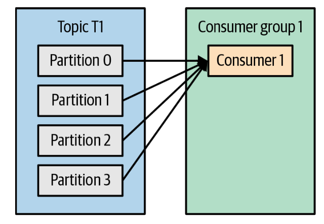
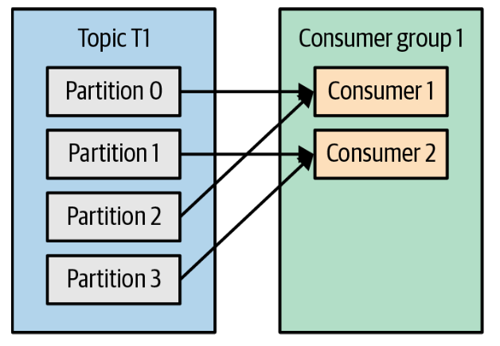
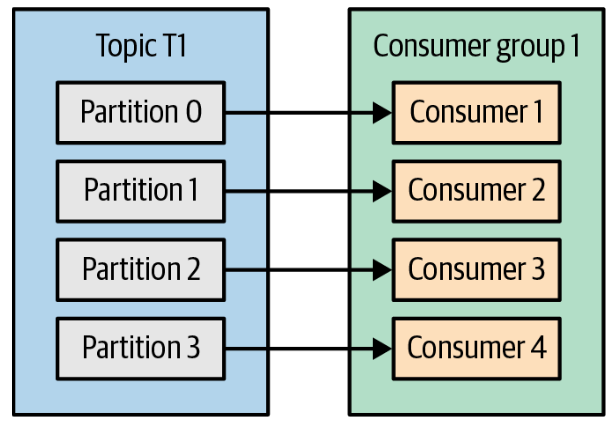
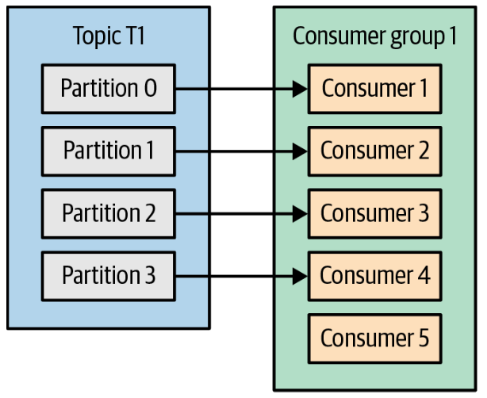
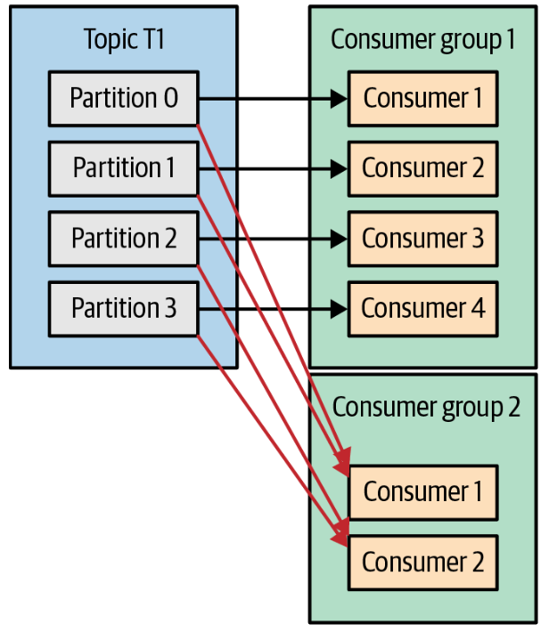
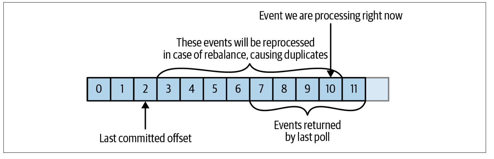
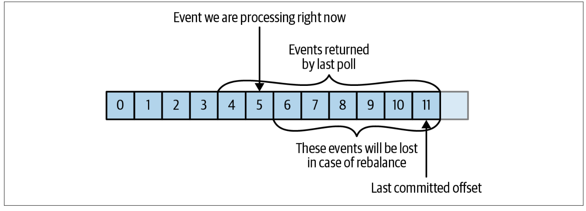

# Chapter 1: Meet Kafka

## Topics and Partitions
Topics are additionally broken down into a number of partitions. Going back to the “commit log” description, a partition is a single log. Each partition can be hosted on a different server, which means that a single topic can be scaled horizontally across multiple servers to provide performance far beyond the ability of a single server. Additionally, partitions can be replicated, such that different servers will store a copy of the same partition in case one server fails. A stream is considered to be a single topic of data, regardless of the number of partitions. This represents a single stream of data moving from the producers to the consumers.

## Producers and Consumers
By default, the producer will balance messages over all partitions of a topic evenly. In some cases, the producer will direct messages to specific partitions. This is typically done using the message key and a partitioner that will generate a hash of the key and map it to a specific partition. This ensures that all messages produced with a given key will get written to the same partition.

The consumer subscribes to one or more topics and reads the messages in the order in which they were produced to each partition. The consumer keeps track of which messages it has already consumed by keeping track of the offset of messages. The offset — an integer value that continually increases — is another piece of metadata that Kafka adds to each message as it is produced. Each message in a given partition has a unique offset, and the following message has a greater offset (though not necessarily monotonically greater). By storing the next possible offset for each partition, typically in Kafka itself, a consumer can stop and restart without losing its place.

When a consumer group consumes messages from a topic, it stores the offset of each consumer in the group in the __consumer_offsets topic. This allows Kafka to track the position of each consumer in the topic and to deliver new messages to the consumer when it is ready to receive them. The __consumer_offsets topic is a compacted topic, which means that it only retains the latest offset for each consumer in the group. Older offsets are discarded to save space.

Consumers work as part of a consumer group, which is one or more consumers that work together to consume a topic. The group ensures that each partition is only consumed by one member. Consumers can horizontally scale to consume topics with a large number of messages. Additionally, if a single consumer fails, the remaining members of the group will reassign the partitions being consumed to take over for the missing member.

## Brokers and Clusters

In Apache Kafka, a cluster is a group of servers that work together to handle the incoming and outgoing messages in a Kafka system. The servers in a Kafka cluster are called brokers.

A single Kafka cluster can consist of one or more brokers, and each broker can handle a large number of topics and partitions

The broker receives messages from producers, assigns offsets to them, and writes the messages to storage on disk. It also services consumers, responding to fetch requests for partitions and responding with the messages that have been published.
 
A key feature of Apache Kafka is that of retention, which is the durable storage of messages for some period of time. Kafka brokers are configured with a default retention setting for topics, either retaining messages for some period of time (e.g., 7 days) or until the partition reaches a certain size in bytes (e.g., 1 GB). Once these limits are reached, messages are expired and deleted.

Individual topics can also be configured with their own retention settings so that messages are stored for only as long as they are useful. Topics can also be configured as log compacted, which means that Kafka will retain only the last message produced with a specific key. This can be useful for changelog-type data, where only the last update is interesting.

In summary, a Kafka cluster is a group of brokers that work together to handle the incoming and outgoing messages in a Kafka system, and a broker is a server that is part of a Kafka cluster and is responsible for storing and replicating messages for a portion of the topic partitions.

## Multiple Clusters
The replication mechanisms within the Kafka clusters are designed only to work within a single cluster, not between multiple clusters. The Kafka project includes a tool called MirrorMaker, used for replicating data to other clusters. At its core, MirrorMaker is simply a Kafka consumer and producer, linked together with a queue. Messages are consumed from one Kafka cluster and produced to another.

# Chapter 2: Installing Kafka
# Chapter 3: Kafka Producers: Writing Messages to Kafka
## Producer Overview
We start producing messages to Kafka by creating a ProducerRecord, which must include the topic we want to send the record to and a value. Optionally, we can also specify a key, a partition, a timestamp, and/or a collection of headers. Once we send the ProducerRecord, the first thing the producer will do is serialize the key and value objects to byte arrays so they can be sent over the network.

Next, if we didn’t explicitly specify a partition, the data is sent to a partitioner. The partitioner will choose a partition for us, usually based on the ProducerRecord key. Once a partition is selected, the producer knows which topic and partition the record will go to. It then adds the record to a batch of records that will also be sent to the same topic and partition. A separate thread is responsible for sending those batches of records to the appropriate Kafka brokers.

When the broker receives the messages, it sends back a response. If the messages were successfully written to Kafka, it will return a RecordMetadata object with the topic, partition, and the offset of the record within the partition.

Once we instantiate a producer, it is time to start sending messages. There are three primary methods of sending messages:
- **Fire-and-forget:** We send a message to the server and don’t really care if it arrives successfully or not. Most of the time, it will arrive successfully, since Kafka is highly available and the producer will retry sending messages automatically. However, in case of nonretriable errors or timeout, messages will get lost and the application will not get any information or exceptions about this.
- **Synchronous send:** Technically, Kafka producer is always asynchronous—we send a message and the send() method returns a Future object. However, we use get() to wait on the Future and see if the send() was successful or not before sending the next record.
- **Asynchronous send:** We call the send() method with a callback function, which gets triggered when it receives a response from the Kafka broker.

## Configuring Producers
- **client.id:** is a logical identifier for the client and the application it is used in. This can be any string and will be used by the brokers to identify messages sent from the client. It is used in logging and metrics and for quotas. Choosing a good client name will make troubleshooting much easier
- **acks:** The acks parameter controls how many partition replicas must receive the record before the producer can consider the write successful. By default, Kafka will respond that the record was written successfully after the leader received the record (release 3.0 of Apache Kafka is expected to change this default). This option has a significant impact on the durability of written messages, and depending on your use case, the default may not be the best choice. 
    - **acks=0**: The producer will not wait for a reply from the broker before assuming the message was sent successfully. This means that if something goes wrong and the broker does not receive the message, the producer will not know about it, and the message will be lost. However, because the producer is not waiting for any response from the server, it can send messages as fast as the network will support, so this setting can be used to achieve very high throughput.
    - **acks=1**: The producer will receive a success response from the broker the moment the leader replica receives the message. If the message can’t be written to the leader (e.g., if the leader crashed and a new leader was not elected yet), the producer will receive an error response and can retry sending the message, avoiding potential loss of data. The message can still get lost if the leader crashes and the latest messages were not yet replicated to the new leader. If the leader broker goes offline but replicas haven't replicated the data yet, we have a data loss.
    - **acks=all**: The producer will receive a success response from the broker once all in sync replicas receive the message. This is the safest mode since you can make sure more than one broker has the message and that the message will survive even in case of a crash. However, the latency we discussed in the acks=1 case will be even higher, since we will be waiting for more than just one broker to receive the message. No data loss, the leader and all replicas recieve data before sending response to the producer.
- **max.block.ms**: is a configuration for the Kafka producer that specifies the maximum amount of time the producer will block when sending messages to the server. When the producer is unable to send a message to the server, it will retry until either the message is successfully sent or the maximum block time has been reached. If the block time is reached and the message still has not been sent, the producer will throw an exception. The purpose of this configuration is to prevent the producer from getting stuck in a loop trying to send a message that cannot be sent, which could cause the producer to consume a lot of resources and potentially cause issues with the rest of the application. By setting a maximum block time, you can ensure that the producer will not block indefinitely and will throw an exception if the message cannot be sent within a certain amount of time.
- **linger.ms**: is a configuration parameter in Apache Kafka that specifies the amount of time the producer will wait to collect more messages before sending a batch of messages to the server. By default, the producer sends messages to the server as soon as they are available. However, this can lead to a large number of small requests being sent to the server, which can be inefficient. For example, you could set it to 100 milliseconds. This would cause the producer to wait for up to 100 milliseconds to collect additional messages before sending a batch of messages to the server.
- **retry.backoff.ms**: is a configuration for the Kafka producer that specifies the amount of time the producer will wait before retrying a failed send request. When the producer is unable to send a message to the server, it will retry the request until either the message is successfully sent or the maximum number of retries has been reached. The retry.backoff.ms configuration controls the amount of time the producer will wait between retry attempts.
- **request.timeout.ms**: is a configuration parameter in Apache Kafka that sets the maximum amount of time the client will wait for the response of a request. It specifies the maximum time the client will wait for a response from the broker when producing or consuming messages, or when fetching metadata.
- **delivery.timeout.ms**: is a configuration for the Kafka producer that specifies the maximum amount of time the producer will wait for a response from the server after sending a message. This timeout controls how long the producer will wait for the server to acknowledge receipt of the message. If the producer does not receive an acknowledgement from the server within the delivery timeout, it will assume that the message has not been delivered and will either retry the send or throw an exception, depending on the configuration of the producer and the error handling settings for the particular message. The purpose of this configuration is to ensure that the producer does not get stuck waiting for a response from the server when it should be able to move on and send more messages. By setting a delivery timeout, you can ensure that the producer will not wait indefinitely and will either retry or fail if it does not receive a response within a certain amount of time. The following condition must be fulfilled: `delivery.timeout.ms >= linger.ms + retry.backoff.ms + request.timeout.ms`
- **batch.size**: specifies the maximum number of bytes the producer will send in a single request to the server. When the producer has collected this many bytes of messages, it will send the messages to the server in a single request, even if linger.ms has not yet expired.
- **buffer.memory**: specifies the total amount of memory the producer can use to buffer messages waiting to be sent to the server. When the producer sends messages to the Kafka cluster, it stores the messages in a buffer before sending them to the server. The buffer.memory parameter controls the size of this buffer, and determines how many messages the producer can store before it starts dropping or blocking new messages.
- **compression.type**: By default, messages are sent uncompressed. This parameter can be set to snappy, gzip, lz4, or zstd, in which case the corresponding compression algorithms will be used to compress the data before sending it to the brokers.
- **max.in.flight.requests.per.connection**: This controls how many message batches the producer will send to the server without receiving responses. Higher settings can increase memory usage while improving throughput.
- **max.request.size**: is a configuration parameter in Apache Kafka that specifies the maximum size of a request the broker will accept. It is used to limit the size of requests sent by the producer and consumer to the broker. For producers, **max.request.size** determines the maximum size of a request the producer can send to the broker. If the producer tries to send a request that is larger than the max.request.size, it will receive an error. For consumers, **max.request.size** determines the maximum size of a fetch request the consumer can send to the broker. If the consumer tries to fetch more data than the max.request.size allows, it will receive an error. The default value for **max.request.size** is 1 MB. It is recommended to set the max.request.size to a value that is appropriate for your application and use case.

## Serializers
When the object you need to send to Kafka is not a simple string or integer, you have a choice of either using a generic serialization library like Avro, Thrift, or Protobuf to create records, or creating a custom serialization for objects you are already using. We highly recommend using a generic serialization library.

## Using Avro Records with Kafka
Unlike Avro files, where storing the entire schema in the data file is associated with a fairly reasonable overhead, storing the entire schema in each record will usually more than double the record size. However, Avro still requires the entire schema to be present when reading the record, so we need to locate the schema elsewhere. To achieve this, we follow a common architecture pattern and use a Schema Registry. The Schema Registry is not part of Apache Kafka, but there are several open source options to choose from. We’ll use the Confluent Schema Registry for this example. The idea is to store all the schemas used to write data to Kafka in the registry. Then we simply store the identifier for the schema in the record we produce to Kafka. The consumers can then use the identifier to pull the record out of the Schema Registry and deserialize the data.

## Partitions
All messages with the same key will go to the same partition. When the key is null and the default partitioner (Murmur2Partitioner) is used, the record will be sent to one of the available partitions of the topic at random. A round-robin algorithm will be used to balance the messages among the partitions. If a key exists and the default partitioner is used, Kafka will hash the key (using its own hash algorithm, so hash values will not change when Java is upgraded) and use the result to map the message to a specific partition. Since it is important that a key is always mapped to the same partition, we use all the partitions in the topic to calculate the mapping—not just the available partitions. This means that if a specific partition is unavailable when you write data to it, you might get an error.

In addition to the default partitioner, Apache Kafka clients also provide RoundRobin Partitioner and UniformStickyPartitioner. These provide random partition assignment and sticky random partition assignment even when messages have keys. These are useful when keys are important for the consuming application (for example, there are ETL applications that use the key from Kafka records as the primary key when loading data from Kafka to a relational database), but the workload may be skewed, so a single key may have a disproportionately large workload. Using the UniformStickyPartitioner will result in an even distribution of workload across all partitions.

The RoundRobin Partitioner assigns messages to the partitions in a round-robin fashion, regardless of the key of the message. It does not take the key of the message into account when determining the partition assignment. The RoundRobin partitioner can be useful when you want to distribute records evenly across all partitions, but do not need to maintain any stickiness for record keys.

The UniformStickyPartitioner also assigns messages to the partitions in a round-robin fashion, but it attempts to assign messages with the same key to the same partition in a "sticky" fashion. It uses a hash function to determine the partition assignment, and tries to ensure that messages with the same key are sent to the same partition as much as possible.

When partitioning keys is important, the easiest solution is to create topics with sufficient partitions (the Confluent blog contains suggestions on how to choose the number of partitions) and never add partitions.

So far, we have discussed the traits of the default partitioner, which is the one most commonly used. However, Kafka does not limit you to just hash partitions, and sometimes there are good reasons to partition data differently. For example, suppose that you are a B2B vendor and your biggest customer is a company that manufactures handheld devices called Bananas. Suppose that you do so much business with cus‐ tomer “Banana” that over 10% of your daily transactions are with this customer. If you use default hash partitioning, the Banana records will get allocated to the same partition as other accounts, resulting in one partition being much larger than the rest. This can cause servers to run out of space, processing to slow down, etc. What we really want is to give Banana its own partition and then use hash partitioning to map the rest of the accounts to all other partitions.

The RoundRobinPartitioner, UniformStickyPartitioner, and Murmur2Partitioner are three partitioning strategies in Apache Kafka that can be used by a producer to determine which partition a record should be sent to. Here are some differences and similarities between these partitioners:
- The RoundRobinPartitioner distributes records across partitions in a round-robin fashion, sending the first record to the first partition, the second record to the second partition, and so on. It does not preserve any "stickiness" for record keys.
- The UniformStickyPartitioner attempts to distribute records uniformly across all partitions, while preserving the "stickiness" of records to a particular partition. This means that once a record is sent to a particular partition, it is more likely to be sent to the same partition again in the future.
- The Murmur2Partitioner is the default partitioner in Apache Kafka. It uses the Murmur2 hash function to determine the partition to which a record should be sent. The Murmur2 hash function maps record keys to a number in a deterministic way, and the resulting number is used to determine the partition to which the record should be sent.

In terms of similarities, all three partitioners are designed to evenly distribute records across all partitions of a topic.
In terms of differences, the RoundRobinPartitioner and UniformStickyPartitioner both distribute records evenly across all partitions, but the RoundRobinPartitioner does not preserve record "stickiness", while the UniformStickyPartitioner does. The Murmur2Partitioner uses the record key to determine the partition assignment in a deterministic way.


## Headers
Records can, in addition to key and value, also include headers. Record headers give you the ability to add some metadata about the Kafka record, without adding any extra information to the key/value pair of the record itself. Headers are often used for lineage to indicate the source of the data in the record, and for routing or tracing messages based on header information without having to parse the message itself. Headers are implemented as an ordered collection of key/value pairs. The keys are always a String, and the values can be any serialized object—just like the message value.

## Interceptors
There are times when you want to modify the behavior of your Kafka client applica‐ tion without modifying its code, perhaps because you want to add identical behavior to all applications in the organization. Or perhaps you don’t have access to the original code. Kafka’s ProducerInterceptor interceptor includes two key methods:
- `ProducerRecord<K, V> onSend(ProducerRecord<K, V> record)`: This method will be called before the produced record is sent to Kafka, indeed before it is even serialized. When overriding this method, you can capture information about the sent record and even modify it. Just be sure to return a valid ProducerRecord from this method. The record that this method returns will be serialized and sent to Kafka.
- `void onAcknowledgement(RecordMetadata metadata, Exception exception)`: This method will be called if and when Kafka responds with an acknowledgment for a send. The method does not allow modifying the response from Kafka, but you can capture information about the response. The onAcknowledgement callback function is called after the consumer has successfully committed the offsets for a batch of messages to Kafka. This can be useful for performing some action or updating some state based on the successful processing of a batch of messages.

## Quotas and Throttling
Kafka brokers have the ability to limit the rate at which messages are produced and consumed. This is done via the quota mechanism. Kafka has three quota types: produce, consume, and request. Produce and consume quotas limit the rate at which clients can send and receive data, measured in bytes per second. Request quotas limit the percentage of time the broker spends processing client requests. Quotas can be applied to all clients by setting default quotas, specific client-ids, specific users, or both. User-specific quotas are only meaningful in clusters where security is configured and clients authenticate.

The default produce and consume quotas that are applied to all clients are part of the Kafka broker configuration file. For example, to limit each producer to send no more than 2 MBps on average, add the following configuration to the broker configuration file: quota.producer.default=2M. While not recommended, you can also configure specific quotas for certain clients that override the default quotas in the broker configuration file. To allow clientA to produce 4 MBps and clientB 10 MBps, you can use the following: quota. producer.`override="clientA:4M,clientB:10M"`

Quotas that are specified in Kafka’s configuration file are static, and you can only modify them by changing the configuration and then restarting all the brokers. Since new clients can arrive at any time, this is very inconvenient. Therefore the usual method of applying quotas to specific clients is through dynamic configuration that can be set using `kafka-config.sh` or the AdminClient API.

When a client reaches its quota, the broker will start throttling the client’s requests to prevent it from exceeding the quota. This means that the broker will delay responses to client requests; in most clients this will automatically reduce the request rate (since the number of in-flight requests is limited) and bring the client traffic down to a level allowed by the quota. To protect the broker from misbehaved clients sending additional requests while being throttled, the broker will also mute the communication channel with the client for the period of time needed to achieve compliance with the quota. 

If you use async `Producer.send()` and continue to send messages at a rate that is higher than the rate the broker can accept (whether due to quotas or just plain old capacity), the messages will first be queued in the client memory. If the rate of sending continues to be higher than the rate of accepting messages, the client will eventually run out of buffer space for storing the excess messages and will block the next `Producer.send()` call. If the timeout delay is insufficient to let the broker catch up to the producer and clear some space in the buffer, eventually Producer.send() will throw `TimeoutException`. Alternatively, some of the records that were already placed in batches will wait for longer than delivery.time out.ms and expire, resulting in calling the `send()` callback with a `TimeoutException`. It is therefore important to plan and monitor to make sure that the broker capacity over time will match the rate at which producers are sending data.

# Chapter 4: Kafka Consumers -  Reading Data from Kafka
## Consumers and Consumer Groups
Kafka consumers are typically part of a consumer group. When multiple consumers are subscribed to a topic and belong to the same consumer group, each consumer in the group will receive messages from a different subset of the partitions in the topic. Let’s take topic T1 with four partitions. Now suppose we created a new consumer, C1, which is the only consumer in group G1, and use it to subscribe to topic T1. Consumer C1 will get all messages from all four T1 partitions.



If we add another consumer, C2, to group G1, each consumer will only get messages from two partitions. Perhaps messages from partition 0 and 2 go to C1, and messages from partitions 1 and 3 go to consumer C2.



If G1 has four consumers, then each will read messages from a single partition.



If we add more consumers to a single group with a single topic than we have parti‐ tions, some of the consumers will be idle and get no messages at all.



Create topics with a large number of partitions—it allows adding more consumers when the load increases. Keep in mind that there is no point in adding more consumers than you have partitions in a topic—some of the consumers will just be idle.

In addition to adding consumers in order to scale a single application, it is very common to have multiple applications that need to read data from the same topic.

To make sure an application gets all the messages in a topic, ensure the application has its own consumer group.



To summarize, you create a new consumer group for each application that needs all the messages from one or more topics. You add consumers to an existing consumer group to scale the reading and processing of messages from the topics, so each addi‐ tional consumer in a group will only get a subset of the messages.


## Consumer Groups and Partition Rebalance


As we saw in the previous section, consumers in a consumer group share ownership of the partitions in the topics they subscribe to. When we add a new consumer to the group, it starts consuming messages from partitions previously consumed by another consumer. The same thing happens when a consumer shuts down or crashes; it leaves the group, and the partitions it used to consume will be consumed by one of the remaining consumers. Moving partition ownership from one consumer to another is called a rebalance. The rebalance process is coordinated by the consumer group coordinator, which is a broker that is responsible for managing the membership and partition assignments of a consumer group. There are two types of rebalances, depending on the partition assignment strategy that the consumer group uses:
- **Eager rebalances**: During an eager rebalance, all consumers stop consuming, give up their ownership of all partitions, rejoin the consumer group, and get a brand-new partition assignment. This is essentially a short window of unavailability of the entire consumer group. The length of the window depends on the size of the consumer group as well as on several configuration parameters. First, all consumers give up their partition assigning, and second, after they all complete this and rejoin the group, they get new partition assignments and can resume consuming.

- **Cooperative rebalances**: Cooperative rebalances (also called incremental rebalances) typically involve reassigning only a small subset of the partitions from one consumer to another, and allowing consumers to continue processing records from all the partitions that are not reassigned. This is achieved by rebalancing in two or more phases. Initially, the consumer group leader informs all the consumers that they will lose ownership of a subset of their partitions, then the consumers stop consuming from these partitions and give up their ownership in them. In the second phase, the consumer group leader assigns these now orphaned partitions to their new owners. This incremental approach may take a few iterations until a stable partition assignment is achieved, but it avoids the complete “stop the world” unavailability that occurs with the eager approach. This is especially important in large consumer groups where rebalances can take a significant amount of time.

Consumers maintain membership in a consumer group and ownership of the parti‐ tions assigned to them by sending heartbeats to a Kafka broker designated as the group coordinator (this broker can be different for different consumer groups). The heartbeats are sent by a background thread of the consumer, and as long as the con‐ sumer is sending heartbeats at regular intervals, it is assumed to be alive. 
If the consumer stops sending heartbeats for long enough, its session will timeout and the group coordinator will consider it dead and trigger a rebalance. In Kafka, the consumer group coordinator is responsible for monitoring the health of the consumers in the group. One way it does this is by checking for heartbeats, which are periodic messages that the consumers send to the coordinator to let it know that they are still alive and working. If a consumer crashes and stops processing messages, it will stop sending heartbeats to the coordinator. The coordinator will wait a few seconds without receiving any heartbeats before deciding that the consumer is dead. At this point, the coordinator will trigger a rebalance in order to redistribute the work of reading and processing data among the remaining consumers in the group.

### How Does the Process of Assigning Partitions to Consumers Work?
When a consumer wants to join a group of other consumers in Kafka, it sends a message to the group coordinator asking to join. The group coordinator is a special broker that helps manage the group. The first consumer to join the group becomes the leader of the group. The leader is responsible for deciding how to share the work of reading and processing data from Kafka topics among all of the consumers in the group. To do this, the leader uses a special tool called a PartitionAssignor. The PartitionAssignor helps the leader figure out which consumer should be responsible for which part of the data.

## Static Group Membership
By default, the identity of a consumer as a member of its consumer group is transient. When consumers leave a consumer group, the partitions that were assigned to the consumer are revoked, and when it rejoins, it is assigned a new member ID and a new set of partitions through the rebalance protocol.

All this is true unless you configure a consumer with a unique group.instance.id, which makes the consumer a static member of the group. When a consumer first joins a consumer group as a static member of the group, it is assigned a set of parti‐ tions according to the partition assignment strategy the group is using, as normal. However, when this consumer shuts down, it does not automatically leave the group—it remains a member of the group until its session times out. When the con‐ sumer rejoins the group, it is recognized with its static identity and is reassigned the same partitions it previously held without triggering a rebalance. The group coordi‐ nator that caches the assignment for each member of the group does not need to trig‐ ger a rebalance but can just send the cache assignment to the rejoining static member.

If two consumers join the same group with the same group.instance.id, the second consumer will get an error saying that a consumer with this ID already exists.

When a consumer in Kafka is responsible for reading and processing data from certain partitions, that responsibility does not change even if the consumer is restarted. This means that if the consumer is turned off and then turned back on again, it will still be responsible for the same partitions. While the consumer is off, no one will be reading and processing data from those partitions. When the consumer is turned back on, it will be behind on the data from those partitions because it wasn't processing them while it was off. You should be confident that the consumer will be able to catch up on this "lag" and process all of the data from the partitions once it is turned back on.

## Creating a Kafka Consumer
The property is group.id, and it specifies the consumer group the KafkaConsumer instance belongs to. While it is possible to create consumers that do not belong to any consumer group, this is uncommon, so for most of the chapter we will assume the consumer is part of a group.

```Java
Properties props = new Properties();
props.put("bootstrap.servers", "broker1:9092,broker2:9092");
props.put("group.id", "CountryCounter");
props.put("key.deserializer", "org.apache.kafka.common.serialization.StringDeserializer");
props.put("value.deserializer", "org.apache.kafka.common.serialization.StringDeserializer");
KafkaConsumer<String, String> consumer = new KafkaConsumer<String, String>(props);
```

## Subscribing to Topics
Once we create a consumer, the next step is to subscribe to one or more topics. The subscribe() method takes a list of topics as a parameter, so it’s pretty simple to use:

```Java
consumer.subscribe(Collections.singletonList("customerCountries"));
```

It is also possible to call subscribe with a regular expression. The expression can match multiple topic names, and if someone creates a new topic with a name that matches, a rebalance will happen almost immediately and the consumers will start consuming from the new topic. This is useful for applications that need to consume from multiple topics and can handle the different types of data the topics will contain. Subscribing to multiple topics using a regular expression is most commonly used in applications that replicate data between Kafka and another system or streams processing applications.

If your Kafka cluster has large number of partitions, perhaps 30,000 or more, you should be aware that the filtering of topics for the subscription is done on the client side. This means that when you subscribe to a subset of topics via a regular expression rather than via an explicit list, the consumer will request the list of all topics and their partitions from the broker in regular intervals. The client will then use this list to detect new topics that it should include in its subscription and subscribe to them. When the topic list is large and there are many consumers, the size of the list of topics and partitions is significant, and the regular expression subscription has significant overhead on the broker, client, and network. There are cases where the bandwidth used by the topic metadata is larger than the bandwidth used to send data. This also means that in order to subscribe with a regular expression, the client needs permissions to describe all topics in the cluster—that is, a full describe grant on the entire cluster.

## The Poll Loop
In Apache Kafka, the poll loop is a central part of the Kafka consumer. It is a loop that runs in the background, repeatedly calling the poll() method on the consumer to retrieve new records from the Kafka broker.

Here is a simplified version of the poll loop:
```Java
while (true) {
    ConsumerRecords<String, String> records = consumer.poll(Duration.ofMillis(100));
    for (ConsumerRecord<String, String> record : records) {
        // Process the record
    }
}
```
The `poll()` method retrieves a batch of records from the Kafka broker. If there are no new records available, the `poll()` method will block for a specified amount of time (in this case, 100 milliseconds) before returning an empty batch of records. If the poll() method finds new records in the Kafka broker within 56 milliseconds, it will return those records to the consumer and the poll loop will continue to the next iteration. The `poll()` method will not block for the full 100 milliseconds in this case, because it has found the records it was waiting for. This helps to reduce the CPU usage of the consumer by not constantly polling the broker when there are no new records to process.

The poll loop will continue running indefinitely, until the consumer is shut down or the thread is interrupted.

In Apache Kafka, the poll loop is implemented in the KafkaConsumer class. The KafkaConsumer class provides a `poll()` method that can be called by the user to retrieve a batch of records from the Kafka broker. However, the poll loop itself is not called directly by the user.

Instead, the KafkaConsumer class starts the poll loop when the `subscribe()` or `assign()` method is called, which tells the consumer to start consuming records from one or more topics. The `subscribe()` and `assign()` methods start a background thread that runs the poll loop in the consumer, continuously calling the `poll()` method to retrieve new records from the Kafka broker.

This method is now deprecated in favor of a new method called `poll(Duration)`, which has slightly different behavior. The `poll(Duration)` method still retrieves records from the Kafka broker, but it takes a Duration object as an argument instead of a long. This allows the timeout to be specified in other time units besides milliseconds.

In addition to the change in argument type, the `poll(Duration)` method has slightly different behavior when it comes to how it waits for metadata from the Kafka broker. The `poll(long)` method would block for as long as it took to get the needed metadata, even if this was longer than the specified timeout duration. The poll(Duration) method, on the other hand, will adhere to the specified timeout duration and not wait for metadata if it takes longer than the timeout.

## Thread Safety
You can’t have multiple consumers that belong to the same group in one thread, and you can’t have multiple threads safely use the same consumer. One consumer per thread is the rule. To run multiple consumers in the same group in one application, you will need to run each in its own thread. It is useful to wrap the consumer logic in its own object and then use Java’s ExecutorService to start multiple threads, each with its own consumer.

## Configuring Consumers
So far we have focused on learning the Consumer API, but we’ve only looked at a few of the configuration properties—just the mandatory bootstrap.servers, group.id, key.deserializer, and value.deserializer.  Most of the parameters have rea‐ sonable defaults and do not require modification, but some have implications on the performance and availability of the consumers. Let’s take a look at some of the more important properties.

### fetch.min.bytes
This property allows a consumer to specify the minimum amount of data that it wants to receive from the broker when fetching records, by default one byte. If a broker receives a request for records from a consumer but the new records amount to fewer bytes than fetch.min.bytes, the broker will wait until more messages are available before sending the records back to the consumer. This reduces the load on both the consumer and the broker, as they have to handle fewer back-and-forth mes‐ sages in cases where the topics don’t have much new activity. 

### fetch.max.wait.ms
By setting fetch.min.bytes, you tell Kafka to wait until it has enough data to send before responding to the consumer. fetch.max.wait.ms lets you control how long to wait. By default, Kafka will wait up to 500 ms. This results in up to 500 ms of extra latency in case there is not enough data flowing to the Kafka topic to satisfy the minimum amount of data to return. If you set fetch.max.wait.ms to 100 ms and fetch.min.bytes to 1 MB, Kafka will receive a fetch request from the consumer and will respond with data either when it has 1 MB of data to return or after 100 ms, whichever happens first.

### fetch.max.bytes
In Apache Kafka, the fetch.max.bytes configuration property specifies the maximum amount of data that the Kafka consumer can receive in a single fetch request from the Kafka broker.

When the consumer sends a fetch request to the broker, it specifies the maximum amount of data it is willing to receive in the request. The broker will return as many records as it can, up to the maximum specified by the consumer. The fetch.max.bytes property determines the maximum amount of data that the consumer is willing to receive in a single fetch request. The default value of fetch.max.bytes is 50MB. If the consumer reaches the limit specified by the fetch.max.bytes configuration property while retrieving records from the Kafka broker, it will stop fetching more records until the next fetch request.

For example, if the consumer sends a fetch request to the broker and the broker has more records available than the consumer is willing to receive (as specified by the fetch.max.bytes limit), the broker will return as many records as it can up to the limit, and the consumer will process those records. The consumer will then send another fetch request to the broker to retrieve any remaining records.

### max.poll.records
This property controls the maximum number of records that a single call to poll() will return.

### max.partition.fetch.bytes
This property controls the maximum number of bytes the server will return per parti‐ tion (1 MB by default). When KafkaConsumer.poll() returns ConsumerRecords, the record object will use at most max.partition.fetch.bytes per partition assigned to the consumer. Note that controlling memory usage using this configuration can be quite complex, as you have no control over how many partitions will be included in the broker response. Therefore, we highly recommend using fetch.max.bytes instead, unless you have special reasons to try and process similar amounts of data from each partition.

### session.timeout.ms and heartbeat.interval.ms
The amount of time a consumer can be out of contact with the brokers while still considered alive defaults to 10 seconds. If more than session.timeout.ms passes without the consumer sending a heartbeat to the group coordinator, it is considered dead and the group coordinator will trigger a rebalance of the consumer group to allocate partitions from the dead consumer to the other consumers in the group. This property is closely related to heartbeat.interval.ms, which controls how frequently the Kafka consumer will send a heartbeat to the group coordinator, whereas session.timeout.ms controls how long a consumer can go without sending a heartbeat. Therefore, those two properties are typically modified together—heartbeat. interval.ms must be lower than session.timeout.ms and is usually set to one-third of the timeout value. So if session.timeout.ms is 3 seconds, heartbeat. interval.ms should be 1 second. Setting session.timeout.ms lower than the default will allow consumer groups to detect and recover from failure sooner but may also cause unwanted rebalances. Setting session.timeout.ms higher will reduce the chance of accidental rebalance but also means it will take longer to detect a real failure.


### max.poll.interval.ms
This property lets you set the length of time during which the consumer can go without polling before it is considered dead. As mentioned earlier, heartbeats and ses‐ sion timeouts are the main mechanism by which Kafka detects dead consumers and takes their partitions away. However, we also mentioned that heartbeats are sent by a background thread. There is a possibility that the main thread consuming from Kafka is deadlocked, but the background thread is still sending heartbeats. This means that records from partitions owned by this consumer are not being processed. The easiest way to know whether the consumer is still processing records is to check whether it is asking for more records. However, the intervals between requests for more records are difficult to predict and depend on the amount of available data, the type of pro‐ cessing done by the consumer, and sometimes on the latency of additional services.  It has to be an interval large enough that it will very rarely be reached by a healthy consumer but low enough to avoid significant impact from a hanging consumer. The default value is 5 minutes. When the timeout is hit, the background thread will send a “leave group” request to let the broker know that the consumer is dead and the group must rebalance, and then stop sending heartbeats.

### default.api.timeout.ms
The default.api.timeout.ms property determines how long the consumer or producer will wait for a response from the Kafka broker before timing out and throwing an exception. This timeout applies to all consumer and producer API requests, such as fetch requests, produce requests, and metadata requests. This is the timeout that will apply to (almost) all API calls made by the consumer when you don’t specify an explicit timeout while calling the API. The default is 1 minute, and since it is higher than the request timeout default, it will include a retry when needed. 

### request.timeout.ms
This is the maximum amount of time the consumer will wait for a response from the broker. If the broker does not respond within this time, the client will assume the broker will not respond at all, close the connection, and attempt to reconnect. This configuration defaults to 30 seconds, and it is recommended not to lower it. It is important to leave the broker with enough time to process the request before giving up.

### auto.offset.reset
This property controls the behavior of the consumer when it starts reading a partition for which it doesn’t have a committed offset, or if the committed offset it has is inva‐ lid (usually because the consumer was down for so long that the record with that off‐ set was already aged out of the broker). The default is “latest,” which means that lacking a valid offset, the consumer will start reading from the newest records (records that were written after the consumer started running). The alternative is “earliest,” which means that lacking a valid offset, the consumer will read all the data in the partition, starting from the very beginning. Setting auto.offset.reset to none will cause an exception to be thrown when attempting to consume from an invalid offset.

### partition.assignment.strategy
We learned that partitions are assigned to consumers in a consumer group. A PartitionAssignor is a class that, given consumers and topics they subscribed to, decides which partitions will be assigned to which consumer. By default, Kafka has the following assignment strategies:
- **Range**: Assigns to each consumer a consecutive subset of partitions from each topic it subscribes to. So if consumers C1 and C2 are subscribed to two topics, T1 and T2, and each of the topics has three partitions, then C1 will be assigned partitions 0 and 1 from topics T1 and T2, while C2 will be assigned partition 2 from those topics. Because each topic has an uneven number of partitions and the assignment is done for each topic independently, the first consumer ends up with more partitions than the second. This happens whenever Range assignment is used and the number of consumers does not divide the number of partitions in each topic neatly.
- **RoundRobin**: Takes all the partitions from all subscribed topics and assigns them to consumers sequentially, one by one. If C1 and C2 described previously used RoundRobin assignment, C1 would have partitions 0 and 2 from topic T1, and partition 1 from topic T2. C2 would have partition 1 from topic T1, and partitions 0 and 2 from topic T2. In general, if all consumers are subscribed to the same topics (a very common scenario), RoundRobin assignment will end up with all consumers having the same number of partitions (or at most one partition difference).
- **Sticky**: The Sticky Assignor has two goals: the first is to have an assignment that is as balanced as possible, and the second is that in case of a rebalance, it will leave as many assignments as possible in place, minimizing the overhead associated with moving partition assignments from one consumer to another. In the common case where all consumers are subscribed to the same topic, the initial assignment from the Sticky Assignor will be as balanced as that of the RoundRobin Assignor. Subsequent assignments will be just as balanced but will reduce the number of partition movements. In cases where consumers in the same group subscribe to different topics, the assignment achieved by Sticky Assignor is more balanced than that of the RoundRobin Assignor.
- **Cooperative Sticky**: This assignment strategy is identical to that of the Sticky Assignor but supports cooperative rebalances in which consumers can continue consuming from the partitions that are not reassigned.

### client.id 
This can be any string, and will be used by the brokers to identify requests sent from the client, such as fetch requests. It is used in logging and metrics, and for quotas.

### client.rack
By default, consumers will fetch messages from the leader replica of each partition. However, when the cluster spans multiple datacenters or multiple cloud availability zones, there are advantages both in performance and in cost to fetching messages from a replica that is located in the same zone as the consumer. To enable fetching from the closest replica, you need to set the client.rack configuration and identify the zone in which the client is located. Then you can configure the brokers to replace the default replica.selector.class with org.apache.kafka.common.replica.Rack AwareReplicaSelector.
You can also implement your own replica.selector.class with custom logic for choosing the best replica to consume from, based on client metadata and partition metadata.

## Commits and Offsets
We call the action of updating the current position in the partition an offset commit. Instead, consumers commit the last message they’ve successfully processed from a partition and implicitly assume that every message before the last was also success‐ fully processed.

How does a consumer commit an offset? It sends a message to Kafka, which updates a special __consumer_offsets topic with the committed offset for each partition. As long as all your consumers are up, running, and churning away, this will have no impact. However, if a consumer crashes or a new consumer joins the consumer group, this will trigger a rebalance. After a rebalance, each consumer may be assigned a new set of partitions than the one it processed before. In order to know where to pick up the work, the consumer will read the latest committed offset of each partition and continue from there.

If the committed offset is smaller than the offset of the last message the client pro‐ cessed, the messages between the last processed offset and the committed offset will be processed twice.



If the committed offset is larger than the offset of the last message the client actually processed, all messages between the last processed offset and the committed offset will be missed by the consumer group.



## Automatic Commit
The easiest way to commit offsets is to allow the consumer to do it for you. If you configure `enable.auto.commit=true`, then every five seconds the consumer will commit the latest offset that your client received from `poll()`. The five-second interval is the default and is controlled by setting auto.commit.interval.ms. Just like everything else in the consumer, the automatic commits are driven by the poll loop. Whenever you poll, the consumer checks if it is time to commit, and if it is, it will commit the offsets it returned in the last poll. 

Consider that, by default, automatic commits occur every five seconds. Suppose that we are three seconds after the most recent commit our consumer crashed. After the rebalancing, the surviving consumers will start consuming the partitions that were previously owned by the crashed broker. But they will start from the last offset com‐ mitted. In this case, the offset is three seconds old, so all the events that arrived in those three seconds will be processed twice. It is possible to configure the commit interval to commit more frequently and reduce the window in which records will be duplicated, but it is impossible to completely eliminate them.
With autocommit enabled, when it is time to commit offsets, the next poll will commit the last offset returned by the previous poll. It doesn’t know which events were actually processed, so it is critical to always process all the events returned by `poll()` before calling `poll()` again. (Just like `poll()`, `close()` also commits offsets automatically.) This is usually not an issue, but pay attention when you handle exceptions or exit the poll loop prematurely. Automatic commits are convenient, but they don’t give developers enough control to avoid duplicate messages.