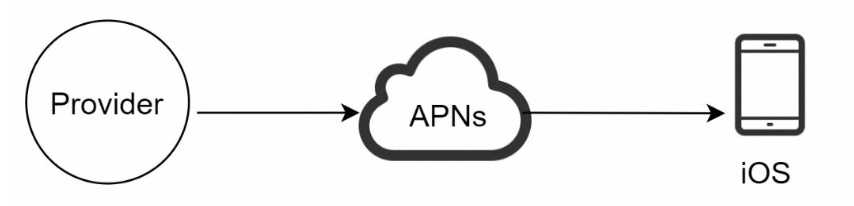

## Interview Tips
To wrap up, we summarize a list of the Dos and Don’ts.
Dos
- Always ask for clarification. Do not assume your assumption is correct. - Understand the requirements of the problem.
- There is neither the right answer nor the best answer. A solution designed to solve the problems of a young startup is different from that of an established company with millions of users. Make sure you understand the requirements.
- Let the interviewer know what you are thinking. Communicate with your interview. - Suggest multiple approaches if possible.
- Once you agree with your interviewer on the blueprint, go into details on each component. Design the most critical components first.
- Bounce ideas off the interviewer. A good interviewer works with you as a teammate. - Never give up.
Don’ts
- Don't be unprepared for typical interview questions.
- Don’t jump into a solution without clarifying the requirements and assumptions.
- Don’t go into too much detail on a single component in the beginning. Give the high- level design first then drills down.
- If you get stuck, don't hesitate to ask for hints. - Again, communicate. Don't think in silence.
- Don’t think your interview is done once you give the design. You are not done until your interviewer says you are done. Ask for feedback early and often.

## SCALE FROM ZERO TO MILLIONS OF USERS
Vertical scaling, referred to as “scale up”, means the process of adding more power (CPU, RAM, etc.) to your servers. Horizontal scaling, referred to as “scale-out”, allows you to scale by adding more servers into your pool of resources.

## DESIGN A RATE LIMITER
### Where to put the rate limiter?
- Client-side implementation: Generally speaking, client is an unreliable place to enforce rate limiting because client requests can easily be forged by malicious actors. Moreover, we might not have control over the client implementation.
- Server-side implementation: A rate limiter that is placed on the server- side.
- Middleware implementation: which throttles requests to your APIs as shown below. API gateway is a fully managed service that supports rate limiting, SSL termination, authentication, IP whitelisting, servicing static content, etc. For now, we only need to know that the API gateway is a middleware that supports rate limiting.


### Algorithms for rate limiting
Here is a list of popular algorithms:
- Token bucket
- Leaking bucket
- Fixed window counter 
- Sliding window log
- Sliding window counter


### High-level architecture
The basic idea of rate limiting algorithms is simple. At the high-level, we need a counter to keep track of how many requests are sent from the same user, IP address, etc. If the counter is larger than the limit, the request is disallowed.
Where shall we store counters? Using the database is not a good idea due to slowness of disk access. In-memory cache is chosen because it is fast and supports time-based expiration strategy. For instance, Redis is a popular option to implement rate limiting. It is an in- memory store that offers two commands: INCR and EXPIRE.
- INCR: It increases the stored counter by 1.
- EXPIRE: It sets a timeout for the counter. If the timeout expires, the counter is automatically deleted.

- Rules are stored on the disk. Workers frequently pull rules from the disk and store them in the cache.
- When a client sends a request to the server, the request is sent to the rate limiter middleware first.
- Rate limiter middleware loads rules from the cache. It fetches counters and last request timestamp from Redis cache. Based on the response, the rate limiter decides:
- if the request is not rate limited, it is forwarded to API servers.
- if the request is rate limited, the rate limiter returns 429 too many requests error to the client. In the meantime, the request is either dropped or forwarded to the queue.


## DESIGN CONSISTENT HASHING
To achieve horizontal scaling, it is important to distribute requests/data efficiently and evenly across servers. Consistent hashing is a commonly used technique to achieve this goal. 

### The rehashing problem
If you have n cache servers, a common way to balance the load is to use the following hash method:
serverIndex = hash(key) % N, where N is the size of the server pool. This approach works well when the size of the server pool is fixed, and the data distribution is even. However, problems arise when new servers are added, or existing servers are removed. For example, if server 1 goes offline, the size of the server pool becomes 3. Using the same hash function, we get the same hash value for a key. But applying modular operation gives us different server indexes because the number of servers is reduced by 1.

### Solution: Consistent hashing
Consistent hashing is a special kind of hashing such that when a hash table is re-sized and consistent hashing is used, only k/n keys need to be remapped on average, where k is the number of keys, and n is the number of slots.

Now we understand the definition of consistent hashing, let us find out how it works. Assume SHA-1 is used as the hash function f, and the output range of the hash function is: x0, x1, x2, x3, ..., xn. In cryptography, SHA-1’s hash space goes from 0 to 2^160 - 1. That means x0 corresponds to 0, xn corresponds to 2^160 – 1, and all the other hash values in the middle fall between 0 and 2^160 - 1. Figure 5-3 shows the hash space.


One thing worth mentioning is that hash function used here is different from the one in “the rehashing problem,” and there is no modular operation. As shown in the figure, 4 cache keys (key0, key1, key2, and key3) are hashed onto the hash ring. To determine which server a key is stored on, we go clockwise from the key position on the ring until a server is found. Figure 5-7 explains this process. Going clockwise, key0 is stored on server 0; key1 is stored on server 1; key2 is stored on server 2 and key3 is stored on server 3.


### Add a server
After a new server 4 is added, only key0 needs to be redistributed. k1, k2, and k3 remain on the same servers. Let us take a close look at the logic. Before server 4 is added, key0 is stored on server 0. Now, key0 will be stored on server 4 because server 4 is the first server it encounters by going clockwise from key0’s position on the ring. The other keys are not redistributed based on consistent hashing algorithm.


### Remove a server
When a server is removed, only a small fraction of keys require redistribution with consistent hashing. In Figure below, when server 1 is removed, only key1 must be remapped to server 2. The rest of the keys are unaffected.


### Two issues in the basic approach
The consistent hashing algorithm was introduced by Karger et al. at MIT [1]. The basic steps are:
- Map servers and keys on to the ring using a uniformly distributed hash function.
- To find out which server a key is mapped to, go clockwise from the key position until the first server on the ring is found.

Problems:
- First, it is impossible to keep the same size of partitions on the ring for all servers considering a server can be added or removed. It is possible that the size of the partitions on the ring assigned to each server is very small or fairly large. 
- Second, it is possible to have a non-uniform key distribution on the ring. For instance, if servers are mapped to positions, most of the keys are stored on server 2. However, server 1 and server 3 have no data.

A technique called virtual nodes or replicas is used to solve these problems.

### Virtual nodes
A virtual node refers to the real node, and each server is represented by multiple virtual nodes on the ring. In Figure 5-12, both server 0 and server 1 have 3 virtual nodes. The 3 is arbitrarily chosen; and in real-world systems, the number of virtual nodes is much larger. Instead of using s0, we have s0_0, s0_1, and s0_2 to represent server 0 on the ring. Similarly, s1_0, s1_1, and s1_2 represent server 1 on the ring. With virtual nodes, each server is responsible for multiple partitions. Partitions (edges) with label s0 are managed by server 0. On the other hand, partitions with label s1 are managed by server 1. To find which server a key is stored on, we go clockwise from the key’s location and find the first virtual node encountered on the ring. As the number of virtual nodes increases, the distribution of keys becomes more balanced. This is because the standard deviation gets smaller with more virtual nodes, leading to balanced data distribution.


### The benefits of consistent hashing:
- Minimized keys are redistributed when servers are added or removed.
- It is easy to scale horizontally because data are more evenly distributed.
- Mitigate hotspot key problem. Excessive access to a specific shard could cause server overload. Imagine data for Katy Perry, Justin Bieber, and Lady Gaga all end up on the same shard. Consistent hashing helps to mitigate the problem by distributing the data more evenly.


## DESIGN A UNIQUE ID GENERATOR IN DISTRIBUTED SYSTEMS

### Possible approaches
#### Approach 1: Multi-master replication
This approach uses the databases’ auto_increment feature. Instead of increasing the next ID by 1, we increase it by k, where k is the number of database servers in use. As illustrated in the figure below, next ID to be generated is equal to the previous ID in the same server plus 2. This solves some scalability issues because IDs can scale with the number of database servers. However, this strategy has some major drawbacks:
- Hard to scale with multiple data centers
- IDs do not go up with time across multiple servers.
- It does not scale well when a server is added or removed.


#### Approach 2: UUID
A UUID is another easy way to obtain unique IDs. UUID is a 128-bit number used to identify information in computer systems. UUID has a very low probability of getting collusion. Quoted from Wikipedia, “after generating 1 billion UUIDs every second for approximately 100 years would the probability of creating a single duplicate reach 50%” 

Pros:
- Generating UUID is simple. No coordination between servers is needed so there will not be any synchronization issues.
- The system is easy to scale because each web server is responsible for generating IDs they consume. ID generator can easily scale with web servers.

Cons:
- IDs are 128 bits long, but our requirement is 64 bits.
- IDs could be non-numeric.

#### Approach 3: Ticket Server
The idea is to use a centralized auto_increment feature in a single database server (Ticket Server). To learn more about this, refer to flicker’s engineering blog article.

Pros:
- Numeric IDs.
- It is easy to implement, and it works for small to medium-scale applications.

Cons:
- Single point of failure. Single ticket server means if the ticket server goes down, all systems that depend on it will face issues. To avoid a single point of failure, we can set up multiple ticket servers. However, this will introduce new challenges such as data synchronization.


#### Approach 4: Twitter snowflake
Divide and conquer is our friend. Instead of generating an ID directly, we divide an ID into different sections. Figure shows the layout of a 64-bit ID.


Each section is explained below.
- Sign bit: 1 bit. It will always be 0. This is reserved for future uses. It can potentially be used to distinguish between signed and unsigned numbers.
- Timestamp: 41 bits. Milliseconds since the epoch or custom epoch. We use Twitter snowflake default epoch 1288834974657, equivalent to Nov 04, 2010, 01:42:54 UTC.
- Datacenter ID: 5 bits, which gives us 2 ^ 5 = 32 datacenters.
- Machine ID: 5 bits, which gives us 2 ^ 5 = 32 machines per datacenter.
- Sequence number: 12 bits. For every ID generated on that machine/process, the sequence number is incremented by 1. The number is reset to 0 every millisecond.


The most important 41 bits make up the timestamp section. As timestamps grow with time, IDs are sortable by time. 41 bits means maximum ~69 years. 

Sequence number is 12 bits, which give us 2 ^ 12 = 4096 combinations. This field is 0 unless more than one ID is generated in a millisecond on the same server. In theory, a machine can support a maximum of 4096 new IDs per millisecond.

## DESIGN A URL SHORTENER

A URL shortener primary needs two API endpoints:
1. URL shortening. To create a new short URL, a client sends a POST request, which contains one parameter: the original long URL
2. URL redirecting. To redirect a short URL to the corresponding long URL, a client sends a GET request.

The hash function must satisfy the following requirements: 
- Each longURL must be hashed to one hashValue.
- Each hashValue can be mapped back to the longURL.


We will explore two types of hash functions for a URL shortener. The first one is “hash + collision resolution”, and the second one is “base 62 conversion.” Let us look at them one by one.

### hash + collision resolution
To shorten a long URL, we should implement a hash function that hashes a long URL to a 7- character string. A straightforward solution is to use well-known hash functions like CRC32, MD5, or SHA-1.
But, even the shortest hash value (from CRC32) is too long (more than 7 characters). How can we make it shorter? The first approach is to collect the first 7 characters of a hash value; however, this method can lead to hash collisions. To resolve hash collisions, we can recursively append a new predefined string until no more collision is discovered. This method can eliminate collision; however, it is expensive to query the database to check if a shortURL exists for every request.


### Base 62 conversion
Base conversion is another approach commonly used for URL shorteners. Base conversion helps to convert the same number between its different number representation systems. Base 62 conversion is used as there are 62 possible characters for hashValue. For example, 11157 is converted to XT2.


### Comparison of the two approaches


### Big picture


1. longURL is the input.
2. The system checks if the longURL is in the database.
3. If it is, it means the longURL was converted to shortURL before. In this case, fetch the shortURL from the database and return it to the client.
4. If not, the longURL is new. A new unique ID (primary key) Is generated by the unique ID generator.
5. Convert the ID to shortURL with base 62 conversion.
6. Create a new database row with the ID, shortURL, and longURL. To make the flow easier to understand, let us look at a concrete example.
- Assuming the input longURL is: https://en.wikipedia.org/wiki/Systems_design 
- Unique ID generator returns ID: 2009215674938.
- Convert the ID to shortURL using the base 62 conversion. ID (2009215674938) is converted to “zn9edcu”.
- Save ID, shortURL, and longURL to the database as shown in Table 8-4.


The flow of URL redirecting is summarized as follows:
1. A user clicks a short URL link: https://tinyurl.com/zn9edcu
2. The load balancer forwards the request to web servers.
3. If a shortURL is already in the cache, return the longURL directly.
4. If a shortURL is not in the cache, fetch the longURL from the database. If it is not in the database, it is likely a user entered an invalid shortURL.
5. The longURL is returned to the user.


## DESIGN A WEB CRAWLER
A web crawler is known as a robot or spider. It is widely used by search engines to discover new or updated content on the web. Content can be a web page, an image, a video, a PDF file, etc. A web crawler starts by collecting a few web pages and then follows links on those pages to collect new content. A crawler is used for many purposes:
- Search engine indexing: This is the most common use case. A crawler collects web pages to create a local index for search engines. For example, Googlebot is the web crawler behind the Google search engine.
- Web archiving: This is the process of collecting information from the web to preserve data for future uses. For instance, many national libraries run crawlers to archive web sites.
- Web mining: The explosive growth of the web presents an unprecedented opportunity for data mining. Web mining helps to discover useful knowledge from the internet. For example, top financial firms use crawlers to download shareholder meetings and annual reports to learn key company initiatives.
- Web monitoring. The crawlers help to monitor copyright and trademark infringements over the Internet.


1. Add seed URLs to the URL Frontier
2. HTML Downloader fetches a list of URLs from URL Frontier.
3. HTML Downloader gets IP addresses of URLs from DNS resolver and starts downloading.
4. Content Parser parses HTML pages and checks if pages are malformed.
5. After content is parsed and validated, it is passed to the “Content Seen?” component.
6. “Content Seen” component checks if a HTML page is already in the storage.
- If it is in the storage, this means the same content in a different URL has already been processed. In this case, the HTML page is discarded.
- If it is not in the storage, the system has not processed the same content before. The content is passed to Link Extractor.
7. Link extractor extracts links from HTML pages.
8. Extracted links are passed to the URL filter.
9. After links are filtered, they are passed to the “URL Seen?” component.
10. “URL Seen” component checks if a URL is already in the storage, if yes, it is processed before, and nothing needs to be done.
11. If a URL has not been processed before, it is added to the URL Frontier.


- Seed URLs: A web crawler uses seed URLs as a starting point for the crawl process. For example, to crawl all web pages from a university’s website, an intuitive way to select seed URLs is to use the university’s domain name.
To crawl the entire web, we need to be creative in selecting seed URLs. A good seed URL serves as a good starting point that a crawler can utilize to traverse as many links as possible. The general strategy is to divide the entire URL space into smaller ones. The first proposed approach is based on locality as different countries may have different popular websites. Another way is to choose seed URLs based on topics; for example, we can divide URL space into shopping, sports, healthcare, etc. Seed URL selection is an open-ended question. You are not expected to give the perfect answer. Just think out loud.
- URL Frontier: Most modern web crawlers split the crawl state into two: to be downloaded and already downloaded. The component that stores URLs to be downloaded is called the URL Frontier. You can refer to this as a First-in-First-out (FIFO) queue. For detailed information about the URL Frontier, refer to the deep dive.
- HTML Downloader: The HTML downloader downloads web pages from the internet. Those URLs are provided by the URL Frontier.
- DNS Resolver: To download a web page, a URL must be translated into an IP address. The HTML Downloader calls the DNS Resolver to get the corresponding IP address for the URL. For instance, URL www.wikipedia.org is converted to IP address 198.35.26.96 as of 3/5/2019.
- Content Parser: After a web page is downloaded, it must be parsed and validated because malformed web pages could provoke problems and waste storage space. Implementing a content parser in a crawl server will slow down the crawling process. Thus, the content parser is a separate component.
- Content Seen?: Online research reveals that 29% of the web pages are duplicated contents, which may cause the same content to be stored multiple times. We introduce the “Content Seen?” data structure to eliminate data redundancy and shorten processing time. It helps to detect new content previously stored in the system. To compare two HTML documents, we can compare them character by character. However, this method is slow and time-consuming, especially when billions of web pages are involved. An efficient way to accomplish this task is to compare the hash values of the two web pages [7].
- Content Storage: It is a storage system for storing HTML content. The choice of storage system depends on factors such as data type, data size, access frequency, life span, etc. Both disk and memory are used. Most of the content is stored on disk because the data set is too big to fit in memory. • Popular content is kept in memory to reduce latency.
- URL Extractor: URL Extractor parses and extracts links from HTML pages. Figure 9-3 shows an example of a link extraction process. Relative paths are converted to absolute URLs by adding the “https://en.wikipedia.org” prefix.
- URL Filter: The URL filter excludes certain content types, file extensions, error links and URLs in “blacklisted” sites.
- URL Seen?: “URL Seen?” is a data structure that keeps track of URLs that are visited before or already in the Frontier. “URL Seen?” helps to avoid adding the same URL multiple times as this can increase server load and cause potential infinite loops.
Bloom filter and hash table are common techniques to implement the “URL Seen?” component. We will not cover the detailed implementation of the bloom filter and hash table here. 
- URL Storage: URL Storage stores already visited URLs.
So far, we have discussed every system component. Next, we put them together to explain the workflow.


You can think of the web as a directed graph where web pages serve as nodes and hyperlinks (URLs) as edges. The crawl process can be seen as traversing a directed graph from one web page to others. Two common graph traversal algorithms are DFS and BFS. However, DFS is usually not a good choice because the depth of DFS can be very deep.
BFS is commonly used by web crawlers and is implemented by a first-in-first-out (FIFO) queue. In a FIFO queue, URLs are dequeued in the order they are enqueued. However, this implementation has two problems:
- Most links from the same web page are linked back to the same host. In Figure 9-5, all the links in wikipedia.com are internal links, making the crawler busy processing URLs from the same host (wikipedia.com). When the crawler tries to download web pages in parallel, Wikipedia servers will be flooded with requests. This is considered as “impolite”.
- Standard BFS does not take the priority of a URL into consideration. The web is large and not every page has the same level of quality and importance. Therefore, we may want to prioritize URLs according to their page ranks, web traffic, update frequency, etc.


### URL frontier
URL frontier helps to address these problems. A URL frontier is a data structure that stores URLs to be downloaded. The URL frontier is an important component to ensure politeness, URL prioritization, and freshness. 

#### Politeness
Generally, a web crawler should avoid sending too many requests to the same hosting server within a short period. Sending too many requests is considered as “impolite” or even treated as denial-of-service (DOS) attack. For example, without any constraint, the crawler can send thousands of requests every second to the same website. This can overwhelm the web servers. The general idea of enforcing politeness is to download one page at a time from the same host. A delay can be added between two download tasks. 
- Queue router: It ensures that each queue (b1, b2, ... bn) only contains URLs from the same host.
- Queue selector: Each worker thread is mapped to a FIFO queue, and it only downloads URLs from that queue. The queue selection logic is done by the Queue selector.
- Worker thread 1 to N. A worker thread downloads web pages one by one from the same host. A delay can be added between two download tasks.


#### Priority
A random post from a discussion forum about Apple products carries very different weight than posts on the Apple home page. Even though they both have the “Apple” keyword, it is sensible for a crawler to crawl the Apple home page first.
- Prioritizer: It takes URLs as input and computes the priorities.
- Queue f1 to fn: Each queue has an assigned priority. Queues with high priority are selected with higher probability.
- Queue selector: Randomly choose a queue with a bias towards queues with higher priority.


The following img describes politeness and priority solutions together.


### Performance optimization
- Cache DNS Resolver: DNS Resolver is a bottleneck for crawlers because DNS requests might take time due to the synchronous nature of many DNS interfaces. DNS response time ranges from 10ms to 200ms. Maintaining our DNS cache to avoid calling DNS frequently is an effective technique for speed optimization. Our DNS cache keeps the domain name to IP address mapping and is updated periodically by cron jobs.
- Short timeout: Some web servers respond slowly or may not respond at all. To avoid long wait time, a maximal wait time is specified. If a host does not respond within a predefined time, the crawler will stop the job and crawl some other pages.
- Server-side rendering: Numerous websites use scripts like JavaScript, AJAX, etc to generate links on the fly. If we download and parse web pages directly, we will not be able to retrieve dynamically generated links. To solve this problem, we perform server-side rendering (also called dynamic rendering) first before parsing a page

## DESIGN A NOTIFICATION SYSTEM
### iOS push notification
We primary need three components to send an iOS push notification:
- Provider. A provider builds and sends notification requests to Apple Push Notification Service (APNS). To construct a push notification, the provider provides the following data:
- Device token: This is a unique identifier used for sending push notifications.
- Payload: This is a JSON dictionary that contains a notification’s payload. Here is an example:

```JSON
{
    "aps" : {
        "alert" : {
            "title" : "Game Request",
            "body" : "Bob wants to play chess",
            "action-loc-key" : "Play"
        },
        "badge" : 5
    }
}
```
- APNS: This is a remote service provided by Apple to propagate push notifications to iOS devices.
- iOS Device: It is the end client, which receives push notifications. 



### Android push notification
Android adopts a similar notification flow. Instead of using APNs, Firebase Cloud Messaging (FCM) is commonly used to send push notifications to android devices.


### SMS message
For SMS messages, third party SMS services like Twilio [1], Nexmo [2], and many others are commonly used. Most of them are commercial services.


### Email
Although companies can set up their own email servers, many of them opt for commercial email services. Sendgrid [3] and Mailchimp [4] are among the most popular email services, which offer a better delivery rate and data analytics.


### High level design


- **Service 1 to N**: They represent different services that send notifications via APIs provided by notification servers.
- **Notification servers**: They provide the following functionalities:
Provide APIs for services to send notifications. Those APIs are only accessible internally
or by verified clients to prevent spams. Carry out basic validations to verify emails, phone numbers, etc. Query the database or cache to fetch data needed to render a notification. • Put notification data to message queues for parallel processing. Here is an example of the API to send an email:

```JSON
{
    "to" : [
        {
            "user_id" :123456
        }
    ],
    "from" : {
        "email" : "from_address@example.com"
    },
    "subject" : "Hello World!",
    "content" : [
        {
            "type" : "text/plain",
            "value" : "Hello world!"
        }
    ]   
}
```
- **Cache**: User info, device info, notification templates are cached. 
- **DB**: It stores data about user, notification, settings, etc.
- **Message queues:** They remove dependencies between components. Message queues serve as buffers when high volumes of notifications are to be sent out. Each notification type is assigned with a distinct message queue so an outage in one third-party service will not affect other notification types.
- **Workers**: Workers are a list of servers that pull notification events from message queues and send them to the corresponding third-party services.
- **Third-party services**: Already explained in the initial design.
- **iOS, Android, SMS, Email**: Already explained in the initial design.


Next, let us examine how every component works together to send a notification: 
1. A service calls APIs provided by notification servers to send notifications.
2. Notification servers fetch metadata such as user info, device token, and notification setting from the cache or database.
3. A notification event is sent to the corresponding queue for processing. For instance, an iOS push notification event is sent to the iOS PN queue.
4. Workers pull notification events from message queues. 
5. Workers send notifications to third party services.
6. Third-party services send notifications to user devices.


- **Retry mechanism**: When a third-party service fails to send a notification, the notification will be added to the message queue for retrying. If the problem persists, an alert will be sent out to developers.
- **Security in push notifications**: For iOS or Android apps, appKey and appSecret are used to secure push notification APIs [6]. Only authenticated or verified clients are allowed to send push notifications using our APIs.

## DESIGN A NEWS FEED SYSTEM


- User: a user can view news feeds on a browser or mobile app. A user makes a post with content “Hello” through API:/v1/me/feed?content=Hello&auth_token={auth_token}
- Load balancer: distribute traffic to web servers.
- Web servers: web servers redirect traffic to different internal services.
- Post service: persist post in the database and cache.
- Fanout service: push new content to friends’ news feed. Newsfeed data is stored in the cache for fast retrieval.
- Notification service: inform friends that new content is available and send out push notifications.


- User: a user sends a request to retrieve her news feed. The request looks like this: / v1/me/feed.
- Load balancer: load balancer redirects traffic to web servers.
- Web servers: web servers route requests to newsfeed service.
- Newsfeed service: news feed service fetches news feed from the cache.
- Newsfeed cache: store news feed IDs needed to render the news feed.


### Web servers
Besides communicating with clients, web servers enforce authentication and rate-limiting. Only users signed in with valid auth_token are allowed to make posts. The system limits the number of posts a user can make within a certain period, vital to prevent spam and abusive content.

### Fanout service
Fanout is the process of delivering a post to all friends. Two types of fanout models are: fanout on write (also called push model) and fanout on read (also called pull model). Both models have pros and cons. We explain their workflows and explore the best approach to support our system.
### Fanout on write. 
With this approach, news feed is pre-computed during write time. A new post is delivered to friends’ cache immediately after it is published.

Pros:
- The news feed is generated in real-time and can be pushed to friends immediately.
- Fetching news feed is fast because the news feed is pre-computed during write time.

Cons:
- If a user has many friends, fetching the friend list and generating news feeds for all of them are slow and time consuming. It is called hotkey problem.
- For inactive users or those rarely log in, pre-computing news feeds waste computing resources.
### Fanout on read.
The news feed is generated during read time. This is an on-demand model. Recent posts are pulled when a user loads her home page.

Pros:
- For inactive users or those who rarely log in, fanout on read works better because it will not waste computing resources on them.
- Data is not pushed to friends so there is no hotkey problem.

Cons:
- Fetching the news feed is slow as the news feed is not pre-computed.
We adopt a hybrid approach to get benefits of both approaches and avoid pitfalls in them. Since fetching the news feed fast is crucial, we use a push model for the majority of users. For celebrities or users who have many friends/followers, we let followers pull news content on-demand to avoid system overload. Consistent hashing is a useful technique to mitigate the hotkey problem as it helps to distribute requests/data more evenly.


The fanout service works as follows:
1. Fetch friend IDs from the graph database. Graph databases are suited for managing friend relationship and friend recommendations. Interested readers wishing to learn more about this concept should refer to the reference material [2].
2. Get friends info from the user cache. The system then filters out friends based on user settings. For example, if you mute someone, her posts will not show up on your news feed even though you are still friends. Another reason why posts may not show is that a user could selectively share information with specific friends or hide it from other people.
3. Send friends list and new post ID to the message queue.
4. Fanout workers fetch data from the message queue and store news feed data in the news feed cache. You can think of the news feed cache as a <post_id, user_id> mapping table. Whenever a new post is made, it will be appended to the news feed table as shown in Figure 11-6. The memory consumption can become very large if we store the entire user and post objects in the cache. Thus, only IDs are stored. To keep the memory size small, we set a configurable limit. The chance of a user scrolling through thousands of posts in news feed is slim. Most users are only interested in the latest content, so the cache miss rate is low.
5. Store <post_id, user_id > in news feed cache. Figure 11-6 shows an example of what the news feed looks like in cache.

### Newsfeed retrieval deep dive


1. A user sends a request to retrieve her news feed. The request looks like this: /v1/me/feed 2. The load balancer redistributes requests to web servers.
3. Web servers call the news feed service to fetch news feeds.
4. News feed service gets a list post IDs from the news feed cache.
5. A user’s news feed is more than just a list of feed IDs. It contains username, profile picture, post content, post image, etc. Thus, the news feed service fetches the complete user and post objects from caches (user cache and post cache) to construct the fully hydrated news feed.
6. The fully hydrated news feed is returned in JSON format back to the client for rendering.

## DESIGN A CHAT SYSTEM
To develop a high-quality design, we should have a basic knowledge of how clients and servers communicate. In a chat system, clients can be either mobile applications or web applications. Clients do not communicate directly with each other. Instead, each client connects to a chat service, which supports all the features mentioned above. Let us focus on fundamental operations. The chat service must support the following functions:
- Receive messages from other clients.
- Find the right recipients for each message and relay the message to the recipients.
- If a recipient is not online, hold the messages for that recipient on the server until she is online.

The chat system is broken down into three major categories: stateless services, stateful services, and third-party integration.


### Stateless Services
Stateless services are traditional public-facing request/response services, used to manage the login, signup, user profile, etc. These are common features among many websites and apps.
Stateless services sit behind a load balancer whose job is to route requests to the correct services based on the request paths. These services can be monolithic or individual microservices. We do not need to build many of these stateless services by ourselves as there are services in the market that can be integrated easily. The one service that we will discuss more in deep dive is the service discovery. Its primary job is to give the client a list of DNS host names of chat servers that the client could connect to.

### Stateful Service
The only stateful service is the chat service. The service is stateful because each client maintains a persistent network connection to a chat server. In this service, a client normally does not switch to another chat server as long as the server is still available. The service discovery coordinates closely with the chat service to avoid server overloading. We will go into detail in deep dive.

### Third-party integration
For a chat app, push notification is the most important third-party integration. It is a way to inform users when new messages have arrived, even when the app is not running. Proper integration of push notification is crucial. Refer to Chapter 10 Design a notification system for more information.


- Chat servers facilitate message sending/receiving.
- API servers handle everything including user login, signup, change profile, etc.
- Notification servers send push notifications.
- Finally, the key-value store is used to store chat history. When an offline user comes online, she will see all her previous chat history.


### Message table for 1 on 1 chat


### Message table for group chat


### Message ID
How to generate message_id is an interesting topic worth exploring. Message_id carries the responsibility of ensuring the order of messages. To ascertain the order of messages, message_id must satisfy the following two requirements:
- IDs must be unique.
- IDs should be sortable by time, meaning new rows have higher IDs than old ones.
How can we achieve those two guarantees? The first idea that comes to mind is the “auto_increment” keyword in MySql. However, NoSQL databases usually do not provide such a feature.
The second approach is to use a global 64-bit sequence number generator like Snowflake [6]. This is discussed in “Chapter 7: Design a unique ID generator in a distributed system”.
The final approach is to use local sequence number generator. Local means IDs are only unique within a group. The reason why local IDs work is that maintaining message sequence within one-on-one channel or a group channel is sufficient. This approach is easier to implement in comparison to the global ID implementation.

### Service discovery
The primary role of service discovery is to recommend the best chat server for a client based on the criteria like geographical location, server capacity, etc. Apache Zookeeper [7] is a popular open-source solution for service discovery. It registers all the available chat servers and picks the best chat server for a client based on predefined criteria.

### 1 on 1 chat flow


1. User A sends a chat message to Chat server 1.
2. Chat server 1 obtains a message ID from the ID generator.
3. Chat server 1 sends the message to the message sync queue.
4. The message is stored in a key-value store.
5. a. If User B is online, the message is forwarded to Chat server 2 where User B is connected.
5. b. If User B is offline, a push notification is sent from push notification (PN) servers.
6. Chat server 2 forwards the message to User B. There is a persistent WebSocket connection between User B and Chat server 2.


### Message synchronization across multiple devices
User A has two devices: a phone and a laptop. When User A logs in to the chat app with her phone, it establishes a WebSocket connection with Chat server 1. Similarly, there is a connection between the laptop and Chat server 1.
Each device maintains a variable called cur_max_message_id, which keeps track of the latest message ID on the device. Messages that satisfy the following two conditions are considered as news messages:
- The recipient ID is equal to the currently logged-in user ID.
- Message ID in the key-value store is larger than cur_max_message_id .
With distinct cur_max_message_id on each device, message synchronization is easy as each device can get new messages from the KV store.


### Small group chat flow
The following figure explains what happens when User A sends a message in a group chat. Assume there are 3 members in the group (User A, User B and user C). First, the message from User A is copied to each group member’s message sync queue: one for User B and the second for User C. You can think of the message sync queue as an inbox for a recipient. This design choice is good for small group chat because:
- it simplifies message sync flow as each client only needs to check its own inbox to get new messages.
- when the group number is small, storing a copy in each recipient’s inbox is not too expensive.


On the recipient side, a recipient can receive messages from multiple users. Each recipient has an inbox (message sync queue) which contains messages from different senders. The following figure illustrates the design.


### Online presence
An online presence indicator is an essential feature of many chat applications. Usually, you can see a green dot next to a user’s profile picture or username. This section explains what happens behind the scenes.
In the high-level design, presence servers are responsible for managing online status and communicating with clients through WebSocket. There are a few flows that will trigger online status change. Let us examine each of them.
### User login
The user login flow is explained in the “Service Discovery” section. After a WebSocket connection is built between the client and the real-time service, user A’s online status and last_active_at timestamp are saved in the KV store. Presence indicator shows the user is online after she logs in.
### User logout
The online status is changed to offline in the KV store. The presence indicator shows a user is offline.
### User disconnection
We all wish our internet connection is consistent and reliable. However, that is not always the case; thus, we must address this issue in our design. When a user disconnects from the internet, the persistent connection between the client and server is lost. A naive way to handle user disconnection is to mark the user as offline and change the status to online when the connection re-establishes. However, this approach has a major flaw. It is common for users to disconnect and reconnect to the internet frequently in a short time. For example, network connections can be on and off while a user goes through a tunnel. Updating online status on every disconnect/reconnect would make the presence indicator change too often, resulting in poor user experience.
We introduce a heartbeat mechanism to solve this problem. Periodically, an online client sends a heartbeat event to presence servers. If presence servers receive a heartbeat event within a certain time, say x seconds from the client, a user is considered as online. Otherwise, it is offline.
In the following figure, the client sends a heartbeat event to the server every 5 seconds. After sending 3 heartbeat events, the client is disconnected and does not reconnect within x = 30 seconds (This number is arbitrarily chosen to demonstrate the logic). The online status is changed to offline.


### Online status fanout
How do user A’s friends know about the status changes? Figure 12-19 explains how it works. Presence servers use a publish-subscribe model, in which each friend pair maintains a channel. When User A’s online status changes, it publishes the event to three channels, channel A-B, A-C, and A-D. Those three channels are subscribed by User B, C, and D, respectively. Thus, it is easy for friends to get online status updates. The communication between clients and servers is through real-time WebSocket.
 


## DESIGN A SEARCH AUTOCOMPLETE SYSTEM
Trie (pronounced “try”) is a tree-like data structure that can compactly store strings. The name comes from the word retrieval, which indicates it is designed for string retrieval operations. The main idea of trie consists of the following:
- A trie is a tree-like data structure.
- The root represents an empty string.
- Each node stores a character and has 26 children, one for each possible character. To save space, we do not draw empty links.
- Each tree node represents a single word or a prefix string.
The following figure shows a trie with search queries “tree”, “try”, “true”, “toy”, “wish”, “win”. Search queries are highlighted with a thicker border. After adding frequency info to nodes, updated trie data structure is shown.


How does autocomplete work with trie? Before diving into the algorithm, let us define some terms.
- p: length of a prefix
- n: total number of nodes in a trie
- c: number of children of a given node
Steps to get top k most searched queries are listed below: 
1. Find the prefix. Time complexity: O(p).
2. Traverse the subtree from the prefix node to get all valid children. A child is valid if it can form a valid query string. Time complexity: O(c)
3. Sort the children and get top k. Time complexity: O(clogc)

Let us use an example as shown in the figure below to explain the algorithm. Assume k equals to
2 and a user types “tr” in the search box. The algorithm works as follows: 
- Step 1: Find the prefix node “tr”.
- Step 2: Traverse the subtree to get all valid children. In this case, nodes [tree: 10], [true: 35], [try: 29] are valid.
- Step 3: Sort the children and get top 2. [true: 35] and [try: 29] are the top 2 queries with prefix “tr”.


The time complexity of this algorithm is the sum of time spent on each step mentioned above:
O(p) + O(c) + O(clogc)
The above algorithm is straightforward. However, it is too slow because we need to traverse the entire trie to get top k results in the worst-case scenario. Below are two optimizations:
1. Limit the max length of a prefix
2. Cache top search queries at each node Let us look at these optimizations one by one.
Limit the max length of a prefix
Users rarely type a long search query into the search box. Thus, it is safe to say p is a small integer number, say 50. If we limit the length of a prefix, the time complexity for “Find the prefix” can be reduced from O(p) to O(small constant), aka O(1).


To avoid traversing the whole trie, we store top k most frequently used queries at each node. Since 5 to 10 autocomplete suggestions are enough for users, k is a relatively small number. In our specific case, only the top 5 search queries are cached.
By caching top search queries at every node, we significantly reduce the time complexity to retrieve the top 5 queries. However, this design requires a lot of space to store top queries at every node. Trading space for time is well worth it as fast response time is very important.
Figure shows the updated trie data structure. Top 5 queries are stored on each node. For example, the node with prefix “be” stores the following: [best: 35, bet: 29, bee: 20, be: 15, beer: 10].


Let us revisit the time complexity of the algorithm after applying those two optimizations: 
1. Find the prefix node. Time complexity: O(1)
2. Return top k. Since top k queries are cached, the time complexity for this step is O(1).
As the time complexity for each of the steps is reduced to O(1), our algorithm takes only O(1) to fetch top k queries.

In our previous design, whenever a user types a search query, data is updated in real-time. This approach is not practical for the following two reasons:
- Users may enter billions of queries per day. Updating the trie on every query significantly slows down the query service.
- Top suggestions may not change much once the trie is built. Thus, it is unnecessary to update the trie frequently.

Figure shows the redesigned data gathering service. Each component is examined one by one.


Analytics Logs. It stores raw data about search queries. Logs are append-only and are not indexed. Table shows an example of the log file.


### Trie operations
#### Create
Trie is created by workers using aggregated data. The source of data is from Analytics Log/DB.
#### Update
There are two ways to update the trie.
- Option 1: Update the trie weekly. Once a new trie is created, the new trie replaces the old one.
- Option 2: Update individual trie node directly. We try to avoid this operation because it is slow. However, if the size of the trie is small, it is an acceptable solution. When we update a trie node, its ancestors all the way up to the root must be updated because ancestors store top queries of children. Figure 13-13 shows an example of how the update operation works. On the left side, the search query “beer” has the original value 10. On the right side, it is updated to 30. As you can see, the node and its ancestors have the “beer” value updated to 30.

#### Delete
We have to remove hateful, violent, sexually explicit, or dangerous autocomplete suggestions. We add a filter layer in front of the Trie Cache to filter out unwanted suggestions. Having a filter layer gives us the flexibility of removing results based on different filter rules. Unwanted suggestions are removed physically from the database asynchronically so the correct data set will be used to build trie in the next update cycle.

### Scale
Since English is the only supported language, a naive way to shard is based on the first character. Here are some examples.
- If we need two servers for storage, we can store queries starting with ‘a’ to ‘m’ on the first server, and ‘n’ to ‘z’ on the second server.
- If we need three servers, we can split queries into ‘a’ to ‘i’, ‘j’ to ‘r’ and ‘s’ to ‘z’.


At the first glance this approach seems reasonable, until you realize that there are a lot more words that start with the letter ‘c’ than ‘x’. This creates uneven distribution. To mitigate the data imbalance problem, we analyze historical data distribution pattern and apply smarter sharding logic as shown in Figure. The shard map manager maintains a lookup database for identifying where rows should be stored. For example, if there are a similar number of historical queries for ‘s’ and for ‘u’, ‘v’, ‘w’, ‘x’, ‘y’ and ‘z’ combined, we can maintain two shards: one for ‘s’ and one for ‘u’ to ‘z’.


To support other non-English queries, we store Unicode characters in trie nodes. 

## DESIGN YOUTUBE


It consists of the following components:
- User: A user watches YouTube on devices such as a computer, mobile phone, or smart TV.
- Load balancer: A load balancer evenly distributes requests among API servers. • API servers: All user requests go through API servers except video streaming.
- Metadata DB: Video metadata are stored in Metadata DB. It is sharded and replicated to meet performance and high availability requirements.
- Metadata cache: For better performance, video metadata and user objects are cached.
- Original storage: A blob storage system is used to store original videos. A quotation in Wikipedia regarding blob storage shows that: “A Binary Large Object (BLOB) is a collection of binary data stored as a single entity in a database management system” [6].
- Transcoding servers: Video transcoding is also called video encoding. It is the process of converting a video format to other formats (MPEG, HLS, etc), which provide the best video streams possible for different devices and bandwidth capabilities.
- Transcoded storage: It is a blob storage that stores transcoded video files.
- CDN: Videos are cached in CDN. When you click the play button, a video is streamed from the CDN.
- Completion queue: It is a message queue that stores information about video transcoding completion events.
- Completion handler: This consists of a list of workers that pull event data from the completion queue and update metadata cache and database.
Now that we understand each component individually, let us examine how the video uploading flow works. The flow is broken down into two processes running in parallel.
a. Upload the actual video.
b. Update video metadata. Metadata contains information about video URL, size, resolution, format, user info, etc.

### Flow a: upload the actual video


1. Videos are uploaded to the original storage.
2. Transcoding servers fetch videos from the original storage and start transcoding. 3. Once transcoding is complete, the following two steps are executed in parallel:
3. a Transcoded videos are sent to transcoded storage.
3. b Transcoding completion events are queued in the completion queue. 3a.1. Transcoded videos are distributed to CDN.
3. b.1. Completion handler contains a bunch of workers that continuously pull event data from the queue.
3. b.1.a. and 3b.1.b. Completion handler updates the metadata database and cache when video transcoding is complete.
4. API servers inform the client that the video is successfully uploaded and is ready for streaming.

### Flow b: update the metadata
While a file is being uploaded to the original storage, the client in parallel sends a request to update the video metadata as shown. The request contains video metadata, including file name, size, format, etc. API servers update the metadata cache and database.


### Video streaming flow
Before we discuss video streaming flow, let us look at an important concept: streaming protocol. This is a standardized way to control data transfer for video streaming. Popular streaming protocols are:
- MPEG–DASH. MPEG stands for “Moving Picture Experts Group” and DASH stands for "Dynamic Adaptive Streaming over HTTP".
- Apple HLS. HLS stands for “HTTP Live Streaming”. • Microsoft Smooth Streaming.
- Adobe HTTP Dynamic Streaming (HDS).

Videos are streamed from CDN directly. The edge server closest to you will deliver the video. Thus, there is very little latency. 

### System optimizations
#### Speed optimization: parallelize video uploading
Uploading a video as a whole unit is inefficient. We can split a video into smaller chunks by GOP alignment. This allows fast resumable uploads when the previous upload failed. The job of splitting a video file by GOP can be implemented by the client to improve the upload speed.

#### Speed optimization: place upload centers close to users
Another way to improve the upload speed is by setting up multiple upload centers across the globe (Figure 14-24). People in the United States can upload videos to the North America upload center, and people in China can upload videos to the Asian upload center. To achieve this, we use CDN as upload centers.

## DESIGN GOOGLE DRIVE

### High level design


- User: A user uses the application either through a browser or mobile app.
- Block servers: Block servers upload blocks to cloud storage. Block storage, referred to as block-level storage, is a technology to store data files on cloud-based environments. A file can be split into several blocks, each with a unique hash value, stored in our metadata database. Each block is treated as an independent object and stored in our storage system (S3). To reconstruct a file, blocks are joined in a particular order. As for the block size, we use Dropbox as a reference: it sets the maximal size of a block to 4MB [6].
- Cloud storage: A file is split into smaller blocks and stored in cloud storage.
- Cold storage: Cold storage is a computer system designed for storing inactive data, meaning
files are not accessed for a long time.
- Load balancer: A load balancer evenly distributes requests among API servers.
- API servers: These are responsible for almost everything other than the uploading flow. API servers are used for user authentication, managing user profile, updating file metadata, etc.
- Metadata database: It stores metadata of users, files, blocks, versions, etc. Please note that files are stored in the cloud and the metadata database only contains metadata. Move the database out of the server to avoid single point of failure. In the meantime, set up data replication and sharding to meet the availability and scalability requirements.
- Metadata cache: Some of the metadata are cached for fast retrieval.
- Notification service: It is a publisher/subscriber system that allows data to be transferred from notification service to clients as certain events happen. In our specific case, notification service notifies relevant clients when a file is added/edited/removed elsewhere so they can pull the latest changes.
- Offline backup queue: If a client is offline and cannot pull the latest file changes, the offline backup queue stores the info so changes will be synced when the client is online.

#### Sync conflicts
For a large storage system like Google Drive, sync conflicts happen from time to time. When two users modify the same file or folder at the same time, a conflict happens. How can we resolve the conflict? Here is our strategy: the first version that gets processed wins, and the version that gets processed later receives a conflict. user 1 and user 2 tries to update the same file at the same time, but user 1’s file is processed by our system first. User 1’s update operation goes through, but, user 2 gets a sync conflict. How can we resolve the conflict for user 2? Our system presents both copies of the same file: user 2’s local copy and the latest version from the server. User 2 has the option to merge both files or override one version with the other.


#### Block servers
For large files that are updated regularly, sending the whole file on each update consumes a lot of bandwidth. Two optimizations are proposed to minimize the amount of network traffic being transmitted:
- Delta sync. When a file is modified, only modified blocks are synced instead of the whole file using a sync algorithm.
- Compression. Applying compression on blocks can significantly reduce the data size. Thus, blocks are compressed using compression algorithms depending on file types. For example, gzip and bzip2 are used to compress text files. Different compression algorithms are needed to compress images and videos.


- A file is split into smaller blocks.
- Each block is compressed using compression algorithms.
- To ensure security, each block is encrypted before it is sent to cloud storage. 
- Blocks are uploaded to the cloud storage.

It means only modified blocks are transferred to cloud storage. blocks “block 2” and “block 5” represent changed blocks. Using delta sync, only those two blocks are uploaded to the cloud storage.Block servers allow us to save network traffic by providing delta sync and compression.


#### Relational database vs NoSQL database
Achieving strong consistency in a relational database is easy because it maintains the ACID (Atomicity, Consistency, Isolation, Durability) properties. However, NoSQL databases do not support ACID properties by default. ACID properties must be programmatically incorporated in synchronization logic. In our design, we choose relational databases because the ACID is natively supported.

#### Metadata database


- User: The user table contains basic information about the user such as username, email, profile photo, etc.
- Device: Device table stores device info. Push_id is used for sending and receiving mobile push notifications. Please note a user can have multiple devices.
- Namespace: A namespace is the root directory of a user. 
- File: File table stores everything related to the latest file.
- File_version: It stores version history of a file. Existing rows are read-only to keep the integrity of the file revision history.
-  Block: It stores everything related to a file block. A file of any version can be reconstructed by joining all the blocks in the correct order.


#### Upload flow
Let us discuss what happens when a client uploads a file. To better understand the flow, we draw the sequence diagram.


Two requests are sent in parallel: add file metadata and upload the file to cloud storage. Both requests originate from client 1.

- Add file metadata.
    1. Client 1 sends a request to add the metadata of the new file.
    2. Store the new file metadata in metadata DB and change the file upload status to “pending.”
    3. Notify the notification service that a new file is being added.
    4. The notification service notifies relevant clients (client 2) that a file is being uploaded.
- Upload files to cloud storage.
    2. 1. Client 1 uploads the content of the file to block servers.
    2. 2. Block servers chunk the files into blocks, compress, encrypt the blocks, and upload them to cloud storage.
    2. 3. Once the file is uploaded, cloud storage triggers upload completion callback. The request is sent to API servers.
    2. 4. File status changed to “uploaded” in Metadata DB.
    2. 5. Notify the notification service that a file status is changed to “uploaded.”
    2. 6. The notification service notifies relevant clients (client 2) that a file is fully uploaded.

When a file is edited, the flow is similar, so we will not repeat it.

#### Download flow
Download flow is triggered when a file is added or edited elsewhere. How does a client know if a file is added or edited by another client? There are two ways a client can know:
- If client A is online while a file is changed by another client, notification service will inform client A that changes are made somewhere so it needs to pull the latest data.
- If client A is offline while a file is changed by another client, data will be saved to the cache. When the offline client is online again, it pulls the latest changes.


1. Notification service informs client 2 that a file is changed somewhere else.
2. Once client 2 knows that new updates are available, it sends a request to fetch metadata.
3. API servers call metadata DB to fetch metadata of the changes.
4. Metadata is returned to the API servers.
5. Client 2 gets the metadata.
6. Once the client receives the metadata, it sends requests to block servers to download blocks.
7. Block servers first download blocks from cloud storage.
8. Cloud storage returns blocks to the block servers.
9. Client 2 downloads all the new blocks to reconstruct the file.

#### Notification service
To maintain file consistency, any mutation of a file performed locally needs to be informed to other clients to reduce conflicts. Notification service is built to serve this purpose. At the high-level, notification service allows data to be transferred to clients as events happen. Here are a few options:
- Long polling. Dropbox uses long polling.
- WebSocket. WebSocket provides a persistent connection between the client and the server. Communication is bi-directional.

Even though both options work well, we opt for long polling for the following two reasons:
- Communication for notification service is not bi-directional. The server sends information about file changes to the client, but not vice versa.
- WebSocket is suited for real-time bi-directional communication such as a chat app. For Google Drive, notifications are sent infrequently with no burst of data. 


With long polling, each client establishes a long poll connection to the notification service. If changes to a file are detected, the client will close the long poll connection. Closing the connection means a client must connect to the metadata server to download the latest changes. After a response is received or connection timeout is reached, a client immediately sends a new request to keep the connection open.


#### Failure Handling
Following system failures:
- Load balancer failure: If a load balancer fails, the secondary would become active and pick up the traffic. Load balancers usually monitor each other using a heartbeat, a periodic signal sent between load balancers. A load balancer is considered as failed if it has not sent a heartbeat for some time.
- Block server failure: If a block server fails, other servers pick up unfinished or pending jobs.
- Cloud storage failure: S3 buckets are replicated multiple times in different regions. If files are not available in one region, they can be fetched from different regions.
- API server failure: It is a stateless service. If an API server fails, the traffic is redirected to other API servers by a load balancer.
- Metadata cache failure: Metadata cache servers are replicated multiple times. If one node goes down, you can still access other nodes to fetch data. We will bring up a new cache server to replace the failed one.
- Metadata DB failure.  
    - Master down: If the master is down, promote one of the slaves to act as a new master and bring up a new slave node.
    - Slave down: If a slave is down, you can use another slave for read operations and bring another database server to replace the failed one.

- Notification service failure: Every online user keeps a long poll connection with the notification server. Thus, each notification server is connected with many users. According to the Dropbox talk in 2012, over 1 million connections are open per machine. If a server goes down, all the long poll connections are lost so clients must reconnect to a different server. Even though one server can keep many open connections, it cannot reconnect all the lost connections at once. Reconnecting with all the lost clients is a relatively slow process.
- Offline backup queue failure: Queues are replicated multiple times. If one queue fails, consumers of the queue may need to re-subscribe to the backup queue.