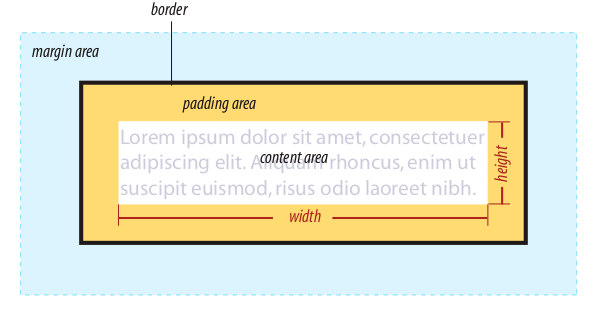
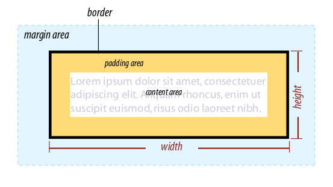
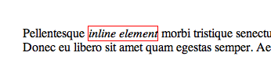

# CSS Notes

## General

Generally speaking, the closer the style sheet is to the content, the more weight it is given. Embedded style sheets that appear right in the document in the style element have more weight than external style sheets. Inline styles have more weight than embedded style sheets.

External style sheets -> Embedded style sheets -> Inline styles

To prevent a specific rule from being overridden, you can assign it _“importance”_ with the `!important` indicator

Style information can come from various sources, listed here from general to specific. Items lower in the list will override items above them:

-   Browser default settings
-   User style settings (set in a browser as a “reader style sheet”)
-   Linked external style sheet (added with the link element)
-   Imported style sheets (added with the `@import` function)
-   Embedded style sheets (added with the style element)
-   Inline style information (added with the style attribute in an opening tag)
-   Any style rule marked `!important` by the author
-   Any style rule marked `!important` by the reader (user)

## Selectors

-   ID selectors are more specific than (and will override)
-   Class selectors, which are more specific than (and will override)
-   Contextual selectors, which are more specific than (and will override)
-   Individual element selectors

## Pseudo-classes

### Link pseudo-classes

_:link_: Applies a style to unclicked (unvisited) links  
_:visited_: Applies a style to links that have already been clicked

### User action pseudo-classes

_:focus_: Applies when the element is selected and ready for input  
_:hover_: Applies when the mouse pointer is over the element  
_:active_: Applies when the element (such a link or button) is in the process of being clicked or tapped

### More Pseudo-classes

_:root_ | _:only-child_ | _:nth-child()_ | _:empty_ | _:first-of-type_ | _:nth-last-child()_ | _:first-child_ | _:last-of-type_ | _:nth-of-type()_ | _:last-child_ | _:only-of-type_ | _:nth-last-of-type()_

## Font and Text Properties

### font-family

_Values:_ one or more font or generic font family names, separated by commas | inherit  
_Default:_ depends on the browser  
_Applies to:_ all elements  
_Inherits:_ yes

_“Why specify more than one font?”_  
If the first specified font is not found, the browser tries the next one, and down through the list until it finds one that works.

### font-size

_Values:_ length unit  
_Default:_ medium  
_Applies to:_ all elements  
_Inherits:_ yes

The preferred values for font-size in contemporary web design are em measurements and percentage values. For example, the font-size of the h1 ’s parent element ( body ) has been specified as 100% of the default text size (generally 16 pixels). The h1 inherits the 16px size from the body element, and applying the 150% font-size value multiplies that inherited value, resulting in an h1 that is 24 pixels. If the user has her font size set to 30 pixels, for example, to read it on a television browser from across the room, the resulting h1 would be 45 pixels, but would maintain its proportion relative to the main body text, which is the idea of using relative measurements.

_Em best practices_  
As of this writing, the most popular solution for making ems display consistently is to set the size of the body element to 100% (keeping it at the default or user’s preference), then use ems to size the text elements thereafter.

**The shortcut font property**  
_Values:_ font-style font-weight font-variant font-size/line-height font-family| inherit  
_Default:_ depends on default value for each property listed  
_Applies to:_ all elements  
_Inherits:_ yes

At minimum, the font property must include a font-size value and a font -family value, in that order. Omitting one or putting them in the wrong order causes the entire rule to be invalid. This is an example of a minimal font property value:

```
p { font: 1em sans-serif; }
```

### text-indent

_Values:_ length measurement | percentage | inherit  
_Default:_ 0  
_Applies to:_ block-level elements, table cells, and inline blocks  
_Inherits:_ yes

### text-align

_Values:_ left | right | center | justify | inherit  
_Default:_ left for languages that read left to right; right for languages that read right to left  
_Applies to:_ block-level elements, table cells, and inline blocks  
_Inherits:_ yes

### list-style-type

_Values:_ none | disc | circle | square | decimal | decimal-leading-zero | lower-alpha |
upper-alpha | lower-latin | upper-latin | lower-roman | upper-roman | lower-greek | inherit  
_Default:_ disc  
_Applies to:_ ul , ol and li (or elements whose display value is list-item )  
_Inherits:_ yes

### list-style-position

_Values:_ inside | outside | inherit  
_Default:_ outside  
_Applies to:_ ul , ol , and li (or elements whose display value is list-item )  
_Inherits:_ yes

The list-style-position property allows you to pull the bullet inside the content area so it runs into the list content.

### list-style-image

_Values:_ url | none | inherit  
_Default:_ none  
_Applies to:_ ul , ol , and li (or elements whose display value is list-item )  
_Inherits:_ yes

You can also use your own image as a bullet using the list-style-image property.

### CSS Review: Font and Text Properties

| Property        | Description                                                               |
| --------------- | ------------------------------------------------------------------------- |
| font            | A shorthand property that combines font properties                        |
| font-family     | Specifies a typeface or generic font family                               |
| font-size       | The size of the font                                                      |
| font-style      | Specifies italic or oblique fonts                                         |
| font-variant    | Specifies a small-caps font                                               |
| font-weight     | Specifies the boldness of the font                                        |
| letter-spacing  | Inserts space between letters                                             |
| line-height     | The distance between baselines of neighboring text lines                  |
| text-align      | The horizontal alignment of text                                          |
| text-decoration | Underlines, overlines, and lines through                                  |
| text-direction  | Whether the text reads left-to-right or right-to-left                     |
| text-indent     | Amount of indentation of the first line in a block                        |
| text-shadow     | Adds a drop shadow under the text                                         |
| text-transform  | Changes the capitalization of text when it displays                       |
| vertical-align  | Adjusts the vertical position of inline elements relative to the baseline |
| white-space     | How whitespace in the source is displayed                                 |
| word-spacing    | Inserts space between words                                               |

## Colors and Backgrounds

### color

_Values:_ color value (name or numeric) | inherit  
_Default:_ depends on the browser and user’s preferences  
_Applies to:_ all elements  
*Inherits:*yes

### background-color

_Values:_ color value (name or numeric) | transparent | inherit  
_Default:_ transparent  
_Applies to:_ all elements  
_Inherits:_ no

### opacity

_Values:_ number (0 to 1)  
_Default:_ 1  
_Applies to:_ all elements
_Inherits:_ no

### background-image

_Values:_ url (location of image) | none | inherit  
_Default:_ none  
_Applies to:_ all elements  
_Inherits:_ no

The image starts in the top lefthand corner and tiles horizontally and vertically until the entire element is filled. (although you’ll learn how to change that in a moment)

### background-repeat

_Values:_ repeat | repeat-x | repeat-y | no-repeat | inherit  
_Default:_ repeat  
_Applies to:_ all elements  
_Inherits:_ no

### background-position

_Values:_ length measurement | percentage | left | center | right | top | bottom | inherit  
_Default:_ 0% 0% (same as left top )  
_Applies to:_ all elements  
*Inherits:*no

The background-position property specifies the position of the origin image
in the background. You can think of the origin image as the first image that
is placed in the background from which tiling images extend. Here is the
property and its various values.

### background-attachment

_Values:_ scroll | fixed | local (new in CSS3) | inherit  
_Default:_ scroll  
_Applies to:_ all elements  
_Inherits:_ no

**_fixed_**  
The background is fixed relative to the viewport. Even if an element has a scrolling mechanism, the background doesn't move with the element. (This is not compatible with background-clip: text.)  
**_local_**  
The background is fixed relative to the element's contents. If the element has a scrolling mechanism, the background scrolls with the element's contents, and the background painting area and background positioning area are relative to the scrollable area of the element rather than to the border framing them.  
**_scroll_**  
The background is fixed relative to the element itself and does not scroll with its contents. (It is effectively attached to the element's border.)

### The Shorthand background Property

_Values:_ background-color background-image background-repeat background-
attachment background-position | inherit  
_Default:_ see indiviual properties  
_Applies to:_ all elements  
_Inherits:_ no

### Multiple backgrounds

To apply multiple values for background-image , put them in a list separated
by commas.

```
#example1 {
  background-image: url(img_flwr.gif), url(paper.gif);
  background-position: right bottom, left top;
  background-repeat: no-repeat, repeat;
}
```

## Thinking Inside the Box

### box-sizing

_Values:_ content-box | border-box  
_Default:_ content-box  
_Applies to:_ all elements  
_Inherits:_ no

Using the content box model, the width and height values are applied to the content area only. The other way to specify the size of an element is to apply width and height dimensions to the entire visible box, including the padding and border.

Content-box



Border-box


### overflow

_Values:_ visible | hidden | scroll | auto | inherit  
_Default:_ visible  
_Applies to:_ block-level elements and replaced inline elements (such as images)  
_Inherits:_ no

When an element is set to a size that is too small for its contents, it is pos-
sible to specify what to do with the content that doesn’t fit, using the over-
flow property.

**_visible_**  
The default value is visible , which allows the content to hang out over
the element box so that it all can be seen.  
**_hidden_**  
When overflow is set to hidden , the content that does not fit gets clipped
off and does not appear beyond the edges of the element’s content area.  
**_scroll_**  
When scroll is specified, scrollbars are added to the element box to let
users scroll through the content. Be aware that when you set the value to
scroll , the scrollbars will always be there, even if the content fits in the
specified height just fine.  
**_auto_**  
The auto value allows the browser to decide how to handle overflow. In
most cases, scrollbars are added only when the content doesn’t fit and
they are needed.

## Margins

### Collapsing margins

Using the two paragraphs from the previous figure as an example, if the top
element has a bottom margin of 4 ems, and the following element has a top
margin of 2 ems, the resulting margin space between elements does not add
up to 6 ems. Rather, the margins collapse and the resulting margin between
the paragraphs will be 4 ems, the largest specified value.

### Margins on inline elements

You can apply top and bottom margins to inline text elements (or “non-
replaced inline elements,” to use the proper CSS terminology), but it won’t
add vertical space above and below the element, and the height of the line
will not change. However, when you apply left and right margins to inline
text elements, margin space will be held clear before and after the text in the
flow of the element, even if that element breaks over several lines.

## Display

The display property defines the type of element box an element generates
in the layout.

_Values:_ inline | block | list-item | inline-block | table | inline-table | table-row-group | table-header-group | table-footer-group | table-row |
table-column-group | table-column | table-cell | table-caption | none
The following are new in CSS3: run-in | compact | ruby | ruby-base | ruby-text |
ruby-base-container | ruby-text-container  
_Default:_ inline  
_Applies to:_ all elements  
_Inherits:_ yes

**_inline_**  
The default value for elements. Think of elements like `<span>`, `<em>`, or `<b>` and how wrapping text in those elements within a string of text doesn’t break the flow of the text.



The `<em>` element has a 1px red border. Notice it sits right inline with the rest of the text.

An inline element will accept margin and padding, but the element still sits inline as you might expect. Margin and padding will only push other elements horizontally away, not vertically.

An inline element will not accept height and width. It will just ignore it.

**_inline block_**  
An element set to inline-block is very similar to inline in that it will set inline with the natural flow of text (on the “baseline”). The difference is that you are able to set a width and height which will be respected.

**_block_**  
The element generates a block element box, generating line breaks both before and after the element when in the normal flow. A number of elements are set to block by the browser UA stylesheet. They are usually container elements, like `<div>`, `<section>`, and `<ul>`. Also text “blocks” like `<p>` and `<h1>`. Block level elements do not sit inline but break past them. By default (without setting a width) they take up as much horizontal space as they can.

### CSS Review: Basic Box Properties

| Property             | Description                                                                              |
| -------------------- | ---------------------------------------------------------------------------------------- |
| border               | A shorthand property that combines border properties                                     |
| border-color         | Shorthand property for specifying the color of borders                                   |
| border-image (CSS3)  | Adds an image inside the border area                                                     |
| border-radius (CSS3) | Shorthand property for rounding the corners of the visible element box                   |
| border-style         | Shorthand property for specifying the style of borders                                   |
| border-width         | Shorthand property for specifying the width of borders                                   |
| box-sizing           | Specifies whether width and height dimensions apply to the content box or the border box |
| box-shadow (CSS3)    | Adds a drop shadow around the visible element box                                        |
| display              | Defines the type of element box an element generates                                     |
| height               | Specifies the height of the element’s content area                                       |
| width                | Specifies the width of an element’s content area                                         |
| margin               | Shorthand property for specifying margin space around an element                         |
| max-height           | Specifies the maximum height of an element                                               |
| max-width            | Specifies the maximum width of an element                                                |
| min-height           | Specifies the minimum height of an element                                               |
| min-width            | Specifies the minimum width of an element                                                |
| overflow             | How to handle content that doesn’t fit in the content area                               |
| padding              | Shorthand property for specifying space between the content area and the border          |

## Positioning Basics

### position

_Values:_ static | relative | absolute | fixed | inherit  
_Default:_ static  
_Applies to:_ all elements  
_Inherits:_ no

**_static_**  
This is the normal positioning scheme in which elements are positioned
as they occur in the normal document flow.

**_relative_**  
Relative positioning moves the box relative to its original position in the
flow. The distinctive behavior of relative positioning is that the space
the element would have occupied in the normal flow is preserved as an
empty space.

**Important Notes:**

1. The original space in the document flow is preserved.
2. Overlap happens.Because this is a positioned element, it can potentially overlap other ele-
   ments

**_absolute_**  
Absolutely positioned elements are removed from the document flow
entirely and positioned with respect to the browser window or a contain-
ing element (we’ll talk more about this later). Unlike relatively positioned
elements, the space they would have occupied is closed up. In fact, they
have no influence at all on the layout of surrounding elements.

**_fixed_**  
The distinguishing characteristic of fixed positioning is that the element
stays in one position in the window even when the document scrolls.
Fixed elements are removed from the document flow and positioned
relative to the browser window (or other viewport) rather than another
element in the document. It currently causes some hiccups on mobile
devices, as discussed later in this chapter.

### Containing blocks

-   If the positioned element is not contained within another positioned ele-
    ment, then it will be placed relative to the initial containing block (cre-
    ated by the html element).
-   But if the element has an ancestor (i.e., is contained within an element)
    that has its position set to relative , absolute , or fixed , the element will
    be positioned relative to the edges of that element instead.

Let’s deliberately turn the element into a containing block and see what
happens. All we have to do is apply the `position` property to it; we don’t
have to actually move it. The most common way to make an element into a
containing block is to set the `position` to `relative` , but don’t move it with
offset values.

### top, right, bottom, left

_Values:_ length measurement | percentage | auto | inherit  
_Default:_ auto  
_Applies to:_ positioned elements (where position value is relative , absolute , or fixed )  
_Inherits:_ no
