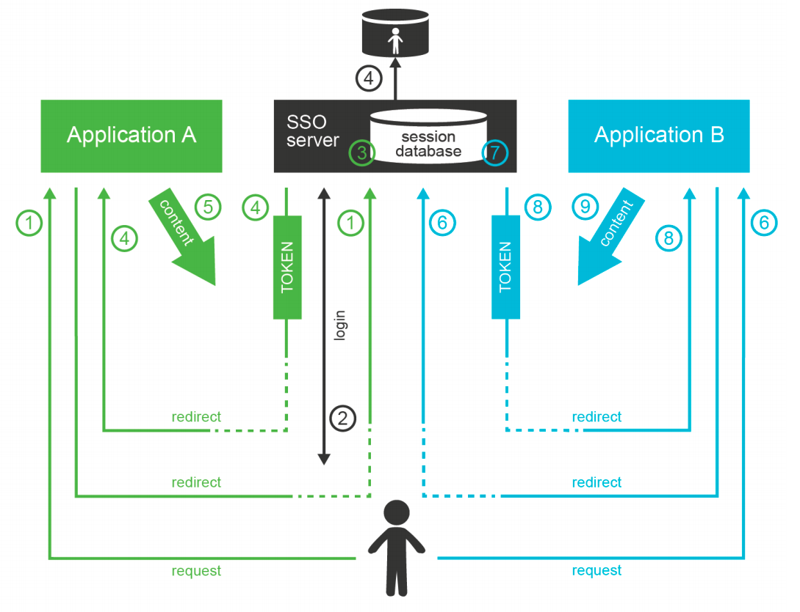

# Identity and Access Management

**Authentication** is a mechanism by which computer checks that the user is really the one he prentends to be. 

**Authorization** is a related mechanism by which the computer determines whether to allow of deny specific action to a user.

## Directory Servers
Directory Servers are just databases that store information and built with the primary purpose to provide shared data storage to applications.

<ins>**Directory Servers vs Databases**<ins>

- While databases are built for application-specific data model, 
directory servers usually extend standardized data model which improves interoperability. While

- While databases may be heavyweight and expensive to scale, directory servers are designed to be lightweight and provide massive scalability. That makes directory
servers almost ideal candidates for shared account database. 

Directory servers are good for *storing*, *searching* and *retrieving* data. While the user account 
data often contain entitlement information (permissions, groups, roles, etc.), identity stores are not well suited to evaluated them. A directory server can provide
information what permissions an account has, but it is not designed to make a decision whether to allow or deny a specific operation. Directory servers do not contain
data about user sessions. It means that directory servers do not know whether user is currently logged in or not. Directory servers provide only the very basic capabilities.
There are plug-ins and extensions that provide partial capabilities to support authentication and authorization. But that does not change the funcdamental design 
principles. Directory servers are databases, not authentication or authorization servers. They should be used as such. The right way to do it is to use authentication
server instead of directory server. Access Management (AM) technologies can provide that.

## LDAP
Lightweight Directory Access Protocol (LDAP) is a standart protocol for accessing directory services. It is a very efficient binary protocol that was designed to
support massively distributed shared databases. It has small set of well-defined simple operations. The operations and the data meta-model implied by the protocol
allow very efficient data replication and horizontal scalability of directory servers. These benefits often come at the expense of slow write operations. As
identity data are often read but seldom modified, slower writes are usually a perfectly acceptable trade-off. Therefore, LDAP-based directory servers were and in
many places still remain, the most popular databases for identity data. 

## Single Directory Server Myth
Shared directory server makes user management easier. However, this is not a complete solution and there are serious limitations to this approach. The heterogeneity
of information systems makes it nearly impossible to put all required data into a single directory system. There may be additional sources of information. For example
Management information system may be responsible for determination of user’s roles (e.g. in project-oriented organizational structure). Inventory management 
system may be responsible for assigning telephone number to the user. The groupware system may be an authoritative source of the user’s e-mail address and 
other electronic contact data. There are usually 2 to 20 systems that provide authoritative information for a single user. Therefore, there is no simple way 
how to feed and maintain the data in the directory system. The single directory approach is feasible only in very simple environments or in almost entirely
homogeneous environments. In all other cases there is a need to supplement the solution by other
identity management technologies.

<ins>**Possible drawbacks**</ins>
- Many complex applications need local user
database. They must store the copies of user records in their own databases to operate efficiently.  Keeping the copy synchronized with the directory data may 
seem like a simple task. But it is not. Additionaly, there are legacy systems which usually cannot access the external data at all

- Some services need to keep even more state than just a simple database record. For example file
servers usually create home directories for users. While the account creation can usually be done
in on-demand fashion (e.g. create user directory at first user log-on), the modification and deletion
of the account is much more difficult. Directory server will not do that.

- Perhaps the most painful problem is the complexity of access control policies. Role names and
access control attributes may not have the same meaning in all systems. Different systems usually
have different authorization algorithms that are not mutually compatible. While this issue can be
solved with per-application access control attributes, the maintenance of these attributes is seldom
trivial. If every application has its own set of attributes to control access control policies then the
centralized directory provides only a negligible advantage.

This does not mean that the directory servers or other shared databases are useless. Quite the
contrary. They are very useful if they are used correctly. They just cannot be used alone. More
components are needed to build a complete solution

## Access Management
While directory systems are not designed to handle complex authentication, access management
(AM) systems are built to handle just that. Access management systems handle all the flavors of
authentication, and even some authorization aspects. The principle of all access management
systems is basically the same:

1. Access management system gets between the user and the target application. This can be done
by a variety of mechanisms, the most common method is that the applications themselves
redirect the user to the AM system if they do not have existing session.
2. Access management system prompts user for the username and password, interacts with
authentication token, creates a challenge and prompts for the response or in any other way
initiates the authentication procedure.
3. User enters the credentials
4. Access management system checks the validity of credentials and evaluates access policies.
5. If access is allowed then the AM system redirects user back to the application. The redirection
usually contains an access token: a small piece of information that tells the application that the
user is authenticated.
6. Application validates the token, creates a local session and allows the access.

After that procedure, the user works with the application normally. Only the first access goes
through the AM server. This is important for AM system performance and sizing, and it impacts
session management functionality

In the LDAP case, it is the application
that prompts for the password. In the AM case, the Access Management server does everything.

## Web Single Sign-On
Single Sign-On (SSO) systems allow user to authenticate once, and access number of different
system after that. There are many SSO systems for web applications, however it looks like these
systems are all using the same basic principle of operation. This general access management flow is
described below:
1. Application A redirects the user to the access management server (SSO server).
2. The access management server authenticates the user.
3. The access management server establishes session (SSO session) with the user browser. This is
the crucial part of the SSO mechanism.
4. User is redirected back to the application A. Application A usually establishes a local session with
the user.
5. User interacts with application A.
6. When user tries to access application B, the application B redirects user to the access
management server.
7. The access management server checks for existence of SSO session. As the user authenticated
with the access management server before, there is a valid SSO session.
8. Access management server does not need to authenticate the user again and immediately
redirects user back to application B.
9. Application B establishes a local session with the user and proceeds normally.
The user usually does not even realize that he was redirected when accessing application B. There is
no interaction between the redirects and the redirects and the processing on the access
management server is usually very fast. It looks like the user was logged into the application B all
the time

## Authorization in Access Management
The request of a user accessing an application is directly or indirectly passed through the access
management server. Therefore, the access management server can analyze the request and
evaluate whether the user request is authorized or not. That is a theory. Unfortunately, the situation
is much more complicated in practice.

The AM server usually intercepts only the first request to access the application because it would be
a performance impact to intercept all the requests. After the first request, the application
established a local session and proceeds with the operation without any communication with the
AM server. Therefore the AM server can only evaluate authorization during the first request. In practice, it usually
means that the AM server can make only all-or-nothing authorization decisions: whether a
particular user can access all parts of a particular application or that he cannot access the
application at all. The AM server usually cannot make any finer-grain decisions just by itself.

## SAML and OpenID Connect
The first widespread standardized protocol in this field was Security Assertion Markup Language
(SAML). The original intent of SAML was to allow cross-domain sign-on and identity data sharing
across organizations on the Internet. SAML is quite complex, heavily based on XML standards. Its specifications are long,
divided into several profiles, there are many optional elements and features and overall SAML is a
set of very rich and flexible mechanisms.

Primary purpose of SAML is transfer of identity information between organizations. The latest fashion favors RESTful services and simpler architectural approaches. All of that
probably contributed to the development of OpenID Connect protocol (OIDC). OpenID Connect is
based on much simpler mechanisms than SAML, but it is reusing the same basic principles. 

#### OpenID history
OpenID connect has a very eventful history. It all started with a bunch of homebrew protocols such as LID
or SXIP, that are mostly forgotten today. That was followed by the development of OpenID protocol,
which was still very simple. OpenID gained some attention especially with providers of Internet
services. Despite its simplicity, OpenID was not very well engineered, and it quickly reached its
technological limits. It was obvious that OpenID needs to be significantly improved. At that time,
there was almost unrelated protocol called OAuth, which was designed for management of crossdomain authorizations. That protocol was developed into something that was almost, but not quite, entirely unlike the original OAuth protocol. As the result had almost nothing to do with the original
OAuth protocol, it is perfectly understandable that it was dubbed OAuth2. In fact, OAuth2 is not
really a protocol at all. It is rather a vaguely-defined framework to build other protocols. OAuth2
framework was used to build a cross-domain authentication and user profile protocol. This new
protocol is much more similar to SAML than to the original OpenID, therefore it was an obvious choice to call it OpenID Connect. Some traditions are just worth maintaining. Now there are two protocols that are using the same principle and doing almost the same thing.

The interaction goes like this:
1. User is accessing a resource. This can be web page or web application on the target site.
2. Target site does not have a valid session for the user. Therefore it redirects user browser to the
source site. It will add authentication request into that redirect.
3. Browser follows the redirect to the source site. The source site gets the authentication request
and parses it.
4. If the user is not already authenticated with the source site then the authentication happens
now. The source site prompts for the username, password, certificate, one-time password or
whatever credential that is required by the policy. With a bit of luck the authentication
succeeds.
5. The source site redirects the browser back to the target site. The source site adds authentication
response to the redirect. The most important part of the response is a token. The token directly
or indirectly asserts user’s identity.
6. The target site will parse the authentication response and process the token. The token may by
just a reference to the real token (SAML artifact) or it may be access key to another service that
provides the identity (OIDC UserInfo). In that case the target site makes another request (6a).
This request is usually a direct one and does not use browser redirects. One way or another, the
target site now has claims about user identity.
7. Target site evaluates the identity, processes authorizations and so on. A local session with the
user is usually established at this point to skip the authentication redirects on the next request.
The target site finally provides the content

Following table compares the terminology and technologies used in SAML and OIDC worlds.

|                        | Saml world                            | OpenID Connect World                                 |
|------------------------|---------------------------------------|------------------------------------------------------|
| Source site            | Identity Provider (IdP)               | Identity Provider (IDP) or OpenID Provider (OP)      |
| Target site            | Service Provider (SP)                 | Relying Party (RP)                                   |
| Token                  | SAML Assertion (or artifact)          | ID token, access token                               |
| Intended for           | Web applications, web services (SOAP) | Web applications, mobile applications, REST services |
| Based on               | N/A                                   | OAuth2                                               |
| Data representation    | XML                                   | JSON                                                 |
| Cryptography framework | XMLenc, XMLdsig                       | JOSE                                                 |
| Token format           | SAML                                  | JWT                                                  |

Maybe the most important differences between SAML, OIDC and web-SSO systems is the intended
use:
- SAML was designed for the web applications and SOAP web services world. It will handle
centralized (single-IDP) scenarios very will, but it can also work in decentralized federations. Go
for SAML if you are using SOAP and WS-Security or if you plan to build big decentralized
federation.
- OpenID Connect was designed mostly for use with social networks and similar Internet services.
Its philosophy is still somehow centralized. It will work well if there is one strong identity
provider and many relying parties. Technologically it will fit into RESTful world much better
than SAML. Current fashion trends are favorable to OIDC.
- Web-SSO systems are designed to be used inside a single organization. This is ideal to
implement SSO between several customer-facing applications so the customers will have no
idea that they interact with many applications and not just one. The web-SSO systems are not
designed to work across organizational boundaries.

Although SAML and OIDC are designed primarily for cross-domain use, it is no big surprise to see
them inside a single organization. However, it has to be expected that the SSO system based on
SAML or OIDC will have slightly more complicated setup than a simple Web-SSO system.

## Access Management and the Data
Access Management servers and Identity Providers need to know the data about users to work
properly. The purpose of access management systems is to manage access of
users to the applications. Which usually means processing authentication, authorization (partially),
auditing the access and so on. For this to work, the AM system needs access to the database where
the user data are stored. It needs access to usernames, passwords and other credentials,
authorization policies, attributes and so on. The AM systems usually do not store these data
themselves. They rely on external databases. In most cases these databases are directory services or
noSQL databases

However, there is one critical issue – especially if the AM system is also used as a single sign-on
server. The data in the directory service and the data in the applications must be consistent. E.g. it
is a huge problem if one user has different usernames in several applications. Which username
should he use to log in? Which username should be sent to the applications? There are ways how to
handle such situations, but this is usually very cumbersome and expensive. It is much easier to
unify the data before the AM system is deployed.

The AM systems usually assume that the underlying database is
already properly managed. E.g. a typical AM system has only a very minimalistic user interface to
create, modify and delete user records. Some AM systems may have self-service functionality (such
as password reset), but even that functionality is usually very limited. Even though the AM relies on
the fact that the data in the AM directory service and the data in applications are consistent there is
usually no way how to fully synchronize the data by using the AM system itself. There may be
methods for on-demand or opportunistic data updates, e.g. creating user record in the database
when the user logs in for the first time. But there are usually no solutions for deleting the records
or for updating the records of inactive users.

 But for
the AM system to really work properly it needs something to manage and synchronize the data.
Identity Management (IDM) system is usually used for that purpose. In fact, it is usually strongly
recommended deploying directory and IDM system before the AM system. The AM system cannot
work without the data. And if the AM works with data that are not maintained properly, it will not
take a long time until it fails.

## Advantages and Disadvantages of Access Management Systems
Access management systems have significant advantages. As the authentication is carried out by a central
access management server, it can be easily controlled and audited. Such centralization can be used
to consistently apply authentication policies - and to easily change them when needed. It also
allows better utilization of an investment into authentication technologies. E.g. multi-factor or
adaptive authentication can be quite expensive if it has to be implemented by every application.
But when it is implemented in the AM server, it is re-used by all the applications without additional
investment. However, there are also drawbacks. As the access management is centralized, it is obviously a
single point of failure. Nobody is going to log in when the AM server fails. Therefore AM servers need to be highly available
and scalable.

## Homogeneous Access Management Myth
There are at least two popular access management protocols for the web. There are huge identity
federations based on SAML. Cloud services and social networks usually use OpenID Connect or its
variations. There are variations and related protocols to be used for mobile applications and
services. Then there are other SSO protocols, primarily focused on intra-organizational use. There
is no single protocol or mechanism that can solve all the problems in the AM world.

Therefore it has to be expected that there will be several AM or SSO systems in the organization,
each one serving its own technological island. And each island needs to be managed.

**Perhaps the best way to evaluate an AM project is to ask several questions:**
- Do I really need access management for all applications? Do I need 100% coverage? Can I afford
all the costs? Maybe it is enough to integrate just a couple of applications that are source of the
worst pain. Do I know which applications are these? Do I know what my users really use during
they workday? Do I know what they need?
- What are the real security benefits of AM deployment? Will I be disabling the native
authentication to the applications? Even for system administrators? What will I do in case of
administration emergencies (e.g. system recovery)? Would system administrators still be able to
circumvent the AM system? If yes then what is the real security benefit? If not then what will be
the recovery procedure in case the AM system fails?
- Do I really need SSO for older and rarely used applications? What is the real problem here? Is
the problem that users are entering the password several times per day? Or is the real problem
that they have to enter a different username or password to different applications, and they
keep forgetting the credentials? Maybe simple data cleanup and password management will
solve the worst problems, and I can save a huge amount of money on AM project?

## Identity Management
Identity management is exactly what the name says: it is all about managing identities. It is about
the processes to create Active Directory accounts and mailboxes for a new employee

IDM makes it possible to immediately
disable all access to a suspicious user during a security incident. IDM takes care of adding new
privileges and removing old privileges of users during reorganization. IDM makes sure all the
accounts are properly disabled when the employee leaves the company.IDM records access privileges of
temporary workers, partners, support engineers and all the third-party identities that are not
maintained in your human resources (HR) system. IDM automates the processes of role request and
approval. IDM records every change in user privileges in the audit trail. IDM governs the annual reviews of roles and access privileges. IDM makes sure the copies of user data that are kept in the
applications are synchronized and properly managed. IDM makes sure data are managed
according to data protection rules. And IDM does many other things that are absolutely essential
for every organization to operate in an efficient and secure manner. The IDM systems used to be expensive.
Very expensive. The IDM systems used to be so expensive, it was very difficult to justify the cost
even with such substantial and clear benefits. But that time is over now.

## Identity Management connectors
Identity management system must connect to many different applications, databases and
information systems. Typical IDM deployment has tens or even hundreds of such connections.
Therefore the ease of connecting IDM system with its environment is one of its essential qualities.

Current IDM systems use connectors to communicate with all surrounding systems. These
connectors are based on similar principles that database drivers

img

Connector is usually relatively simple piece of code. Primary responsibility of a connector is to
adapt communication protocols. Therefore LDAP connector translates the LDAP protocol messages
into data represented using a common connector interface. The SQL connector does the same thing
with SQL-based protocols. The connector also interprets the operations invoked on the common
connector interface by the IDM system. Therefore the LDAP protocol will execute the "create"
operation by sending LDAP "add" message to the LDAP server and parsing the reply.

## Identity Provisioning
Provisioning is perhaps the most frequently used feature in any IDM system. In the generic sense
provisioning means maintenance of user accounts in applications, databases and other target
systems. This includes creation of the account, various modifications during the account lifetime
and permanent disable or delete at the end of the lifetime. The IDM system is using connectors to
manipulate the accounts. Good IDM system can also manage,
provision and synchronize organizational structures. However, this feature is still not entirely
common.

## Synchronization and Reconciliation
Some applications already keep a track of the changes. Some databases record a timestamp of the
last change for each row. Some directory servers keep a record of recent changes for the purpose of
data replication. Such meta-data can be used by the IDM system. The IDM system may periodically
scan the timestamps or replication logs for new changes. When the IDM detects a change it can
retrieve the changed objects and react to the change based on its policies. The scanning for changes
based on meta-data is usually very efficient therefore it can be executed every couple of minutes.
Therefore the reaction to the change can be done almost in the real-time. This method has many
names in various IDM systems. It is called "live synchronization", "active synchronization" or
simply just "synchronization". Sadly, this method is not always available. In fact this ability is quite
rare.

But all is not lost. Even if the application does not maintain good meta-data that allow near-realtime change detection there is still one very simple way that works for almost any system. The IDM
system gets the list of all accounts in the application. Then it compares that list with the list of
accounts that are supposed to be there. Therefore it compares the reality (what is there) with the
policy (what should be there). The IDM system can react to any discrepancies and repair them. This
method is called reconciliation. It is quite a brutal method, almost barbaric. But it does the job.

The drawback of synchronization is that it is not entirely reliable. The IDM system may miss
some changes, e.g. due to change log expiration, system times not being synchronized or variety of
other reasons. On the other hand, reconciliation is mostly reliable. But it is a very demanding task.
Therefore these two methods are often used together. Synchronization runs all the time and
handles the vast majority of the changes. Reconciliation runs weekly or monthly and it acts as a
safety net to catch the changes that might have escaped during synchronization.

## Identity Management and Role-Based Access Control
User has a role, the role
contains permissions, permissions are used for authorization - that is the basic principle of RBAC.
The low-level permissions are hidden from the users. Users are quite happy when they deal with
the business-friendly role names. Most RBAC systems allow for roles to be placed inside other roles thus creating role hierarchy.

img

## Identity Management and Authorizations
The IDM system does not take direct part in authorization. IDM system sets up accounts in
applications and databases. But the IDM system itself is not active when user logs into an
application and executes the operations. Does that mean IDM system cannot do anything about
authorizations? Definitely not. The IDM system does not enforce authorization decisions. But the
IDM can manage the data that determine how the authorization is evaluated. IDM system can place
the account to the correct groups, which will cause certain operations to be allowed and other
operations denied. IDM system can set up an access control lists (ACLs) for each account that it
manages. IDM system is not evaluating or enforcing the authorizations directly. But it indirectly
manages the data that are used to evaluate authorizations. And this is an extremely important
feature.

## Organizational Structure, Roles, Services and Other Wildlife
There are many things that an advanced IDM system can manage:
- Accounts. Obviously. Many IDM systems can fully manage account attributes, groups
membership, privileges, account status (enabled/disabled), validity dates and all the other
details.
- Groups and roles. Apart from managing the membership of accounts in groups the IDM system
can take care of the whole group life-cycle: create a group, manage it and delete it.
- Organizational structure. The IDM system can take organizational structure from its
authoritative source (usually HR) and synchronize it to all the applications that need it. Or the
IDM itself may be used to manually maintain an organizational structure.
- Servers, services, devices and "things". While this is not yet IDM mainstream, there are some
experimental solutions that use IDM principles to manage concepts that are slightly outside the
traditional IDM scope. E.g. there is an IDM-based solution that can automatically deploy
predefined set of virtual machines for each new project. The new IDM systems are so flexible
that they can theoretically manage everything that is at least marginally related to the concept
of identity: virtual machines, networks, applications, configurations, devices … almost anything.
This is still quite a unique functionality. But it is very likely that we will see more stories about
this in the future.

## Complete Identity and Access Management Solution
A clever combination of several components is needed to build complete solution. But there are three basic components that are required for any practical IAM deployment:
- **Directory service** or a similar identity store is the first component. This is the database that
stores user account information. The accounts are stored there in a “clean” form that can be
used by other applications. This database is then widely shared by applications that are capable
to connect to it. This part of the solution is usually implemented as a replicated LDAP server
topology or Active Directory domain. This has an advantage of relatively low cost and high
availability. But there is one major limitation: the data model needs to be simple. Very simple.
And the identity store needs to be properly managed.
- **Access Management** is a second major component of the solution. It takes care of
authentication and (partially) authorization. Access management unifies authentication
mechanisms. If an authentication mechanism is implemented in the access management server
then all integrated applications can easily benefit. It also provides Single Sign-On (SSO),
centralizes access logs and so on. It is a very useful component. But of course, there are
limitations. AM system needs access to identity data. Therefore it needs reliable, very scalable
and absolutely consistent identity database as a back-end. This is usually provided by the
directory service. Performance and availability are the obvious obstacles here. But there is one
more obstacle which is less obvious but every bit as important: data quality. The data in the
directory service must be up to date and properly managed. But that is only part of the picture.
As most applications store some pieces of identity data locally, these data also need to be
synchronized with the directory database. No access management system can do this well
enough. And there is no point for AM to do it at all. The AM system has a very different
architectural responsibilities. Therefore yet another component is needed.
- **Identity Management** is the last but in many ways the most important component. This is the
real brain of the whole solution. The IDM system maintains the data. It is the component that
keeps the entire system from falling apart. It makes sure the data are up to date and compliant
with the policies. It synchronizes all the pieces of identity data that those pesky little
applications always keep creating. It maintains groups, privileges, roles, organizational
structures and all the other things necessary for the directory and the access management to
work properly. It maintains order in the system. And it allows living and breathing system
administrators and security officers to live happily, to breath easily and to keep control over the
whole solution.

img

## IAM and Security
Record who has access to what. Each user has accounts in many applications through the
enterprise. Keep track which account belongs to which user. It is very difficult to do that
manually. But even the worst IDM system can do that.
- **Remove access quickly.** If there is a security incident then the access rights need to be removed
in order of seconds. If an employee is fired then the accounts have to be disabled in order of
minutes. It is not a problem for a system administrator to do that manually. But will the
administrator be available during a security incident late in the night? Would you synchronize
layoffs with the work time of system administrators? Wouldn’t system administrators forget to
stop all the processes and background jobs that the user might have left behind? IDM system
can do that easily. Security staff can simply disable all the accounts by using IDM system. Single
click is all that is needed.
- **Enforce policies.** Keep track about the privileges that were assigned to users. This usually
means managing assignment of roles (and other entitlements) to users. Make sure that the
assignment of sensitive roles is approved before user gets the privileges. Compare the policies
and the reality. System administrators that create accounts and assign entitlements are not
robots. Mistakes can happen. Make sure the mistakes are discovered and remediated. This is the
natural best practice. But it is almost impossible to do manually. Yet even an average IDM
system can do that without any problems.
- **Remove unnecessary roles.** Role assignments and entitlements tend to accumulate over time.
Long-time employees often have access to almost any asset simply because they needed the data
at some point in their career. And the access to the asset was never removed since. This is a
huge security risk. It can be mitigated by inventing a paper-based process to review the
entitlements. But that process is very slow, costly, error-prone and it has to be repeated in
regular intervals. But advanced IDM systems already support automation of this re-certification
process.
- **Maintain order.** If you closely follow the principle of least privilege then you have probably realized that you have more roles that you have users. Roles are abstract concepts and they are
constantly evolving. Even experienced security professionals can easily get lost in the role
hierarchies and structures. The ordinary end users often have absolutely no idea what roles
they need. Yet, it is not that hard to sort the roles to categories if you maintain them in a good
IDM system. This creates a role catalog that is much easier to understand, use and maintain.
- Keep track. Keep an audit record about any privilege change. This means keeping track of all
new accounts, account modifications, deletions, user and account renames, role assignments
and unassignments, approvals, role definition changes, policy changes and so on. This is a huge
task to do manually. And it is almost impossible to avoid mistakes. But a machine can do that
easily and reliably.
- **Scan for vulnerabilities.** Mistakes happen. System administrators often create testing accounts
for troubleshooting purposes. And there is an old tradition to set trivial passwords to such
accounts. These accounts are not always cleaned up after the troubleshooting is done. And there
may be worse mistakes. System administrators may assign privileges to a wrong user. Help desk
may enable account that should be permanently disabled. Therefore, all the applications have
to be permanently scanned for accounts that should not be there and for entitlements that
should not be assigned. This is simply too much work to be done manually. It is not really
feasible unless a machine can scan all the system automatically. This is called reconciliation,
and it is one of the basic functionalities of any decent IDM system
