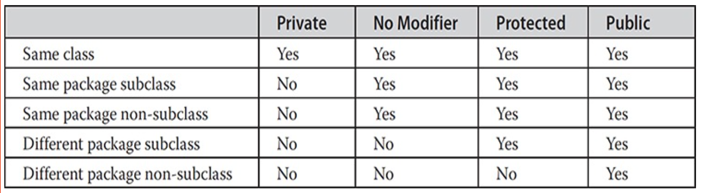
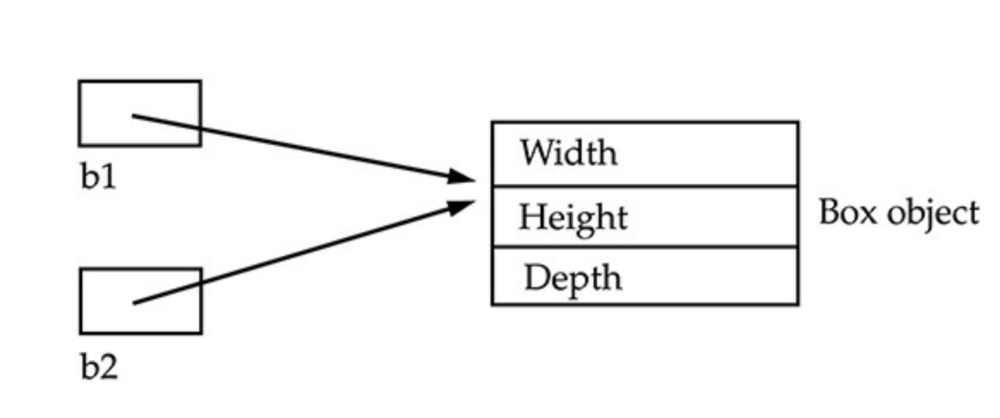
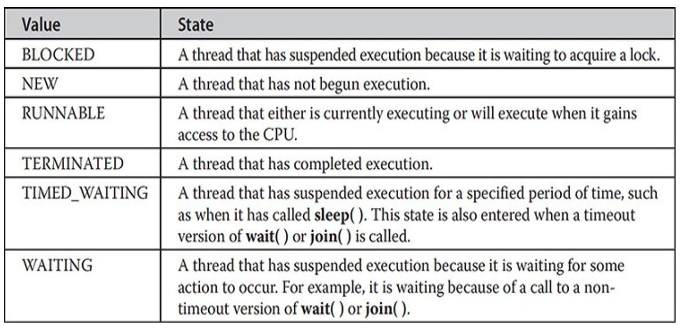
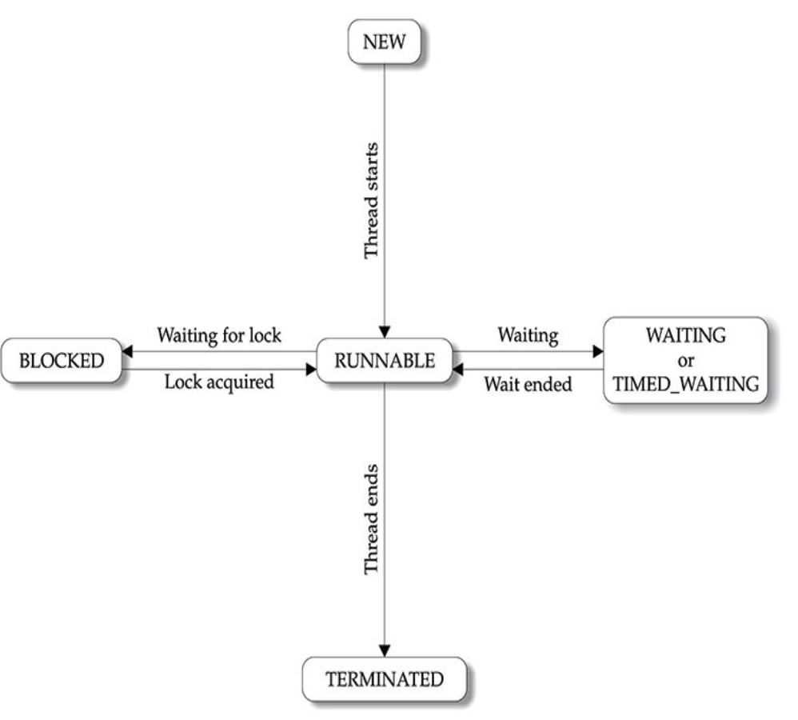
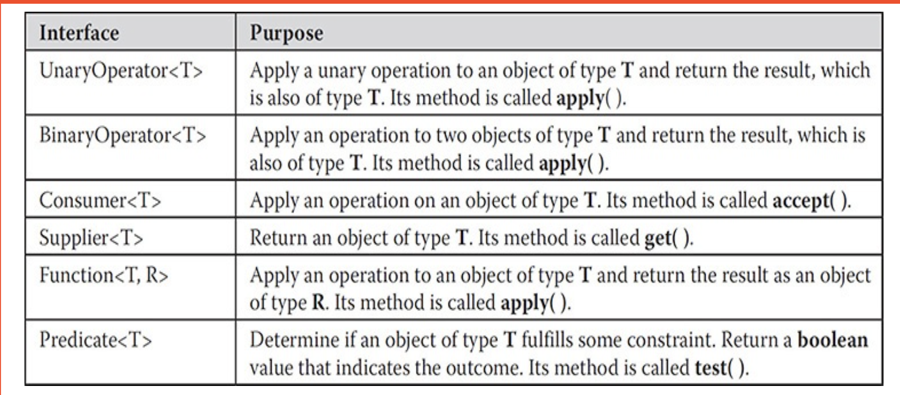

# Book: Java - The Complete Reference 11th Edition

## Abstraction
An essential element of object-oriented programming is *abstraction*. Humans manage complexity through abstraction. For example, people do not think of a car as a set of tens of thousands of individual parts. They think of it as a well- defined object with its own unique behavior. 

## Encapsulation
*Encapsulation* is the mechanism that binds together code and the data it manipulates, and keeps both safe from outside interference and misuse. One way to think about encapsulation is as a protective wrapper that prevents the code and data from being arbitrarily accessed by other code defined outside the wrapper.



## Inheritance
Inheritance is the process by which one object acquires the properties of another object. You can only specify one superclass for any subclass that you create. Java does not support the inheritance of multiple superclasses into a single subclass. However, no class can be a superclass of itself. Although a subclass includes all of the members of its superclass, it cannot access those members of the superclass that have been declared as private.

When a reference to a subclass object is assigned to a superclass reference variable, you will have access only to those parts of the object defined by the superclass. This is why plainbox can’t access weight even when it refers to a BoxWeight object.

Thus, super( ) always refers to the superclass immediately above the calling class. This is true even in a multileveled hierarchy. Also, super( ) must always be the first statement executed inside a subclass constructor.


## Polymorphism
Polymorphism (from Greek, meaning “many forms”) is a feature that allows one interface to be used for a general class of actions.

There are two types of polymorphism in Java: compile time polymorphism and run time polymorphism in java.

### Static polymorphism (or compile-time polymorphism)
The methods use the same name but the parameter varies. This represents the static polymorphism. This polymorphism is resolved during the compiler time and is achieved through the method overloading. 


### Dynamic Polymorphism (or run time polymorphism in Java)
In this form of polymorphism in java, the compiler doesn’t determine the method to be executed. It’s the Java Virtual Machine (JVM) that performs the process at the run time. Dynamic polymorphism refers to the process when a call to an overridden process is resolved at the run time. The reference variable of a superclass calls the overridden method. The methods that are implemented by both the subclass and the superclass provide different functionality while sharing the same name.


## Compiling the Program
The Java bytecode is the intermediate representation of your program that contains instructions the Java Virtual Machine will execute.

In this case, main( ) must be declared as public, since it must be called by code outside of its class when the program is started. The keyword static allows main( ) to be called without having to instantiate a particular instance of the class. This is necessary since main( ) is called by the Java Virtual Machine before any objects are made.

## Identifiers
Identifiers are used to name things, such as classes, variables, and methods. An identifier may be any descriptive sequence of uppercase and lowercase letters, numbers, or the underscore and dollar-sign characters. (The dollar-sign character is not intended for general use.) They must not begin with a number.

## The Primitive Types
- **Integers:** This group includes byte, short, int, and long, which are for whole-valued signed numbers. Variables of type *byte* are especially useful when you’re working with a stream of data from a network or file. 
- **Floating-point:** numbers This group includes float and double, which represent numbers with fractional precision.
- **Characters:** This group includes char, which represents symbols in a character set, like letters and numbers.
- **Boolean:** This group includes boolean, which is a special type for representing true/false values.


The primitive types represent single values—not complex objects. Although Java is otherwise completely object-oriented, the primitive types are not. They are analogous to the simple types found in most other non–object-oriented languages. The reason for this is efficiency. Making the primitive types into objects would have degraded performance too much.

### Float vs double
The type float specifies a single-precision value that uses 32 bits of storage. Single precision is faster on some processors and takes half as much space as double precision, but will become imprecise when the values are either very large or very small.

Double precision, as denoted by the double keyword, uses 64 bits to store a value. Double precision is actually faster than single precision on some modern processors that have been optimized for high-speed mathematical calculations.

## Variables
The variable is the basic unit of storage in a Java program. A variable declared within a block is called a *local variable*. Objects declared in the outer scope will be visible to code within the inner scope. However, the reverse is not true. Variables are created when their scope is entered, and destroyed when their scope is left. Although blocks can be nested, you cannot declare a variable to have the same name as one in an outer scope.

## Java’s Automatic Conversions
When one type of data is assigned to another type of variable, an automatic type conversion will take place if the following two conditions are met:
- The two types are compatible.
- The destination type is larger than the source type.

 ```Java
 byte b;
 int i = 257;
 b = (byte) i; //i is 1
 ```

When the value 257 is cast into a byte variable, the result is the remainder of the division of 257 by 256 (the range of a byte), which is 1 in this case.

```Java
byte a = 40;
byte b = 50;
byte c = 100;
int d = a * b / c;
```

The result of the intermediate term a * b easily exceeds the range of either of its byte operands. To handle this kind of problem, Java automatically promotes each byte, short, or char operand to int when evaluating an expression. This means that the subexpression a*b is performed using integers —not bytes. Thus, 2,000, the result of the intermediate expression, 50 * 40, is legal even though a and b are both specified as type byte.


Java defines several type promotion rules that apply to expressions. They are as follows:
- All byte, short, and char values are promoted to int, as just described. 
- If one operand is a long, the whole expression is promoted to long.
- If one operand is a float, the entire expression is promoted to float.
- If any of the operands are double, the result is double.

## Introducing Type Inference with Local Variables
Beginning with JDK 10, it is now possible to let the compiler infer the type of a local variable based on the type of its initializer, thus avoiding the need to explicitly specify the type. 
```Java
double avg = 10.0;
```
Using type inference, this declaration can now also be written like this:
```Java
var avg = 10.0;
```

In both cases, avg will be of type double. In the first case, its type is explicitly specified. In the second, its type is inferred as double because the initializer 10.0 is of type double. As mentioned, var was added as a context-sensitive identifier. When it is used as the type name in the context of a local variable declaration, it tells the compiler to use type inference to determine the type of the variable being declared based on the type of the initializer.

The preceding example uses var to declare only simple variables, but you can also use var to declare an array. For example:

```Java
var myArray = new int[10]; // This is valid.
```

Furthermore, you cannot use brackets on the left side of a var declaration.

```Java
var[] myArray = new int[10]; // Wrong
```
It is important to emphasize that var can be used to declare a variable only when that variable is initialized.

```Java
var counter; // Wrong! Initializer required.
```

Also, remember that var can be used only to declare local variables. It cannot be used when declaring instance variables, parameters, or return types, for example.

- Only one variable can be declared at a time
- A variable cannot use null as an initializer and the variable being declared cannot be used by the initializer expression. 
- Although you can declare an array type using var, you cannot use var with an array initializer.

## Operators
```Java
x = 42;
y = x++;
```
The value of x is obtained before the increment operator is executed, so the value of y is 42. Of course, in both cases x is set to 43.

If you use the || and && forms, rather than the | and & forms of these operators, Java will not bother to evaluate the right-hand operand when the outcome of the expression can be determined by the left operand alone. 

```Java
if (denom != 0 && num / denom > 10)
```
Since the short-circuit form of AND (&&) is used, there is no risk of causing a run-time exception when denom is zero. 

## Switch

```Java
switch (expression) { 
    case value1:
    // statement sequence break;
    case value2:
    // statement sequence break;
    case valueN :
    // statement sequence break;
    default:
    // default statement sequence
}
```
For versions of Java prior to JDK 7, expression must resolve to type *byte, short, int, char, or an enumeration*. Beginning with JDK 7, expression can also be of type *String*. 

In summary, there are three important features of the switch statement to note:
- The switch differs from the if in that switch can only test for equality, whereas if can evaluate any type of Boolean expression. That is, the switch looks only for a match between the value of the expression and one of its case constants.
- No two case constants in the same switch can have identical values. Of course, a switch statement and an enclosing outer switch can have case constants in common.
- A switch statement is usually more efficient than a set of nested ifs.

When it compiles a switch statement, the Java compiler will inspect each of the case constants and create a “jump table” that it will use for selecting the path of execution depending on the value of the expression. Therefore, if you need to select among a large group of values, a switch statement will run much faster than the equivalent logic coded using a sequence of if-elses. The compiler can do this because it knows that the case constants are all the same type and simply must be compared for equality with the switch expression. The compiler has no such knowledge of a long list of if expressions.

## Iteration Statements
Java permits you to include multiple statements in both the initialization and iteration portions of the for. Each statement is separated from the next by a comma.

```Java
for (int i = 0, j = 10; i < 10 && j > 0; i++,j--) {
    System.out.println("i = " + i + " :: " + "j= " + j);
}
```

You can intentionally create an infinite loop (a loop that never terminates) if you leave all three parts of the for empty.

```Java
for ( ; ; ){
    //...
}
```

### For-Each
A for-each style loop is designed to cycle through a collection of objects, such as an array, in strictly sequential fashion, from start to finish. In Java, the for-each style of for is also referred to as the enhanced for loop. There is one important point to understand about the for-each style loop. Its iteration variable is “read-only” as it relates to the underlying array.

```Java
for (int x[] : nums){
  for (int y : x){
      System.out.println("Valus is " + y);
  }
}
```

```Java
for (var y : nums){
      System.out.println("Valus is " + y);
}
```

## Jump statements
```Java
out:for(int i=1; i<=100; i++){
  System.out.println("outer");
  
  for(int j=1; j<=100; j++){
    System.out.println("nested");
    if(j==2){
    // break; this will exit from inner for loop only
    break out; // this will exit from both for loops
    }
  }
}
```

Keep in mind that you cannot break to any label which is not defined for an enclosing block.

```Java
one:for(int i=1; i<=100; i++){
  System.out.println("outer");
}

two:for(int i=1; i<=100; i++){
  if(j==2){
      break one; //WRONG
  }
}
```
Since the loop labeled one does not enclose the break statement, it is not possible to transfer control out of that block.

A *continue* statement causes control to be transferred directly to the conditional expression that controls the loop.

## Class
A class is a template for an object, and an object is an instance of a class.

The data, or variables, defined within a class are called *instance variables*.

Collectively, the methods and variables defined within a class are called *members* of the class.

First, you must declare a variable of the class type. This variable does not define an object. Instead, it is simply a variable that can refer to an object. Second, you must acquire an actual, physical copy of the object and assign it to that variable. You can do this using the new operator. The new operator dynamically allocates (that is, allocates at run time) memory for an object and returns a reference to it. This reference is, essentially, the address in memory of the object allocated by new. This reference is then stored in the variable.

```Java
 Box mybox; // declare reference to object 
 mybox = new Box(); // allocate a Box object
 ```

 ```Java
 Box b1 = new Box(); 
 Box b2 = b1;
 ```

 You might think that b2 is being assigned a reference to a copy of the object referred to by b1. That is, you might think that b1 and b2 refer to separate and distinct objects. However, this would be wrong. Instead, after this fragment executes, b1 and b2 will both refer to the same object. The assignment of b1 to b2 did not allocate any memory or copy any part of the original object. It simply makes b2 refer to the same object as does b1. Thus, any changes made to the object through b2 will affect the object to which b1 is referring, since they are the same object. Although b1 and b2 both refer to the same object, they are not linked in any other way. For example, a subsequent assignment to b1 will simply unhook b1 from the original object without affecting the object or affecting b2.



```Java
Box b1 = new Box();
Box b2 = b1;
// ...
b1 = null;
```
Here, b1 has been set to null, but b2 still points to the original object.

### Constructors
Constructors look a little strange because they have no return type, not even void. This is because the implicit return type of a class’ constructor is the class type itself.

When you do not explicitly define a constructor for a class, then Java creates a default constructor for the class.

When using the default constructor, all non- initialized instance variables will have their default values, which are zero, null, and false, for numeric types, reference types, and boolean, respectively.

### The this Keyword
*this* can be used inside any method to refer to the current object.

### Garbage collection
Garbage collection only occurs sporadically (if at all) during the execution of your program. It will not occur simply because one or more objects exist that are no longer used.

### Overriding methods

In a class hierarchy, when a method in a subclass has the same name and type signature as a method in its superclass, then the method in the subclass is said to override the method in the superclass. Method overriding occurs only when the names and the type signatures of
the two methods are identical. If they are not, then the two methods are simply overloaded.

### Overloading Methods
return types do not play a role in overload resolution.

```Java
class OverloadDemo {
    void test(){
        //...
    }

    void test(int a){
        //...
    }
    
    double test(double a){
        //...
    }
}
```

some cases, Java’s automatic type conversions can play a role in overload resolution.

```Java
class OverloadDemo {
    void test(){
        //...
    }

    void test(int a, int b){
        //...
    }
    
    double test(double a){
        //...
    }

    public static void main(String args[]){
        test(88); //invokes test(double)
        test(132.23); //invokes test(double)

    }
}
```

### Argument Passing
The first way is *call-by-value*. This approach copies the value of an argument into the formal parameter of the subroutine. Therefore, changes made to the parameter of the subroutine have no effect on the argument. The second way an argument can be passed is *call-by-reference*. In this approach, a reference to an argument (not the value of the argument) is passed to the parameter. Inside the subroutine, this reference is used to access the actual argument specified in the call. This means that changes made to the parameter will affect the argument used to call the subroutine.

- When you pass a primitive type to a method, it is passed by value.
- When you pass an object to a method, the situation changes dramatically, because objects are passed by what is effectively call-by-reference.

Since all objects are dynamically allocated using new, you don’t need to worry about an object going out-of-scope because the method in which it was created terminates. The object will continue to exist as long as there is a reference to it somewhere in your program. When there are no references to it, the object will be reclaimed the next time garbage collection takes place.

## Recursion
When a method calls itself, new local variables and parameters are allocated storage on the stack, and the method code is executed with these new variables from the start. As each recursive call returns, the old local variables and parameters are removed from the stack, and execution resumes at the point of the call inside the method. Recursive methods could be said to “telescope” out and back.
Recursive versions of many routines may execute a bit more slowly than the iterative equivalent because of the added overhead of the additional method calls. A large number of recursive calls to a method could cause a stack overrun.

## Understanding static
When objects of its class are declared, no copy of a static variable is made. Instead, all instances of the class share the same static variable.

Methods declared as static have several restrictions:

- They can only directly call other static methods of their class.
- They can only directly access static variables of their class.
- They cannot refer to this or super in any way.

If you need to do computation in order to initialize your static variables, you can declare a static block that gets executed exactly once, when the class is first loaded. The following example shows a class that has a static method, some static variables, and a static initialization block:

```Java
class UseStatic(){
    static int a,b;
    
    static {
        b = 4;
        a = b * 5;
    }
}
```
As soon as the UseStatic class is loaded, all of the static statements are run.

## Introducing final
A field can be declared as *final*. Doing so prevents its contents from being modified, making it, essentially, a constant. You can do this in one of two ways: First, you can give it a value when it is declared. Second, you can assign it a value within a constructor. The first approach is probably the most common. Declaring a parameter *final* prevents it from being changed within the method. Declaring a local variable *final* prevents it from being assigned a value more than once. The keyword *final* can also be applied to methods, but its meaning is substantially different than when it is applied to variables. This additional usage of *final* is explained below:

- *Using final to Prevent Overriding:* Methods declared as final cannot be overridden
- *Using final to Prevent Inheritance:* it is illegal to declare a class as both abstract and final since an abstract class is incomplete by itself and relies upon its subclasses to provide complete implementations.

## Introducing Nested and Inner Classes
Thus, if class B is defined within class A, then B does not exist independently of A. A nested class has access to the members, including private members, of the class in which it is nested. However, the enclosing class does not have access to the members of the nested class.

There are two types of nested classes: *static* and *non-static*.

A static nested class is one that has the static modifier applied. Because it is static, it must access the non-static members of its enclosing class through an object. That is, it cannot refer to non-static members of its enclosing class directly. Because of this restriction, static nested classes are seldom used.

The most important type of nested class is the *inner* class. An inner class is a non-static nested class.

## Varargs: Variable-Length Arguments

## Using Abstract Classes
There are situations in which you will want to define a superclass that declares the structure of a given abstraction without providing a complete implementation of every method. That is, sometimes you will want to create a superclass that only defines a generalized form that will be shared by all of its subclasses, leaving it to each subclass to fill in the details. Any class that contains one or more abstract methods must also be declared abstract. 

There can be no objects of an abstract class. That is, an abstract class cannot be directly instantiated with the new operator.

Also, you cannot declare abstract constructors, or abstract static methods. Any subclass of an abstract class must either implement all of the abstract methods in the superclass, or be declared abstract itself.

Although abstract classes cannot be used to instantiate objects, they can be used to create object references, because Java’s approach to run-time polymorphism is implemented through the use of superclass references. Thus, it must be possible to create a reference to an abstract class so that it can be used to point to a subclass object. You will see this feature put to use in the next example.


## Finding Packages and CLASSPATH
First, by default, the Java run-time system uses the current working directory as its starting point. Thus, if your package is in a subdirectory of the current directory, it will be found. Second, you can specify a directory path or paths by setting the CLASSPATH environmental variable. Third, you can use the -classpath option with java and javac to specify the path to your classes. 


## Defining an Interface
When no access modifier is included, then default access results, and the interface is only available to other members of the package in which it is declared. When it is declared as public, the interface can be used by code outside its package. 

Before continuing an important point needs to be made. JDK 8 added a feature to interface that made a significant change to its capabilities. Prior to JDK 8, an interface could not define any implementation whatsoever. This is the type of interface that the preceding simplified form shows, in which no method declaration supplies a body. Thus, prior to JDK 8, an interface could define only “what,” but not “how.” JDK 8 changed this. Beginning with JDK 8, it is possible to add a default implementation to an interface method. Furthermore, JDK 8 also added static interface methods, and beginning with JDK 9, an interface can include private methods. Thus, it is now possible for interface to specify some behavior. 

As the general form shows, variables can be declared inside interface declarations. They are implicitly final and static, meaning they cannot be changed by the implementing class. They must also be initialized. All methods and variables are implicitly public.

A default method lets you define a default implementation for an interface method. In other words, by use of a default method, it is possible for an interface method to provide a body, rather than being abstract. A primary motivation for the default method was to provide a means by which interfaces could be expanded without breaking existing code. 

### Question
For example, assume that two interfaces called Alpha and Beta are implemented by a class called MyClass. What happens if both Alpha and Beta provide a method called reset( ) for which both declare a default implementation? Is the version by Alpha or the version by Beta used by MyClass? Or, consider a situation in which Beta extends Alpha. Which version of the default method is used? Or, what if MyClass provides its own implementation of the method? To handle these and other similar types of situations, Java defines a set of rules that resolves such conflicts

### Answer
First, in all cases, a class implementation takes priority over an interface default implementation. Thus, if MyClass provides an override of the reset( ) default method, MyClass’ version is used. This is the case even if MyClass implements both Alpha and Beta. In this case, both defaults are overridden by MyClass’ implementation.

Second, in cases in which a class implements two interfaces that both have the same default method, but the class does not override that method, then an error will result. Continuing with the example, if MyClass implements both Alpha and Beta, but does not override reset( ), then an error will occur.

In cases in which one interface inherits another, with both defining a common default method, the inheriting interface’s version of the method takes precedence. Therefore, continuing the example, if Beta extends Alpha, then Beta’s version of reset( ) will be used.

### Use static Methods in an Interface
Another capability added to interface by JDK 8 is the ability to define one or more static methods. Like static methods in a class, a static method defined by an interface can be called independently of any object. Thus, no implementation of the interface is necessary, and no instance of the interface is required, in order to call a static method. Instead, a static method is called by specifying the interface name, followed by a period, followed by the method name. Here is the general form:
```Java
InterfaceName.staticMethodName
```

### Private Interface Methods
Beginning with JDK 9, an interface can include a private method. A private interface method can be called only by a default method or another private method defined by the same interface. Because a private interface method is specified private, it cannot be used by code outside the interface in which it is defined. 

The key benefit of a private interface method is that it lets two or more default methods use a common piece of code, thus avoiding code duplication. For example, here is another version of the IntStack interface that has two default methods called popNElements( ) and skipAndPopNElements( ). The first returns an array that contains the top N elements on the stack. The second skips a specified number of elements and then returns an array that contains the next N elements. Both use a private method called getElements( ) to obtain an array of the specified number of elements from the stack.

## Exception Types
All exception types are subclasses of the built-in class Throwable. Thus, Throwable is at the top of the exception class hierarchy. Immediately below Throwable are two subclasses that partition exceptions into two distinct branches. One branch is headed by Exception. This class is used for exceptional conditions that user programs should catch. This is also the class that you will subclass to create your own custom exception types. There is an important subclass of Exception, called RuntimeException. Exceptions of this type are automatically defined for the programs that you write and include things such as division by zero and invalid array indexing. The other branch is topped by Error, which defines exceptions that are not expected to be caught under normal circumstances by your program. Exceptions of type Error are used by the Java run-time system to indicate errors having to do with the run-time environment, itself.


In some cases, more than one exception could be raised by a single piece of code. To handle this type of situation, you can specify two or more catch clauses, each catching a different type of exception. When an exception is thrown, each catch statement is inspected in order, and the first one whose type matches that of the exception is executed. After one catch statement executes, the others are bypassed, and execution continues after the try / catch block. When you use multiple catch statements, it is important to remember that exception subclasses must come before any of their superclasses. This is because a catch statement that uses a superclass will catch exceptions of that type plus any of its subclasses. Thus, a subclass would never be reached if it came after its superclass. Further, in Java, unreachable code is an error. For example, consider the following program:
                                                           
## Multithreaded Programming
A multithreaded program contains two or more parts that can run concurrently. Each part of such a program is called a thread, and each thread defines a separate path of execution. However, there are two distinct types of multitasking: *process-based* and *thread-based*.

- *process-based multitasking* is the feature that allows your computer to run two or more programs concurrently. For example, process- based multitasking enables you to run the Java compiler at the same time that you are using a text editor or visiting a web site.

- In a *thread-based multitasking *environment, the thread is the smallest unit of dispatchable code. This means that a single program can perform two or more tasks simultaneously. For instance, a text editor can format text at the same time that it is printing, as long as these two actions are being performed by two separate threads

Multitasking threads require less overhead than multitasking processes. Processes are heavyweight tasks that require their own separate address spaces. Interprocess communication is expensive and limited. Context switching from one process to another is also costly. Threads, on the other hand, are lighter weight. They share the same address space and cooperatively share the same heavyweight process. Interthread communication is inexpensive, and context switching from one thread to the next is lower in cost. While Java programs make use of process-based multitasking environments, process-based multitasking is not under Java’s direct control.

The value of a multithreaded environment is best understood in contrast to its counterpart. Single-threaded systems use an approach called an event loop with polling. In this model, a single thread of control runs in an infinite loop, polling a single event queue to decide what to do next. Once this polling mechanism returns with, say, a signal that a network file is ready to be read, then the event loop dispatches control to the appropriate event handler. Until this event handler returns, nothing else can happen in the program. This wastes CPU time. It can also result in one part of a program dominating the system and preventing any other events from being processed. In general, in a single- threaded environment, when a thread blocks (that is, suspends execution) because it is waiting for some resource, the entire program stops running.

When a Java program starts up, one thread begins running immediately. This is usually called the main thread of your program, because it is the one that is executed when your program begins. The main thread is important for two reasons
- It is the thread from which other “child” threads will be spawned.
- Often, it must be the last thread to finish execution because it performs
various shutdown actions.

Although the main thread is created automatically when your program is started, it can be controlled through a Thread object. To do so, you must obtain a reference to it by calling the method currentThread( ), which is a public static member of Thread.

### Thread Priorities
a thread’s priority is used to decide when to switch from one running thread to the next. This is called a context switch. The rules that determine when a context switch takes place are simple:

- A thread can voluntarily relinquish control. This occurs when explicitly yielding, sleeping, or when blocked. In this scenario, all other threads are examined, and the highest-priority thread that is ready to run is given the CPU.
- A thread can be preempted by a higher-priority thread. In this case, a lower-priority thread that does not yield the processor is simply preempted—no matter what it is doing—by a higher-priority thread. Basically, as soon as a higher-priority thread wants to run, it does. This is called preemptive multitasking.

Thread priorities are used by the thread scheduler to decide when each thread should be allowed to run. In theory, over a given period of time, higher-priority threads get more CPU time than lower-priority threads. In practice, the amount of CPU time that a thread gets often depends on several factors besides its priority.

### Synchronization
That is, you must prevent one thread from writing data while another thread is in the middle of reading it.

- *the monitor:* You can think of a monitor as a very small box that can hold only one thread. Once a thread enters a monitor, all other threads must wait until that thread exits the monitor. In this way, a monitor can be used to protect a shared asset from being manipulated by more than one thread at a time.

Once a thread is inside a synchronized method, no other thread can call any other synchronized method on the same object.

### The Thread Class and the Runnable Interface
Java’s multithreading system is built upon the Thread class, its methods, and its companion interface, Runnable. In the most general sense, you create a thread by instantiating an object of type Thread. Java defines two ways in which this can be accomplished:
- You can implement the Runnable interface.
- You can extend the Thread class, itself.


#### Implementing Runnable
After you create a class that implements Runnable, you will instantiate an object of type Thread from within that class. Thread defines several constructors. The one that we will use is shown here:
```Java
Thread(Runnable threadOb, String threadName)
```
In this constructor, threadOb is an instance of a class that implements the Runnable interface. This defines where execution of the thread will begin. The name of the new thread is specified by threadName.

```Java
public class TestThread implements Runnable{
    Thread thread;

    public TestThread() {
        this.thread = new Thread(this,"Demo Thread");
    }

    public void run(){
        try {
            for (int i = 0; i < 10; i++) {
                Thread.sleep(500);
                System.out.println(i);
            }
        } catch (InterruptedException e) {
            e.printStackTrace();
        }
    }
}

class Test {

    public static void main(String[] args) {
        TestThread t = new TestThread();

        t.thread.start();
    }
}
```
Inside run( ), you will define the code that constitutes the new thread. It is important to understand that run( ) can call other methods, use other classes, and declare variables, just like the main thread can. The only difference is that run( ) establishes the entry point for another, concurrent thread of execution within your program. This thread will end when run( ) returns.After the new thread is created, it will not start running until you call its start( ) method, which is declared within Thread. In essence, start( ) initiates a call to run( ). 

#### Extending Thread
The second way to create a thread is to create a new class that extends Thread, and then to create an instance of that class. The extending class must override the run( ) method, which is the entry point for the new thread. As before, a call to start( ) begins execution of the new thread. Here is the preceding program rewritten to extend Thread:

```Java
package com.codeitlabs;

public class TestThread extends Thread{

    public TestThread() {
        super("Demo Thread");
    }

    public void run(){
        try {
            for (int i = 0; i < 10; i++) {
                Thread.sleep(500);
                System.out.println(i);
            }
        } catch (InterruptedException e) {
            e.printStackTrace();
        }
    }
}

class Test {

    public static void main(String[] args) {
        TestThread t = new TestThread();

        t.start();
    }
}
```

#### Choosing an Approach
Many Java programmers feel that classes should be extended only when they are being enhanced or adapted in some way. So, if you will not be overriding any of Thread’s other methods, it is probably best simply to implement Runnable.


#### Using isAlive( ) and join( )
- *isAlive( )* method returns true if the thread upon which it is called is still running. It returns false otherwise
- While *isAlive( )* is occasionally useful, the method that you will more commonly use to wait for a thread to finish is called *join( )*. This method waits until the thread on which it is called terminates. Its name comes from the concept of the calling thread waiting until the specified thread joins it. Additional forms of join( ) allow you to specify a maximum amount of time that you want to wait for the specified thread to terminate. join() will put the current thread on wait until the thread on which it is called is dead. If thread is interrupted then it will throw InterruptedException.

```Java
package com.codeitlabs;

public class TestThread extends Thread{

    public TestThread() {
        super("Demo Thread");
    }

    public void run(){
        try {
            for (int i = 0; i < 10; i++) {
                Thread.sleep(500);
                System.out.println(i);
            }
        } catch (InterruptedException e) {
            e.printStackTrace();
        }
    }
}

class Test {

    public static void main(String[] args) {
        TestThread t1 = new TestThread();
        TestThread t2 = new TestThread();
        TestThread t3 = new TestThread();

        //Start the threads
        t1.start();
        t2.start();
        t3.start();

        try {
            //Waiting for threads to finish
            t1.join();
            t2.join();
            t3.join();
        } catch (InterruptedException e) {
            e.printStackTrace();
        }

    }
}
```


#### Using Synchronized Methods
Synchronization is easy in Java, because all objects have their own implicit monitor associated with them. To enter an object’s monitor, just call a method that has been modified with the synchronized keyword. While a thread is inside a synchronized method, all other threads that try to call it (or any other synchronized method) on the same instance have to wait.

#### The synchronized Statement
While creating synchronized methods within classes that you create is an easy and effective means of achieving synchronization, it will not work in all cases. To understand why, consider the following. Imagine that you want to synchronize access to objects of a class that was not designed for multithreaded access. That is, the class does not use synchronized methods. Further, this class was not created by you, but by a third party, and you do not have access to the source code. Thus, you can’t add synchronized to the appropriate methods within the class. How can access to an object of this class be synchronized? Fortunately, the solution to this problem is quite easy: You simply put calls to the methods defined by this class inside a synchronized block.

```Java
synchronized (objRef) {
        //...
}
```

#### Interthread Communication
For example, consider the classic queuing problem, where one thread is producing some data and another is consuming it. To make the problem more interesting, suppose that the producer has to wait until the consumer is finished before it generates more data. In a polling system, the consumer would waste many CPU cycles while it waited for the producer to produce. Once the producer was finished, it would start polling, wasting more CPU cycles waiting for the consumer to finish, and so on. Clearly, this situation is undesirable.

To avoid polling, Java includes an elegant interprocess communication mechanism via the wait( ), notify( ), and notifyAll( ) methods. These methods are implemented as final methods in Object, so all classes have them. All three methods can be called only from within a synchronized context. Although conceptually advanced from a computer science perspective, the rules for using these methods are actually quite simple:

- wait( ) tells the calling thread to give up the monitor and go to sleep until some other thread enters the same monitor and calls notify( ) or notifyAll( ).
- notify( ) wakes up a thread that called wait( ) on the same object.
- notifyAll( ) wakes up all the threads that called wait( ) on the same
object. One of the threads will be granted access.

 To begin, consider the following sample program that incorrectly implements a simple form of the producer/consumer problem. It consists of four classes: Q, the queue that you’re trying to synchronize; Producer, the threaded object that is producing queue entries; Consumer, the threaded object that is consuming queue entries; and PC, the tiny class that creates the single Q, Producer, and Consumer.

 ```Java

public class Q {
    int i=0;
    boolean valueSet = false;

    public synchronized void put(int i)  {
        while (valueSet){
            try {
                wait();
            } catch (InterruptedException e) {
                e.printStackTrace();
            }
        }

        this.i = i;
        System.out.println("Put "+i);
        notify();
        valueSet = true;
    }

    public synchronized int get() {
        while(!valueSet){
            try {
                wait();
            } catch (InterruptedException e) {
                e.printStackTrace();
            }
        }
        System.out.println("Got "+i);
        notify();
        valueSet = false;

        return i;
    }

    }

class Producer implements Runnable {
    Q q;
    Thread t;
    public Producer(Q q){
        this.q = q;
        t = new Thread(this, "Producer");
    }
    @Override
    public void run() {
        int i = 0;
        while (true){
            q.put(i++);
        }
    }
}

class Consumer implements Runnable {
    Q q;
    Thread t;

    public Consumer(Q q) {
        this.q = q;
        t = new Thread(this, "Consumer");
    }
    
    @Override
    public void run() {
        while(true)
        q.get();
    }
}

class Test {
    public static void main(String[] args) {
        Q q=new Q();
        Producer p = new Producer(q);
        Consumer c = new Consumer(q);

        p.t.start();
        c.t.start();
    }
}
```

#### Deadlock
Deadlock in Java is a condition when two or more threads try to access the same resources at the same time. Then these threads can never access the resource and eventually go into the waiting state forever.


#### Obtaining a Thread’s State
As mentioned earlier in this chapter, a thread can exist in a number of different states. You can obtain the current state of a thread by calling the *getState( )* method defined by Thread.





#### Using Multithreading
The key to utilizing Java’s multithreading features effectively is to think concurrently rather than serially. For example, when you have two subsystems within a program that can execute concurrently, make them individual threads. With the careful use of multithreading, you can create very efficient programs. A word of caution is in order, however: If you create too many threads, you can actually degrade the performance of your program rather than enhance it. Remember, some overhead is associated with context switching. If you create too many threads, more CPU time will be spent changing contexts than executing your program! One last point: To create compute-intensive applications that can automatically scale to make use of the available processors in a multicore system, consider using the Fork/Join Framework,

## Enumerations
Notice that in the case statements, the names of the enumeration constants are used without being qualified by their enumeration type name. That is, Winesap, not Apple.Winesap, is used. This is because the type of the enumeration in the switch expression has already implicitly specified the enum type of the case constants. There is no need to qualify the constants in the case statements with their enum type name. In fact, attempting to do so will cause a compilation error.

```Java
swith(ap){
    case Jonathan:
        //...
    case Winesap:
        //...
}
```

All enumerations automatically contain two predefined methods: values( ) and valueOf( ).

```Java
public static enum-type [ ] values( )
public static enum-type valueOf(String str )
```

It is important to understand that each enumeration constant is an object of its enumeration type. Thus, when you define a constructor for an enum, the constructor is called when each enumeration constant is created. Also, each enumeration constant has its own copy of any instance variables defined by the enumeration. For example, consider the following version of Apple:

```Java
enum Apple {
    Jonathan(10), GoldenDel(9), RedDel(12), Winesap(15), Cortland(8);

    private int price;
    
    //Constructor
    Apple(int p){
        this.price = p;
    }

    int getPrice(){
        return this.price;
    }
}
```

Although you can’t inherit a superclass when declaring an enum, all enumerations automatically inherit one: java.lang.Enum. 

You can obtain a value that indicates an enumeration constant’s position in the list of constants. This is called its ordinal value, and it is retrieved by calling the ordinal( ) method, shown here:
```Java
final int ordinal( )
```

It returns the ordinal value of the invoking constant. Ordinal values begin at zero. Thus, in the Apple enumeration, Jonathan has an ordinal value of zero, GoldenDel has an ordinal value of 1, RedDel has an ordinal value of 2, and so on. You can compare the ordinal value of two constants of the same enumeration by using the compareTo( ) method. It has this general form:

```Java
final int compareTo(enum-type e)
```

You can compare for equality an enumeration constant with any other object by using equals( ), which overrides the equals( ) method defined by Object. Although equals( ) can compare an enumeration constant to any other object, those two objects will be equal only if they both refer to the same constant, within the same enumeration. Simply having ordinal values in common will not cause equals( ) to return true if the two constants are from different enumerations.

## Type Wrappers
The primitive types are not part of the object hierarchy, and they do not inherit Object.

Java provides type wrappers, which are classes that encapsulate a primitive type within an object.

## Annotation Basics
An annotation is created through a mechanism based on the interface. Let’s begin with an example. Here is the declaration for an annotation called MyAnno:

```Java
@interface MyAnno {
    String str();
    int val();
}
```
First, notice the @ that precedes the keyword interface. This tells the compiler that an annotation type is being declared. Next, notice the two members str( ) and val( ). All annotations consist solely of method declarations. However, you don’t provide bodies for these methods. Instead, Java implements these methods. Moreover, the methods act much like fields, as you will see. An annotation cannot include an extends clause. However, all annotation types automatically extend the Annotation interface. Thus, Annotation is a super-interface of all annotations. 

### Specifying a Retention Policy
Java defines three such policies, which are encapsulated within the java.lang.annotation.RetentionPolicy enumeration. They are SOURCE, CLASS, and RUNTIME. 
- An annotation with a retention policy of SOURCE is retained only in the source file and is discarded during compilation. 
- An annotation with a retention policy of CLASS is stored in the .class file during compilation. However, it is not available through the JVM during run time.
- An annotation with a retention policy of RUNTIME is stored in the .class file during compilation and is available through the JVM during run time. Thus, RUNTIME retention offers the greatest annotation persistence.

If no retention policy is specified for an annotation, then the default policy of CLASS is used.

```Java
@Retention(RetentionPolicy.RUNTIME)
@interface MyAnno {
    String str();
    int val();
}
```

### Using Default Values
You can give annotation members default values that will be used if no value is specified when the annotation is applied. A default value is specified by adding a default clause to a member’s declaration. It has this general form:

```Java
@Retention(RetentionPolicy.RUNTIME)
@interface MyAnno {
    String str() default "Testing";
    int val() default 9000;
}
```

### @Target
The @Target annotation specifies the types of items to which an annotation can be applied. It is designed to be used only as an annotation to another annotation. @Target takes one argument, which is an array of constants of the ElementType enumeration. You can specify one or more of these values in a @Target annotation. To specify multiple values, you must specify them within a braces-delimited list. 
```Java
@Target( { ElementType.FIELD, ElementType.LOCAL_VARIABLE } )
```

## Streams
Java programs perform I/O through streams. A stream is an abstraction that either produces or consumes information. Java defines two types of streams: byte and character. Byte streams provide a convenient means for handling input and output of bytes. 
- Byte streams are used, for example, when reading or writing binary data. 
- Character streams provide a convenient means for handling input and output of characters. They use Unicode and, therefore, can be internationalized. Also, in some cases, character streams are more efficient than byte streams.

## Automatically Closing a File
This feature, sometimes referred to as automatic resource management, or ARM for short, is based on an expanded version of the try statement. Typically, resource-specification is a statement that declares and initializes a resource, such as a file stream. It consists of a variable declaration in which the variable is initialized with a reference to the object being managed. When the try block ends, the resource is automatically released. In the case of a file, this means that the file is automatically closed. This form of try is called the try-with-resources statement. The try-with-resources statement can be used only with those resources that implement the AutoCloseable interface. This interface defines the close( ) method.

```Java
try(FileInputStream fin = new FileInputStream("file")){

    do {
        i = fin.read();
    } while(i! = -1);

}
```
When the try is left, the stream associated with fin is automatically closed by an implicit call to close( ). You don’t need to call close( ) explicitly, which means that you can’t forget to close the file. It is important to understand that a resource declared in the try statement is implicitly final. This means that you can’t assign to the resource after it has been created. Also, the scope of the resource is limited to the try-with- resources statement. You can manage more than one resource within a single try statement. To do so, simply separate each resource specification with a semicolon. The following program shows an example.

```Java
try(FileInputStream fin = new FileInputStream("file");
    FileInputStream fin = new FileInputStream("file1")){
    //...
}
```

## The transient and volatile Modifiers
Java defines two interesting type modifiers: transient and volatile. When an instance variable is declared as transient, its value need not persist when an object is stored. For example: Here, if an object of type T is written to a persistent storage area, the contents of a would not be saved, but the contents of b would.

```Java
class T {
    transient int a; // will not persist
    int b; // will persist

}
```

## Static Import
Java includes a feature called static import that expands the capabilities of the import keyword. By following import with the keyword static, an import statement can be used to import the static members of a class or interface. When using static import, it is possible to refer to static members directly by their names, without having to qualify them with the name of their class. This simplifies and shortens the syntax required to use a static member.

## Generics
Through the use of generics, it is possible to create classes, interfaces, and methods that will work in a type-safe manner with various kinds of data. 
```Java
class Gen <T> {
    T ob;

    Gen (T o){
        ob = o;
    }

    T getob(){
        return ob;
    }
}
```

Before moving on, it’s necessary to state that the Java compiler does not actually create different versions of Gen, or of any other generic class. Although it’s helpful to think in these terms, it is not what actually happens. Instead, the compiler removes all generic type information, substituting the necessary casts, to make your code behave as if a specific version of Gen were created. Thus, there is really only one version of Gen that actually exists in your program. The process of removing generic type information is called erasure, and we will return to this topic later in this chapter.

You cannot use a primitive type, such as int or char.

At this point, you might be asking yourself the following question: Given that the same functionality found in the generic Gen class can be achieved without generics, by simply specifying Object as the data type and employing the proper casts, what is the benefit of making Gen generic? The answer is that generics automatically ensure the type safety of all operations involving Gen. In the process, they eliminate the need for you to enter casts and to type-check code by hand. However, it also prevents the Java compiler from having any real knowledge about the type of data actually stored in NonGen, which is bad for two reasons. First, explicit casts must be employed to retrieve the stored data. Second, many kinds of type mismatch errors cannot be found until run time. Let’s look closely at each problem.
```Java
int v = (Integer) iOb.getob();
```

```Java
// This compiles, but is conceptually wrong! 
iOb = strOb;
v = (Integer) iOb.getob(); // run-time error!
```

You can declare more than one type parameter in a generic type. To specify two or more type parameters, simply use a comma-separated list. For example, the following TwoGen class is a variation of the Gen class that has two type parameters:

```Java
class Gen <T,V> {
    T ob;
    V ov;

    Gen (T o, V v){
        ob = o;
        ov = v;
    }

    T getob(){
        return ob;
    }
}
```
Although the two type arguments differ in this example, it is possible for both types to be the same.
```Java
TwoGen<String, String> x = new TwoGen<String, String> ("A", "B");
```

In addition to using a class type as a bound, you can also use an interface type. In fact, you can specify multiple interfaces as bounds. Furthermore, a bound can include both a class type and one or more interfaces. In this case, the class type must be specified first. When a bound includes an interface type, only type arguments that implement that interface are legal. When specifying a bound that has a class and an interface, or multiple interfaces, use the & operator to connect them. This creates an intersection type. For example

```Java
class Gen<T extends MyClass & MyInterface> { 
    // ...
```
Here, T is bounded by a class called MyClass and an interface called MyInterface. Thus, any type argument passed to T must be a subclass of MyClass and implement MyInterface.


### Erasure
In general, here is how erasure works. When your Java code is compiled, all generic type information is removed (erased). This means replacing type parameters with their bound type, which is Object if no explicit bound is specified, and then applying the appropriate casts (as determined by the type arguments) to maintain type compatibility with the types specified by the type arguments. The compiler also enforces this type compatibility. This approach to generics means that no type parameters exist at run time. They are simply a source-code mechanism.

## Lambda Expressions
A lambda expression is, essentially, an anonymous (that is, unnamed) method. The new operator, sometimes referred to as the lambda operator or the arrow operator, is −>. It divides a lambda expression into two parts. The left side specifies any parameters required by the lambda expression. (If no parameters are needed, an empty parameter list is used.) On the right side is the lambda body, which specifies the actions of the lambda expression. The −> can be verbalized as “becomes” or “goes to.” As stated, a functional interface is an interface that specifies only one abstract method.

```Java
interface MyNumber {
    double getValue();
}
```

As mentioned earlier, a lambda expression is not executed on its own. Rather, it forms the implementation of the abstract method defined by the functional interface that specifies its target type. One other point before moving on. When a lambda expression has only one parameter, it is not necessary to surround the parameter name with parentheses when it is specified on the left side of the lambda operator. For example, this is also a valid way to write the lambda expression used in the program:
```Java
n -> (n % 2)==0
```

In fact, passing a lambda expression as an argument is a common use of lambdas. Moreover, it is a very powerful use because it gives you a way to pass executable code as an argument to a method.

However, when a lambda expression uses a local variable from its enclosing scope, a special situation is created that is referred to as a variable capture. In this case, a lambda expression may only use local variables that are effectively final. An effectively final variable is one whose value does not change after it is first assigned. There is no need to explicitly declare such a variable as final, although doing so would not be an error. (The this parameter of an enclosing scope is automatically effectively final, and lambda expressions do not have a this of their own.)
It is important to understand that a local variable of the enclosing scope cannot be modified by the lambda expression. Doing so would remove its effectively final status, thus rendering it illegal for capture.
The following program illustrates the difference between effectively final and mutable local variables:

```Java
interface MyFunc {
    int func (int n);
}

class VarCapture {
    public static void main (String args[]){

        //A local variable that can be captured.
        int num = 10;

        MyFunc mylambda = (n) -> {
            //This use of num is OK. It does not modify num.
            int v = num + n;

            //However, the following is illegal because it attemps to modify the value of num.
            //num++;

            return v;
        }

        //The following line would also cause an error, beause it would remove the effectively final status from num.
        //num = 9;
    }
}
```

There is an important feature related to lambda expressions called the method reference. A method reference provides a way to refer to a method without executing it. It relates to lambda expressions because it, too, requires a target type context that consists of a compatible functional interface. When evaluated, a method reference also creates an instance of the functional interface. There are different types of method references. We will begin with method references to static methods. 

To create a static method reference, use this general syntax:
 ```Java
 ClassName::methodName
 ```

 Notice that the class name is separated from the method name by a double colon. The :: is a separator that was added to Java by JDK 8 expressly for this purpose. This method reference can be used anywhere in which it is compatible with its target type. The following program demonstrates a static method reference:

```Java
interface StringFunc {
  String func(String n);
}

class MyStringOps {
    static String strReverse(String str){
        String resutl = "";
        for(int i = str.length()-1; i>=0;i--)
            result+=str.charAt(1);
    }

    return result;
}

class MethodRefDemo {
    static String stringOp(StringFunc sf, String s){
        sf.func(s);
    }


    public static void main(String args[]){
        String inStr = "Lambdas add power to Java";
        String outStr;

        outStr = stringOp(MyStringOps::strReverse, inStr);

        System.out.println("Original :" +inStr);
        System.out.println("Reversed :" +outStr);
    }
}
```


You can use method references with generic classes and/or generic methods. For example, consider the following program:

```Java
interface StringFunc<T> {
  String func(T[] vals, T v);
}

class MyArrayOps {
    static <T> int countMatching(T [], T v){
        int count = 0;

        for(int i=0;i<vals.length;i++){
            if(vals[i]==v) count++;

            return count;
        }
    }
}


class GenericMethodRefDemo {

    static <T> int myOp(MyFunc <T> f, T[] vals, T v){
        return f.func(vals,v);
    }

    public static void main(String args[]){
        Integer[] vals = {1, 2, 3, 4, 2, 3 , 4, 4, 5};
        String [] strs = {"One", "Two", "Three" , "Two" }

        int count;

        count myOp(MyArrayOps::<Integer> countMatching, vals, 4);
        System.out.println("vals contains "+count + " 4s");

        count = myOp(MyArrayOps::<String>countMatching, strs, "Two");
    }
}
```
The output is shown here:

```
vals contains 3 4s
strs contains 2 Twos
```

## Predefined Functional Interfaces
Up to this point, the examples in this chapter have defined their own functional interfaces so that the fundamental concepts behind lambda expressions and functional interfaces could be clearly illustrated. However, in many cases, you won’t need to define your own functional interface because the package called java.util.function provides several predefined ones. Although we will look at them more closely in Part II, here is a sampling:


